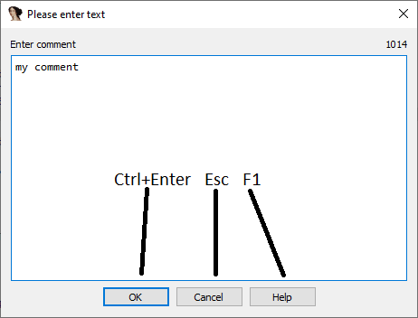
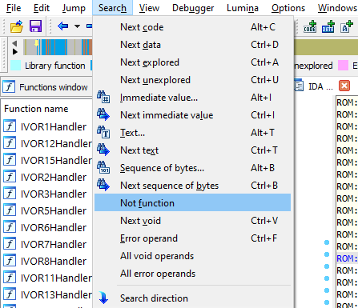
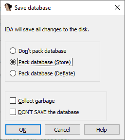

Today, Hex-Rays is excited to launch a special blog series where Igor, one of the experts behind IDA, will provide useful tips and functionalities of IDA that are not always known or less obvious to its users.  
今天，Hex-Rays 很高兴推出一个特别的博客系列，IDA 背后的专家之一 Igor 将提供有用的提示和 IDA 的功能，这些提示和功能并不总是为用户所知或不那么明显。

The first episode of this blog series covers the most useful keyboard shortcuts that will certainly speed up your IDA experience.  
本博客系列的第一集介绍了最实用的键盘快捷键，它们一定会加快你的 IDA 使用体验。

So, we hope you enjoy this first post and tune in every Friday to read **Igor’s tip of the week**!  
希望您喜欢第一篇文章，并在每周五阅读伊戈尔的本周小贴士！

---

This week’s tip will be about using the keyboard in IDA. Nowadays, while most actions can be carried out using the mouse, it can still be much faster and more efficient to use the keyboard. IDA first started as a DOS program, long before GUI and mouse became common, which is why you can still do most of the work without touching the mouse! While most of common shortcuts can be found in the cheat sheet ([HTML](https://www.hex-rays.com/wp-content/static/products/ida/idapro_cheatsheet.html), [PDF](https://www.hex-rays.com/wp-content/static/products/ida/support/freefiles/IDA_Pro_Shortcuts.pdf)), there remains some which are less obvious, but _incredibly useful_!  
本周小贴士的主题是在 IDA 中使用键盘。如今，虽然大多数操作都可以通过鼠标来完成，但使用键盘仍然会更快、更有效率。早在图形用户界面和鼠标开始普及之前，IDA 最初就是一个 DOS 程序，这就是为什么你仍然可以在不接触鼠标的情况下完成大部分工作！虽然大多数常用快捷键都可以在小抄（HTML、PDF）中找到，但仍有一些不太明显但却非常有用的快捷键！

### Text input dialog boxes 文本输入对话框（如输入注释或编辑本地类型）

You can use `Ctrl–Enter` to confirm (OK) or `Esc` to dismiss (Cancel) the dialog. This works regardless of the button arrangement (which can differ depending on the platform and/or theme used).  
您可以使用 `Ctrl-Enter` 确认（OK）或使用 `Esc` 取消（Cancel）对话框。无论按钮的排列方式如何（可能因使用的平台和/或主题而异），都可以使用。

### Quick menu navigation  快速菜单导航

If you hold down `Alt` on Windows (or enable a system option), you should see underlines under the menu item names.  
如果在 Windows 上按住 `Alt` （或启用系统选项），就会在菜单项名称下看到下划线。

You can press the underlined letter (also known as “accelerator”) while holding down `Alt` to open that menu, and _then_ press the underlined letter of the specific menu item to trigger it. The second step will work even if you release `Alt`. For example, to execute “Search > Not function” (which has no default hotkey), you can press `Alt–H, F`. Although there may be no underlines on Linux or Mac, the same key sequence should still work. If you don’t have access to a Windows IDA and don’t want to bruteforce accelerator keys manually, you can check the `cfg/idagui.cfg` file which describes IDA’s default menu layout and all assigned accelerators (prefixed with `&`).  
你可以在按住 `Alt` 的同时按下下划线字母（也称为 "加速器"）来打开该菜单，然后按下特定菜单项的下划线字母来触发它。即使松开 `Alt` ，第二步也会起作用。例如，要执行 `Search > Not function`（没有默认热键），可以按 `Alt–H, F` 。虽然在 Linux 或 Mac 上可能没有下划线，但相同的按键顺序仍然有效。如果你没有 Windows IDA，又不想手动执行加速键，可以查看 `cfg/idagui.cfg` 文件，其中描述了 IDA 的默认菜单布局和所有指定的加速键（前缀为 `&`）。

### Dialog box navigation 对话框导航

In addition to `OK/Cancel` buttons, many of IDA’s dialog boxes have checkboxes, radio buttons or edit fields. You can use the standard `Tab` key to navigate between them and `Space` bar to toggle, however, similarly to the menus, most dialog box controls in IDA have accelerator shortcuts. You can use `Alt` on Windows to reveal them but, unlike menus, they work even _without_ `Alt`. For example. to quickly exit IDA discarding any changes made since opening the database, use this key sequence:  
除了 `OK/Cancel` 按钮外，IDA 的许多对话框还有复选框、单选按钮或编辑栏。您可以使用标准的 `Tab` 键在它们之间导航，也可以使用 `Space` 栏来切换，不过，与菜单类似，IDA 中的大多数对话框控件都有快捷键。你可以在 Windows 中使用 `Alt` 来显示它们，但与菜单不同的是，即使没有 `Alt` ，它们也能正常工作。例如，要快速退出 IDA 并丢弃打开数据库后所做的任何更改，请使用以下按键序列：

- `Alt–X` (或者 `Alt–F4`) 显示 `Save database` 对话框。
- `D` 切换 `DON’T SAVE the database` 复选框。
- `Enter` 或 `Alt–K` (或 `K`) 确认 (OK)。

NOTE: a few dialogs are excluded from this feature, for example the Options-General… dialog, also Script Command (`Shift–F2`) or other dialogs with a text edit box. In such dialogs you have to hold down `Alt` to use accelerators.  
注意：少数对话框不包括在此功能中，例如 `Options-General…` 对话框、脚本命令 ( `Shift-F2` ) 或其他带有文本编辑框的对话框。在此类对话框中，必须按住 `Alt` 才能使用加速器。
