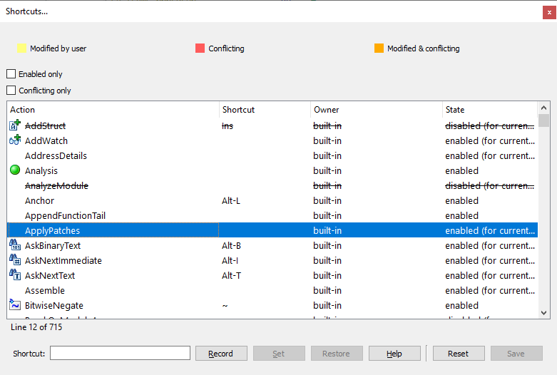
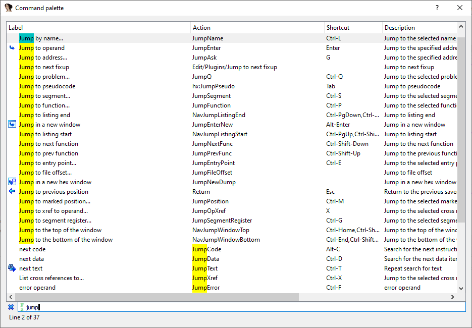

In the previous post we described how to quickly invoke some of IDA’s commands using the keyboard. However, sometimes you may need to perform a specific action many times and if it doesn’t have a default hotkey assigned it can be tedious to click through the menus. Even the accelerator keys help only so much. Or it may be difficult to discover or find a specific action in the first place (some actions do not even have menu items). There are **two IDA features** that would help here:  
在上一篇文章中，我们介绍了如何使用键盘快速调用 IDA 的某些命令。不过，有时你可能需要多次执行某个特定操作，如果没有指定默认热键，点击菜单就会很乏味。即使是加速键也只能提供这么多帮助。或者很难发现或找到某个特定的操作（有些操作甚至没有菜单项）。在这方面，有**两个 IDA 功能**可以提供帮助：

### The shortcut editor  快捷键编辑器

The editor is invoked via `Options > Shortcuts…` and allows you to see, add, and modify shortcuts for almost all UI actions available in IDA.  
通过 `Options > Shortcuts…` 调用该编辑器，可以查看、添加和修改 IDA 中几乎所有用户界面操作的快捷方式。

The dialog is non-modal and shows which actions are available for the current view (currently disabled ones are struck out) so you can try clicking around IDA and see how the set of available actions changes depending on the context.  
该对话框是非模式对话框，显示的是当前视图中可用的操作（当前禁用的操作会被删除），因此您可以尝试在 IDA 周围点击，看看可用操作集是如何根据上下文发生变化的。

To assign a shortcut, select the action in the list then type the key combination in the “Shortcut:” field (on Windows you can also click the “Record” button and press the desired shortcut), then click “Set” to save the new shortcut for this and all future IDA sessions. Use “Restore” to restore just this action, or “Reset” to reset all actions to the default state (as described in `idagui.cfg`).  
要指定快捷方式，请在列表中选择操作，然后在 `Shortcut:` 字段中键入组合键（在 Windows 上也可以单击 `Record` 按钮并按下所需的快捷键），然后单击 `Set` 以保存新的快捷方式，供本次和以后的所有 IDA 会话使用。使用 `Restore` 只还原此操作，或使用 `Reset` 将所有操作重置为默认状态（如 `idagui.cfg` 中所述）。

### The command palette  命令调板

Command palette (default shortcut is `Ctrl–Shift–P`) is similar to the Shortcut editor in that it shows the list of all IDA actions but instead of changing shortcuts you can simply _invoke_ the action.  
命令调板（默认快捷键为 `Ctrl–Shift–P`）与快捷键编辑器类似，显示所有 IDA 操作的列表，但无需更改快捷键，只需调用操作即可。

The filter box at the bottom filters the actions that contain the typed text with fuzzy matching and is focused when the palette is opened so you can just type the approximate name of an action and press `Enter` to invoke the best match.  
底部的过滤框会过滤包含模糊匹配输入文本的操作，并在打开调板时聚焦，因此你只需键入操作的大致名称并按下 `Enter` 即可调用最佳匹配的操作。
