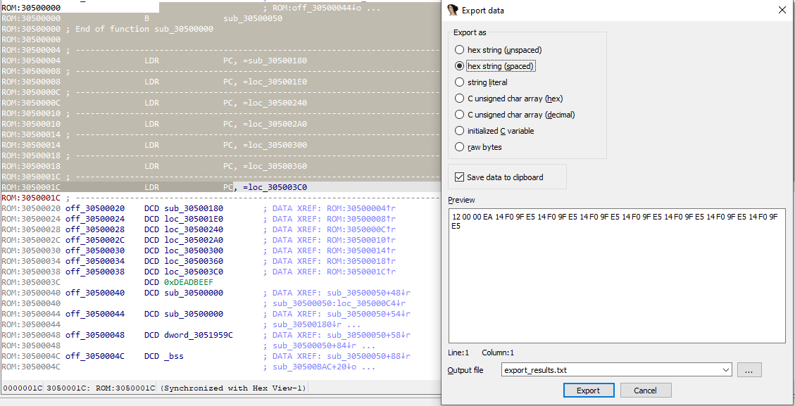

This week’s post is about **selecting items** in IDA and **what you can do** with the selection.  
本周的主题是在 IDA 中选择项目以及如何使用选择结果。

As a small change from the previous posts with mainly keyboard usage, we’ll also use the mouse this time!  
与前几篇主要使用键盘的文章相比，这次我们将使用鼠标！

### Actions and what they are applied to  操作及其应用

When an action is performed in IDA, by default it is applied only to _the item under the cursor_ or to _the current address_ (depending on the action). However, sometimes you might want to perform the action on _more items_ or to _an address range_, for example to:  
在 IDA 中执行操作时，默认情况下只应用于光标下的项目或当前地址（取决于操作）。不过，有时您可能希望对更多项目或地址范围执行操作，例如

-   undefine a range of instructions;  
    取消定义一系列指令；
-   convert a range of undefined bytes to a string literal if IDA can’t do it automatically (_e.g._ string is not null-terminated);  
    如果 IDA 无法自动完成（例如，字符串不是空端），则将未定义字节范围转换为字符串字面量；
-   create a function from a range of instructions with some data in the middle (_e.g._ when you get the dreaded “The function has undefined instruction/data at the specified address” error);  
    从一系列指令中创建一个函数，中间包含一些数据（例如，当你遇到可怕的 "函数在指定地址有未定义的指令/数据 "错误时）；
-   export disassembly or decompilation of only selected functions instead of the whole file;  
    只导出反汇编或反编译选定的函数，而不是整个文件；
-   copy to clipboard a selected fragment of the disassembly.  
    将反汇编的选定片段复制到剪贴板。

### Selecting in IDA 在 IDA 中选择

The simplest ways to select something in IDA are the same as in any text editor:  
在 IDA 中选择内容的最简单方法与在任何文本编辑器中选择内容的方法相同：

-   click and drag with the mouse (you can also scroll with the wheel while keeping the left button pressed);  
    用鼠标单击并拖动（也可以在按住左键的同时用滚轮滚动）；
-   hold down Shift and use the cursor navigation keys ( ← ↑ → ↓ PgUp PgDn Home End etc.).  
    按住 Shift 并使用光标导航键（← ↑ → ↓ PgUp PgDn Home End 等）。

However, this can quickly become tiring if you need to select a huge block of the listing (_e.g._several screenfuls). In that case, the _anchor selection_ will be of great use.  
不过，如果需要选择一大块列表（例如几屏），这样做很快就会变得很累。在这种情况下，锚点选择功能就派上了大用场。

### Using the anchor selection  
使用锚点选择

1.  Move to the start of the intended selection and select Edit > Begin selection (or use the `Alt–L` shortcut).  
    移动到目标选区的起点，选择编辑 > 开始选区（或使用 `Alt–L` 快捷键）。
2.  Navigate to the other end of the selection using any means (cursor keys, Jump actions, Functions window, Navigation bar etc.).  
    使用任何方式（光标键、跳转操作、功能窗口、导航栏等）导航到选区的另一端。
3.  Perform the action (via context menu, keyboard shortcut, or global menu). It will be applied to the selection from the anchor point to the current position.  
    执行操作（通过上下文菜单、键盘快捷键或全局菜单）。该操作将应用于从锚点到当前位置的选区。

### Examples 示例

Some of the actions that use selection:  
一些使用选择的操作：

- Commands in the  `File > Produce file` submenu (create `.ASM`, `.LST`, HTML or `.C` file) 
- `Edit > Export data` (`Shift–E`)  

Some more complicated actions requiring selection will be discussed in the forthcoming posts. Stay tuned and see you next Friday!  
一些需要选择的更复杂的操作将在接下来的文章中讨论。敬请期待，下周五见！