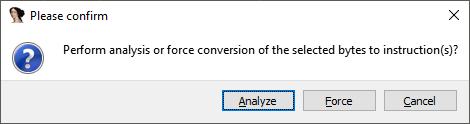
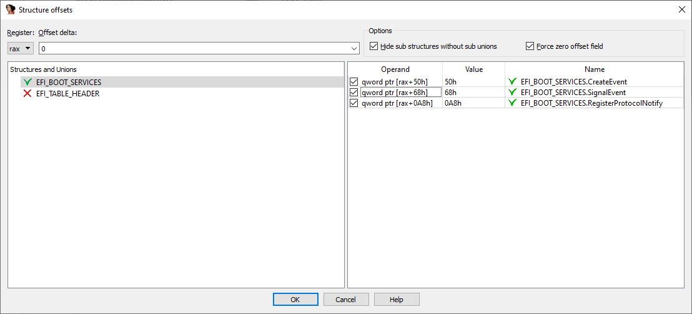
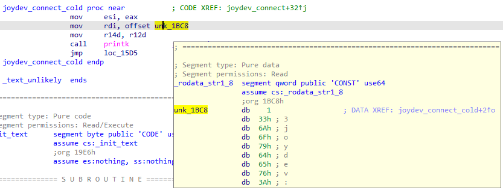
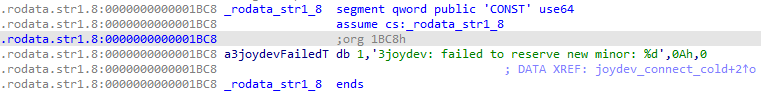
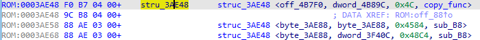

在[上一篇文章](https://hex-rays.com/blog/igor-tip-of-the-week-03-selection-in-ida/)中，我们讨论了在 IDA 中选区的基本用法。本周我们将介绍一些更多会受选区影响的操作示例。

### 固件 / 原始二进制分析

在反汇编原始二进制文件时，IDA 并不总能检测到代码片段，你可能需要通过反复试验在整个加载范围中寻找代码，这会非常耗时。在这种情况下，以下简单方法可用于初步探查：

1. 跳转到数据库起始位置（`Ctrl-PgUp`）。
1. 开始选区（`Alt-L`）。
1. 跳转到末尾（`Ctrl-PgDn`）。
1. 你也可以跳到你认为是代码区末尾的位置（例如一大段 `0x00` 或 `0xFF` 之前）。
1. 选择 `Edit > Code` 或按 `C`。

此时会弹出一个对话框，询问要执行的具体操作：


- 如果你确定选区内大部分是指令，点击 `Force`。
- 如果指令之间可能有数据，点击 `Analyze`。

IDA 会遍历选区，将未定义的字节尝试转换为指令。如果选区内确实有有效代码，你会在函数窗口中看到新添加的函数（可能包含一些误判）。

### 结构体偏移

选区的另一个用途是一次性将结构体偏移应用到多条指令。例如，考虑一个来自 UEFI 模块的函数：

```asm
.text:0000000000001A64 sub_1A64        proc near               ; CODE XREF: sub_15A4+EB↑p
.text:0000000000001A64                                         ; sub_15A4+10E↑p
.text:0000000000001A64
.text:0000000000001A64 var_28          = qw<span>o</span>rd ptr <span>-</span>28h
.text:0000000000001A64 var_18          = qword ptr -18h
.text:0000000000001A64 arg_20          = qword ptr  28h
.text:0000000000001A64
.text:0000000000001A64                 push    rbx
.text:0000000000001A66                 sub     rsp, 40h
.text:0000000000001A6A                 lea     rax, [rsp+48h+var_18]
.text:0000000000001A6F                 xor     r9d, r9d
.text:0000000000001A72                 mov     rbx, rcx
.text:0000000000001A75                 mov     [rsp+48h+var_28], rax
.text:0000000000001A7A                 mov     rax, cs:gBS
.text:0000000000001A81                 lea     edx, [r9+8]
.text:0000000000001A85                 mov     ecx, 200h
.text:0000000000001A8A                 call    qword ptr [rax+50h]
.text:0000000000001A8D                 mov     rax, cs:gBS
.text:0000000000001A94                 mov     r8, [rsp+48h+arg_20]
.text:0000000000001A99                 mov     rdx, [rsp+48h+var_18]
.text:0000000000001A9E                 mov     rcx, rbx
.text:0000000000001AA1                 call    qword ptr [rax+0A8h]
.text:0000000000001AA7                 mov     rax, cs:gBS
.text:0000000000001AAE                 mov     rcx, [rsp+48h+var_18]
.text:0000000000001AB3                 call    qword ptr [rax+68h]
.text:0000000000001AB6                 mov     rax, [rsp+48h+var_18]
.text:0000000000001ABB                 add     rsp, 40h
.text:0000000000001ABF                 pop     rbx
.text:0000000000001AC0                 retn
.text:0000000000001AC0 sub_1A64        endp
```

如果我们知道 `gBS` 是指向 `EFI_BOOT_SERVICES` 的指针，就可以将这些调用转换为结构体偏移。

手动逐条转换很繁琐，这时选区就派上用场了：

- 选中访问该结构的指令
- 按 `T`（结构体偏移）
- 在弹出的对话框中选择基寄存器（如 `rax`）、结构体（如 `EFI_BOOT_SERVICES`），并可勾选要转换的具体指令
  

应用后，列表会变得更易读，例如：

```asm
.text:0000000000001A64 sub_1A64        proc near               ; CODE XREF: sub_15A4+EB↑p
.text:0000000000001A64                                         ; sub_15A4+10E↑p
.text:0000000000001A64
.text:0000000000001A64 Event           = qword ptr -28h
.text:0000000000001A64 var_18          = qword ptr -18h
.text:0000000000001A64 Registration    = qword ptr  28h
.text:0000000000001A64
.text:0000000000001A64                 push    rbx
.text:0000000000001A66                 sub     rsp, 40h
.text:0000000000001A6A                 lea     rax, [rsp+48h+var_18]
.text:0000000000001A6F                 xor     r9d, r9d        ; NotifyContext
.text:0000000000001A72                 mov     rbx, rcx
.text:0000000000001A75                 mov     [rsp+48h+Event], rax ; Event
.text:0000000000001A7A                 mov     rax, cs:gBS
.text:0000000000001A81                 lea     edx, [r9+8]     ; NotifyTpl
.text:0000000000001A85                 mov     ecx, 200h       ; Type
.text:0000000000001A8A                 call    [rax+EFI_BOOT_SERVICES.CreateEvent]
.text:0000000000001A8D                 mov     rax, cs:gBS
.text:0000000000001A94                 mov     r8, [rsp+48h+Registration] ; Registration
.text:0000000000001A99                 mov     rdx, [rsp+48h+var_18] ; Event
.text:0000000000001A9E                 mov     rcx, rbx        ; Protocol
.text:0000000000001AA1                 call    [rax+EFI_BOOT_SERVICES.RegisterProtocolNotify]
.text:0000000000001AA7                 mov     rax, cs:gBS
.text:0000000000001AAE                 mov     rcx, [rsp+48h+var_18] ; Event
.text:0000000000001AB3                 call    [rax+EFI_BOOT_SERVICES.SignalEvent]
.text:0000000000001AB6                 mov     rax, [rsp+48h+var_18]
.text:0000000000001ABB                 add     rsp, 40h
.text:0000000000001ABF                 pop     rbx
.text:0000000000001AC0                 retn
.text:0000000000001AC0 sub_1A64        endp
```

### 强制字符串字面量

当代码引用字符串时，IDA 通常会自动识别并将其转换为字符串项。但在以下情况中自动转换可能失败：

- 字符串包含非 ASCII 字符。
- 字符串不是以空字符结尾。

一个常见例子是 Linux 内核，它使用特殊字节序列标记不同类别的内核消息。

例如，在 `joydev.ko` 模块的某个函数中，地址 `1BC8` 的字符串以非 ASCII 字符开头，因此 IDA 没有自动创建字符串。



此时，只需选中该字符串的字节并按 `A`（转换为字符串），IDA 仍会创建字符串。



### 从数据创建结构体

在处理二进制中的结构化数据时，这个操作非常有用。假设有一个表，其条目大致布局如下：

```c
struct copyentry {
    void    *source;
    void    *dest;
    int      size;
    void    *copyfunc;
};
```

虽然可以在 `Structures` 窗口手动创建结构体，但通常先格式化数据再创建结构体会更方便。创建好四个数据项后，选中它们并在右键菜单中选择 `Create struct from selection`。


IDA 会创建一个表示这些数据项的结构体，之后可用于格式化程序中的其他条目，帮助更好地理解相关代码。



原文地址：https://hex-rays.com/blog/igor-tip-of-the-week-04-more-selection
