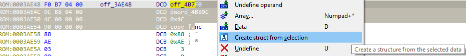

In the [previous post](https://hex-rays.com/blog/igor-tip-of-the-week-03-selection-in-ida/) we talked about the basic usage of selection in IDA. This week we’ll describe a few more examples of actions affected by selection.  
在上一篇文章中，我们介绍了 IDA 中选择的基本用法。本周，我们将再介绍几个受选择影响的操作示例。

### Firmware/raw binary analysis  
固件/原始二进制分析

When disassembling a raw binary, IDA is not always able to detect code fragments and you may have to resort to trial & error for finding the code among the whole loaded range which can be a time-consuming process. In such situation the following simple approach may work for initial reconnaissance:  
在反汇编原始二进制文件时，IDA 并不总能检测到代码片段，您可能需要通过反复试验才能在整个加载范围内找到代码，这可能是一个耗时的过程。在这种情况下，以下简单方法可用于初步侦查：

1.  Go to the start of the database (Ctrl–PgUp);  
    转到数据库的起点（ Ctrl - PgUp ）；
2.  Start selection (Alt–L);  
    开始选择 ( Alt - L )；
3.  Go to the end (Ctrl–PgDn). You can also go to a specific point that you think may be the end of code region (e.g. just before a big chunk of zeroes or FF bytes);  
    转到末尾 ( Ctrl - PgDn )。您也可以转到您认为可能是代码区域结束的特定点（例如，在一大段零或 FF 字节之前）；
4.  Select Edit > Code or press C. You’ll get a dialog asking what specific action to perform:  
    选择编辑 > 代码或按 C 。您将看到一个对话框，询问要执行的具体操作：  
    
5.  Click “Force” if you’re certain there are mostly instructions in the selected range, or “Analyze” if there may be data between instructions.  
    如果确定所选范围内大部分是指令，请单击 "强制"；如果指令之间可能存在数据，请单击 "分析"。
6.   IDA will go through the selected range and try to convert any undefined bytes to instructions. If there is indeed valid code in the selected area, you might see functions being added to the Functions window (probably including some false positives).  
    IDA 将检查所选范围，并尝试将任何未定义的字节转换为指令。如果所选区域确实存在有效代码，你可能会看到函数窗口中添加了函数（可能包括一些误报）。
    

### Structure offsets 结构偏移

Another useful application of selection is applying structure offsets to multiple instructions. For example, let’s consider this function from a UEFI module:  
选择的另一个有用应用是将结构偏移应用于多条指令。例如，我们来看看 UEFI 模块中的这个函数：

```
.text:0000000000001A64 sub_1A64        proc near               ; CODE XREF: sub_15A4+EB↑p
.text:0000000000001A64                                         ; sub_15A4+10E↑p
.text:0000000000001A64
.text:0000000000001A64 var_28          = qw<span>o</span>rd ptr <span>-</span>28h
.text:0000000000001A64 var_18          = qword ptr -18h
.text:0000000000001A64 arg_20          = qword ptr  28h
.text:0000000000001A64
.text:0000000000001A64                 push    rbx
.text:0000000000001A66                 sub     rsp, 40h
.text:0000000000001A6A                 lea     rax, [rsp+48h+var_18]
.text:0000000000001A6F                 xor     r9d, r9d
.text:0000000000001A72                 mov     rbx, rcx
.text:0000000000001A75                 mov     [rsp+48h+var_28], rax
.text:0000000000001A7A                 mov     rax, cs:gBS
.text:0000000000001A81                 lea     edx, [r9+8]
.text:0000000000001A85                 mov     ecx, 200h
.text:0000000000001A8A                 call    qword ptr [rax+50h]
.text:0000000000001A8D                 mov     rax, cs:gBS
.text:0000000000001A94                 mov     r8, [rsp+48h+arg_20]
.text:0000000000001A99                 mov     rdx, [rsp+48h+var_18]
.text:0000000000001A9E                 mov     rcx, rbx
.text:0000000000001AA1                 call    qword ptr [rax+0A8h]
.text:0000000000001AA7                 mov     rax, cs:gBS
.text:0000000000001AAE                 mov     rcx, [rsp+48h+var_18]
.text:0000000000001AB3                 call    qword ptr [rax+68h]
.text:0000000000001AB6                 mov     rax, [rsp+48h+var_18]
.text:0000000000001ABB                 add     rsp, 40h
.text:0000000000001ABF                 pop     rbx
.text:0000000000001AC0                 retn
.text:0000000000001AC0 sub_1A64        endp
```

If we know that `gBS` is a pointer to `EFI_BOOT_SERVICES`, we can convert accesses to it (in the call instructions) to structure offsets. It can be done for each access manually but is tedious. In such situation the selection can be helpful. If we select the instructions accessing the structure and press T (structure offset), a new dialog pops up:  
如果我们知道 `gBS` 是指向 `EFI_BOOT_SERVICES` 的指针，就可以将对它的访问（在调用指令中）转换为结构偏移。每次访问都可以手动完成，但比较繁琐。在这种情况下，选择会有所帮助。如果我们选择访问结构的指令并按下 T （结构偏移），就会弹出一个新的对话框：


You can select which register is used as the base, which structure to apply and even select which specific instructions you want to convert.  
您可以选择以哪个寄存器为基准，应用哪个结构，甚至选择要转换的具体指令。

After selecting `rax` and `EFI_BOOT_SERVICES`, we get a nice-looking listing:  
选择 `rax` 和 `EFI_BOOT_SERVICES` 后，我们得到了一个漂亮的列表：

```
.text:0000000000001A64 sub_1A64        proc near               ; CODE XREF: sub_15A4+EB↑p
.text:0000000000001A64                                         ; sub_15A4+10E↑p
.text:0000000000001A64
.text:0000000000001A64 Event           = qword ptr -28h
.text:0000000000001A64 var_18          = qword ptr -18h
.text:0000000000001A64 Registration    = qword ptr  28h
.text:0000000000001A64
.text:0000000000001A64                 push    rbx
.text:0000000000001A66                 sub     rsp, 40h
.text:0000000000001A6A                 lea     rax, [rsp+48h+var_18]
.text:0000000000001A6F                 xor     r9d, r9d        ; NotifyContext
.text:0000000000001A72                 mov     rbx, rcx
.text:0000000000001A75                 mov     [rsp+48h+Event], rax ; Event
.text:0000000000001A7A                 mov     rax, cs:gBS
.text:0000000000001A81                 lea     edx, [r9+8]     ; NotifyTpl
.text:0000000000001A85                 mov     ecx, 200h       ; Type
.text:0000000000001A8A                 call    [rax+EFI_BOOT_SERVICES.CreateEvent]
.text:0000000000001A8D                 mov     rax, cs:gBS
.text:0000000000001A94                 mov     r8, [rsp+48h+Registration] ; Registration
.text:0000000000001A99                 mov     rdx, [rsp+48h+var_18] ; Event
.text:0000000000001A9E                 mov     rcx, rbx        ; Protocol
.text:0000000000001AA1                 call    [rax+EFI_BOOT_SERVICES.RegisterProtocolNotify]
.text:0000000000001AA7                 mov     rax, cs:gBS
.text:0000000000001AAE                 mov     rcx, [rsp+48h+var_18] ; Event
.text:0000000000001AB3                 call    [rax+EFI_BOOT_SERVICES.SignalEvent]
.text:0000000000001AB6                 mov     rax, [rsp+48h+var_18]
.text:0000000000001ABB                 add     rsp, 40h
.text:0000000000001ABF                 pop     rbx
.text:0000000000001AC0                 retn
.text:0000000000001AC0 sub_1A64        endp
```

### Forced string literals 强制字符串字面形式

When some code is referencing a string, IDA is usually smart enough to detect it and convert referenced bytes to a literal item. However, in some cases the automatic conversion does not work, for example:  
当某些代码引用字符串时，IDA 通常会智能地检测到它，并将引用的字节转换为字面项目。不过，在某些情况下，自动转换不起作用，例如

-   string contains non-ASCII characters  
    字符串包含非 ASCII 字符
-   string is not null-terminated  
    字符串没有空尾

A common example of the former is Linux kernel which uses a special byte sequence to mark different categories of kernel messages. For example, consider this function from the `joydev.ko` module:  
前者的一个常见例子是 Linux 内核，它使用特殊的字节序列来标记不同类别的内核信息。例如，请看 `joydev.ko` 模块中的这个函数：


IDA did not automatically create a string at 1BC8 because it starts with a non-ASCII character. However, if we select the string’s bytes and press A (Convert to string), a string is created anyway:  
IDA 没有在 1BC8 处自动创建字符串，因为它是以非 ASCII 字符开头的。不过，如果我们选择字符串的字节并按下 A （转换为字符串），字符串还是会创建出来：


### Creating structures from data  
从数据创建结构

This action is useful when dealing with structured data in binaries. Let’s consider a table with approximately this layout of entries:  
该操作在处理二进制文件中的结构化数据时非常有用。让我们来看看一个条目布局大致如下的表格：

```
struct copyentry {
 void *source;
 void *dest;
 int size;
 void* copyfunc;
};
```

While such a structure can always be created manually in the Structures window, often it’s easier to format the data first then create a structure which describes it. After creating the four data items, select them and from the context menu, choose “Create struct from selection”:  
虽然可以在 "结构 "窗口中手动创建这样的结构，但通常先格式化数据，然后再创建 描述数据的结构会更方便。创建完四个数据项后，选中它们并从上下文菜单中选择 "从选中项创建结构"：



IDA will create a structure representing the selected data items which can then be used to format other entries in the program or in disassembly to better understand the code working with this data.  
IDA 将创建一个代表所选数据项的结构，然后可以用它来格式化程序中的其他条目，或在反汇编中更好地理解使用这些数据的代码。

