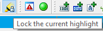
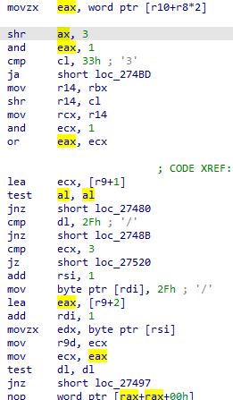
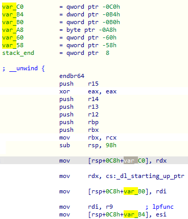

In [IDA](https://www.hex-rays.com/products/ida/), **highlight** is the dynamic coloring of a word or number under the cursor as well as all matching substrings on the screen. In the default color scheme, a yellow background color is used for the highlight.  
在 IDA 中，高亮是对光标下的单词或数字以及屏幕上所有匹配的子串进行动态着色。在默认配色方案中，高亮显示使用黄色背景色。

Highlight is updated when you click on a non-whitespace location in the listing or move the cursor with the arrow keys. Highlight is _not_ updated (remains the same) when:  
单击列表中的非空白位置或使用箭头键移动光标时，高亮显示会更新。在下列情况下，突出显示不会更新（保持不变

-   moving the cursor with PgUp, PgDn, Home, End;  
    使用 PgUp , PgDn , Home , End 移动光标；
-   scrolling the listing with mouse wheel or scroll bar;  
    使用鼠标滚轮或滚动条滚动列表；
-   using Jump commands or clicking in the navigation band (unless the cursor happens to land on a word at the new location);  
    使用跳转命令或在导航栏中单击（除非光标恰好落在新位置的单词上）；
-   highlight is locked by the LockHighlight action (it is one of the handful of actions which are only available as a toolbar button by default).  
    通过 LockHighlight 操作锁定高亮显示（这是少数几个默认情况下只能作为工具栏按钮使用的操作之一）。
    
    
    

### Register highlight 注册高亮

For some processors, highlighted registers are treated in a special way: not only is the same register highlighted but also any register which contains it or is a part of it. For example, on x86_x64, if `ax` is selected, then `al`, `ah`, `eax` and `rax` get highlighted too.  
对于某些处理器，高亮寄存器的处理方式比较特殊：不仅同一寄存器会被高亮，而且包含该寄存器或其一部分的寄存器也会被高亮。例如，在 x86_x64 上，如果 `ax` 被选中，那么 `al` 、 `ah` 、 `eax` 和 `rax` 也会高亮显示。

### 

### Manual highlight 手动高亮

In addition to the automatic highlight by clicking on a word/number, you can also select an arbitrary substring using mouse or keyboard and it will be used to highlight all matching sequences on the screen. For manual highlight, only exactly matching substrings are highlighted — there is no special handling for the registers.  
除了单击单词/数字自动高亮外，您还可以使用鼠标或键盘选择任意子串，然后高亮屏幕上所有匹配的序列。手动高亮时，只有完全匹配的子串才会被高亮--对寄存器没有特殊处理。

### Highlight navigation 高亮导航

You can quickly jump between highlighted matches using Alt–Up and Alt–Down. This works even if the closest match is not on screen — IDA will look for next match in the selected direction.  
您可以使用 Alt - Up 和 Alt - Down 在高亮显示的匹配项之间快速跳转。即使最接近的匹配不在屏幕上，也可使用此功能 - IDA 将沿所选方向查找下一个匹配。

Highlight is available not only in the disassembly listing but in most text-based IDA subviews: Pseudocode, Hex View, Structures and Enums.  
高亮功能不仅在反汇编列表中可用，在大多数基于文本的 IDA 子视图中也可用：伪代码、十六进制视图、结构和枚举。