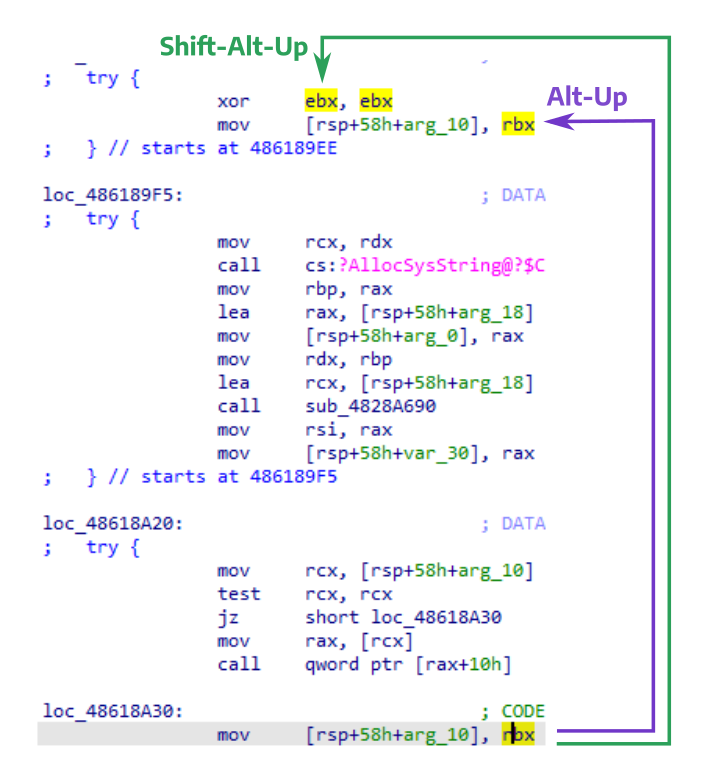

With [every IDA release](https://hex-rays.com/products/ida/news/), we publish detailed release notes describing various new features, improvements and bugfixes. While some of the additions are highlighted and therefore quite visible, others are not so obvious and may require careful reading. Having a closer look at these release notes, you will be surprised to see many small but useful features added through different IDA versions.  
每次发布 IDA 时，我们都会发布详细的发布说明，介绍各种新功能、改进和错误修正。有些新增功能会突出显示，因此非常明显，而有些则不那么明显，可能需要仔细阅读。仔细阅读这些发行说明，您会惊讶地发现，在不同的 IDA 版本中，都增加了许多小而实用的功能。

**A couple of good examples can be:  
以下是几个很好的例子：**

### Register definition and use  
寄存器定义和使用

Added in IDA 7.5, these actions allow you to quickly jump between various uses of a register.  
在 IDA 7.5 中添加的这些操作允许您在寄存器的各种用途之间快速跳转。

> • UI: added actions to search for register definition or register use (Shift+Alt+Up, Shift+Alt+Down)  
> - 用户界面：添加搜索寄存器定义或寄存器使用的操作（Shift+Alt+Up、Shift+Alt+Down）

Shift–Alt–Up: find the previous location where the selected register is **defined** (written to).  
Shift - Alt - Up : 查找所选寄存器定义（写入）的上一个位置。

Shift–Alt–Down: find the next location where the selected register is **used** (read from or partially overwritten).  
Shift - Alt - Down ：查找下一个使用（读取或部分覆盖）所选寄存器的位置。

These actions are especially useful in big functions compiled with high optimization level where the distance between definition and use can be quite big so tracking registers visually using [standard highlight](https://hex-rays.com/blog/igor-tip-of-the-week-05-highlight/) is not always feasible.  
这些操作在以高优化级别编译的大型函数中特别有用，因为在这些函数中，定义和使用之间的距离可能相当大，所以使用标准高亮显示来直观跟踪寄存器并不总是可行的。

In the above screenshot, you can see that Alt–Up jumps to the closest highlight substring match while Shift–Alt–Up finds where rbx was changed (`ebx` is the low part of `rbx` so the `xor` instruction changes `rbx`).  
在上面的截图中，你可以看到 Alt - Up 跳转到最近的高亮子串匹配处，而 Shift - Alt - Up 则找到 rbx 被修改的位置（ `ebx` 是 `rbx` 的低部分，因此 `xor` 指令会修改 `rbx` ）。

These actions are currently implemented for a limited number of processors (x86/x64, ARM, MIPS), but may be extended to others if we get more requests.  
这些操作目前只针对少数处理器（x86/x64、ARM、MIPS）实施，但如果我们收到更多请求，可能会扩展到其他处理器。

### Jump to previous or next function  
跳转到上一个或下一个功能

> + ui: added shortcuts Ctrl+Shift+Up/Ctrl+Shift+Down to jump to the start of the previous/next function  
> +ui：添加了快捷键 Ctrl+Shift+P/Ctrl+Shift+Down 以跳转到上一个/下一个函数的起始位置

Added in IDA 7.2, these are minor but very useful shortcuts, especially in large binaries with many big functions.  
在 IDA 7.2 中添加的这些快捷键虽然不起眼，但却非常有用，尤其是在有许多大功能的大型二进制文件中。

By the way, if standard shortcuts are tricky to use, you can always [set custom ones](https://hex-rays.com/blog/igor-tip-of-the-week-02-ida-ui-actions-and-where-to-find-them/) using a key combination you prefer.  
顺便说一下，如果标准快捷键不好用，您可以使用自己喜欢的组合键设置自定义快捷键。