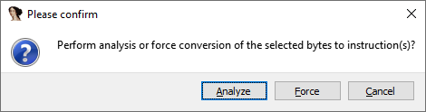
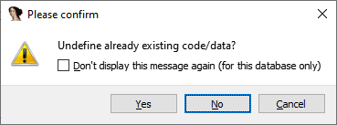
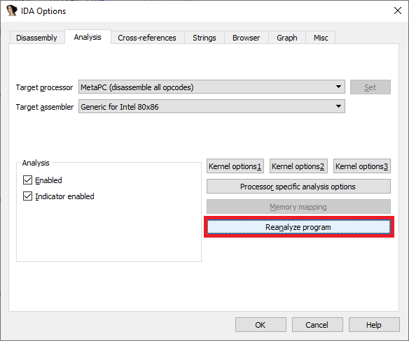
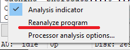

在使用 IDA 的过程中，有时你可能需要重新分析数据库的某些部分，例如：

- 修改外部函数的原型后（尤其是调用约定、清除的字节数，或“不会返回”标志）；
- 修正错误检测到的 `ARM/Thumb` 或 `MIPS32/MIPS16` 区域；
- 更改全局处理器选项后（例如在 MIPS 中设置 `$gp` 值，或在 `PPC` 中设置 `TOC`）；
- 其他情况（分析 `switch` 语句等）。

### 重新分析单条指令

要重新分析一条指令，将光标放在该指令上并按 C（转换为代码）。即使该指令已经是代码，这个操作也不是空操作，它会让 IDA 内核执行以下步骤：

1. 删除当前地址的交叉引用；
1. 让处理器模块重新分析该指令；

通常，这会重新创建交叉引用，包括到下一条指令的流程交叉引用（除非当前指令会终止代码流）。

### 重新分析一个函数

当函数的任何参数被更改时（例如需要重新创建栈变量），该函数的所有指令都会被重新分析。

因此，以下按键序列会触发整个函数的重新分析：

- `Alt-P`（编辑函数）
- `Enter`（确认对话框）

### 重新分析更大范围的指令

可以使用之前“[选区](https://hex-rays.com/blog/igor-tip-of-the-week-04-more-selection)”技巧中提到的方法：

1. 跳转到范围的起始位置；
1. 按 `Alt-L`（开始选区）；
1. 跳转到选区的结束位置；
1. 按 `C`（转换为代码）；
   

   

### 重新分析整个数据库

如果你需要重新分析整个数据库，但又不想手动选中所有代码，可以使用专门的命令，有两种调用方式：

1. 菜单 `Options > General…`，切换到 `Analysis` 选项卡，点击 `Reanalyze program` 按钮；

   

2. 在 IDA 窗口底部的状态栏上右键，选择 `Reanalyze program`。
   

原文地址：https://hex-rays.com/blog/igor-tip-of-the-week-09-reanalysis
