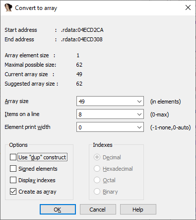
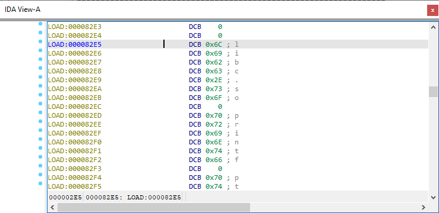
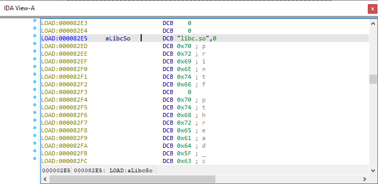
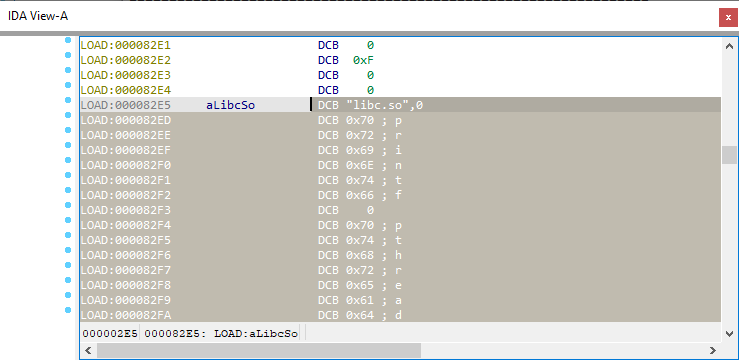
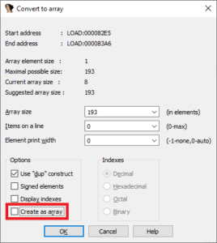
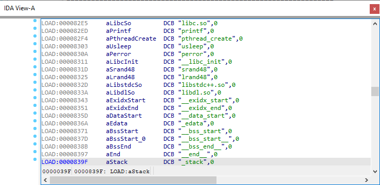

Arrays are used in IDA to represent a sequence of multiple items of the same type: basic types (byte, word, dword etc.) or complex ones (e.g. structures).  
数组在 IDA 中用于表示同一类型的多个项的序列：基本类型（字节、字、dword 等）或复杂类型（如结构）。

### Creating an array 创建数组

To create an array:  
创建数组

1.  Create the first item;  
    创建第一个项目
2.  Choose “Array…” from the context menu , or press *;  
    从右键菜单中选择 "Array...（阵列...）"，或按 * ；
3.  Fill in at least the _Array size_ field and click OK.  
    至少填写数组大小字段，然后单击 "确定"。

Step 1 is optional; if no data item exists at the current location, a byte array will be created.  
步骤 1 是可选的，如果当前位置没有数据项，则将创建一个字节数组。

Hint: if you select a range before pressing *, _Array size_ will be pre-filled with the number of items which fits into the selected range.  
提示：如果在按下 * 之前选择了一个范围，数组大小将预先填入适合所选范围的项目数。

### Array parameters 数组参数

Array parameters affect how the array is displayed in the listing and can be set at the time the array is first created or any time later by pressing *.  
数组参数会影响数组在列表中的显示方式，可以在创建数组时设置，也可以在之后的任何时间按下 * 进行设置。



-   Array size: total number of elements in the array;  
    数组大小：数组中元素的总数；
-   Items on a line:  how many items (at most) to print on one line. 0 means to print the maximum number which fits into the disassembly line;  
    一行中的条目数：一行中要打印的条目数（最多）。0 表示打印适合反汇编行的最大数量；
-   Element print width:  how many characters to use for each element. Together with the previous parameter can be used for formatting arrays into nice-looking tables. For example:  
    元素打印宽度：每个元素打印多少个字符。与前一个参数一起可用于将数组格式化为漂亮的表格。例如  
    8 items per line, print width **-1**:   
    每行 8 个项目，打印宽度 -1：  
    
    ```
    db 1, 2, 3, 4, 5, 6, 7, 8
    db 9, 10, 11, 12, 13, 14, 15, 16
    db 17, 18, 19, 20, 21, 22, 23, 24
    db 25, 255, 255, 255, 255, 255, 255, 26
    db 27, 28, 29, 30, 31, 32, 33, 34
    db 35, 36, 37, 38, 39, 40, 41, 42
    ```
    
    print width **0**:  打印宽度 0：  
    
    ```
    db&nbsp;&nbsp; 1,&nbsp; 2,&nbsp; 3,&nbsp; 4,&nbsp; 5,&nbsp; 6,&nbsp; 7,&nbsp; 8
    db&nbsp;&nbsp; 9, 10, 11, 12, 13, 14, 15, 16
    db&nbsp; 17, 18, 19, 20, 21, 22, 23, 24
    db&nbsp; 25,255,255,255,255,255,255, 26
    db&nbsp; 27, 28, 29, 30, 31, 32, 33, 34
    db&nbsp; 35, 36, 37, 38, 39, 40, 41, 42
    ```
    
    print width **5**:  打印宽度 5：  
    
    ```
    db     1,    2,    3,    4,    5,    6,    7,    8
    db     9,   10,   11,   12,   13,   14,   15,   16
    db    17,   18,   19,   20,   21,   22,   23,   24
    db    25,  255,  255,  255,  255,  255,  255,   26
    db    27,   28,   29,   30,   31,   32,   33,   34
    db    35,   36,   37,   38,   39,   40,   41,   42
    ```
    
-   Use “dup” construct: for assemblers that support it, repeated items with the same value will be collapsed into a dup expression instead of printing each item separately;  
    使用 "dup "结构：对于支持该结构的汇编程序，具有相同值的重复项目将合并为一个 dup 表达式，而不是单独打印每个项目；  
    dup off: `db 0FFh, 0FFh, 0FFh, 0FFh, 0FFh, 0FFh`  dup off： `db 0FFh, 0FFh, 0FFh, 0FFh, 0FFh, 0FFh`  
    dup on: `db 6 dup(0FFh)`  dup on： `db 6 dup(0FFh)`
-   Signed elements: integer items will be treated as signed numbers;  
    有符号元素：整数项将被视为有符号数字；
-   Display indexes: for each line, first item’s array index will be printed in a comment.   
    显示索引：在每一行中，第一个项的数组索引将打印在注释中。
-   Create as array: if unchecked, IDA will convert the array into separate items.  
    创建为数组：如果未选中，IDA 将把数组转换为单独的项。

### Creating multiple string literals  
创建多个字符串字面量

The last option in array parameters dialog can be useful when dealing with multiple string literals packed together. For example, if we have a string table like this:  
数组参数对话框中的最后一个选项在处理多个字符串字面量时非常有用。例如，如果我们有这样一个字符串表：



First, create one string.  
首先，创建一个字符串。



Then, select it and all the following strings using one of the methods [described before](https://www.hex-rays.com/blog/igor-tip-of-the-week-04-more-selection/).  
然后，使用前面介绍的方法之一选中它和下面的所有字符串。



Invoke Edit > Array… or press *. The array size will be set to the total length of the selection. In the dialog, **uncheck** “Create as array”. Click OK.  
调用编辑 > 数组... 或按 * 。数组大小将设置为选中字符串的总长度。在对话框中取消选中 "创建为数组"。点击确定。



We get a nicely formatted string table!  
我们就得到了一个格式化很好的字符串表！



This approach works also with Unicode (UTF-16) strings.  
这种方法也适用于 Unicode (UTF-16) 字符串。