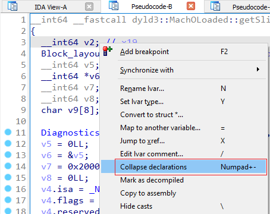
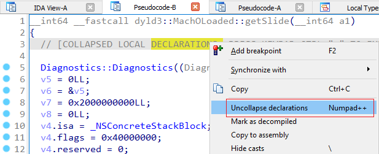
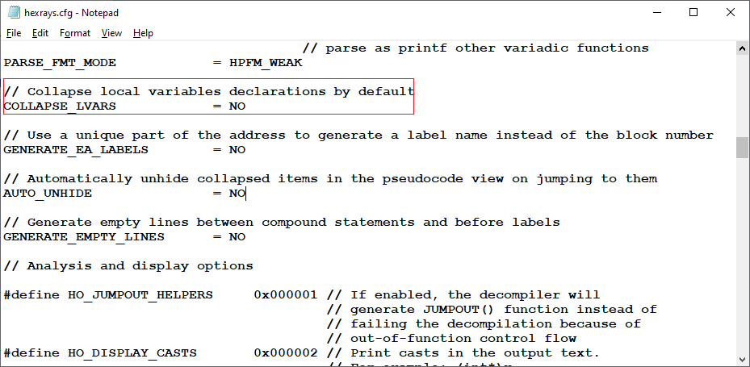
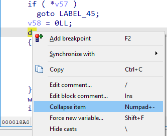
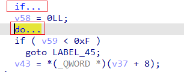

When working with big functions in the decompiler, it may be useful to temporarily hide some parts of the pseudocode to analyze the rest. While currently it’s not possible to hide arbitrary lines [like in disassembly](https://hex-rays.com/blog/igors-tip-of-the-week-31-hiding-and-collapsing/), you can hide specific sections of it.  
在反编译器中处理大型函数时，可能需要暂时隐藏伪代码的某些部分，以便分析其余部分。虽然目前无法像反汇编那样隐藏任意行，但可以隐藏其中的特定部分。

### Collapsing local variable declarations  
折叠局部变量声明

While the local variable declarations are useful to see the overall layout of the stack frame and other [interesting info](https://hex-rays.com/blog/igors-tip-of-the-week-66-decompiler-annotations/), in big functions they may take up a lot of valuable screen estate. To get them out of the way, you can use “Collapse declarations…” from the context menu, or the - key on the numpad.  
虽然局部变量声明有助于查看堆栈框架的整体布局和其他有趣信息，但在大型函数中，它们可能会占用大量宝贵的屏幕空间。要使它们不碍事，可以使用上下文菜单中的 "Collapse declarations...（折叠声明...）"或数字键盘上的 - 键。

This replaces the declarations with a single comment line. To show them again, use “Uncollapse declarations..” or the numpad + key.  
这将用一行注释替换声明。要再次显示它们，请使用 "Uncollapse declarations...（取消折叠声明）"或数字键盘上的 + 键。

To always collapse the declarations by default, set COLLAPSE_LVARS option in `cfg/hexrays.cfg`.  
要始终默认折叠声明，请在 `cfg/hexrays.cfg` 中设置 COLLAPSE_LVARS 选项。

### Collapsing statements 折叠语句

Compound statements can be collapsed too: `if` and `switch` statements, as well as `for`, `while`, and `do` loops. This can be done using the “Collapse item” context menu command, or the same numpad - shortcut.  
复合语句也可以折叠： `if` 和 `switch` 语句，以及 `for` , `while` 和 `do` 循环。可以使用 "折叠项 "上下文菜单命令或相同的数字键盘 - 快捷键来实现。

After collapsing, the whole statement is replaced by one line with the keyword and ellipsis:  
折叠后，整个语句将被一行关键字和省略号所取代：

And can be uncollapsed again from context menu or the numpad + key.  
并可通过上下文菜单或数字键盘 + 键取消折叠。

You can use this approach to progressively hide analyzed code and tackle long functions piece by piece.  
您可以使用这种方法逐步隐藏分析过的代码，并逐个处理长函数。

See also 另请参见

[Hex-Rays interactive operation: Hide/unhide C statements (hex-rays.com)  
Hex-Rays 交互式操作：隐藏/取消隐藏 C 语句 (hex-rays.com)](https://www.hex-rays.com/products/decompiler/manual/cmd_hide.shtml)