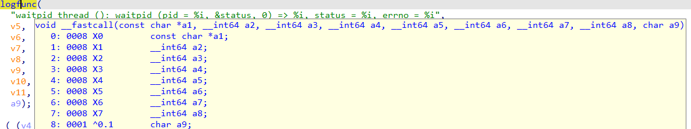
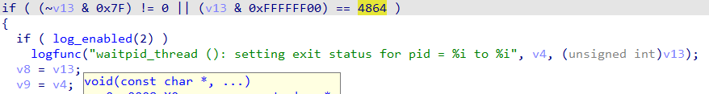
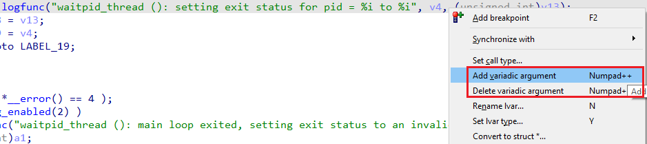
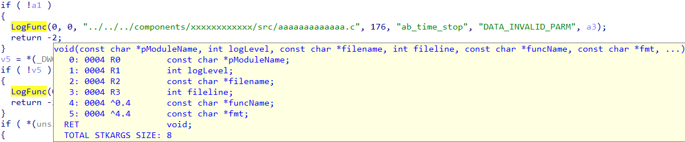
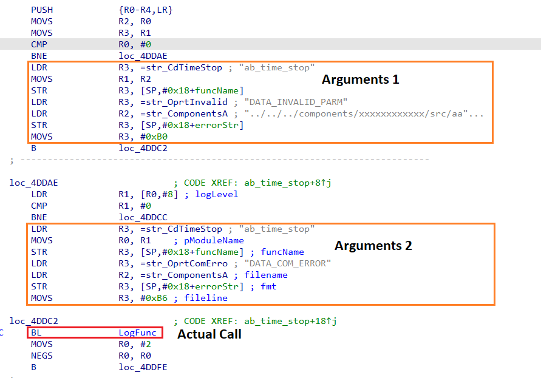
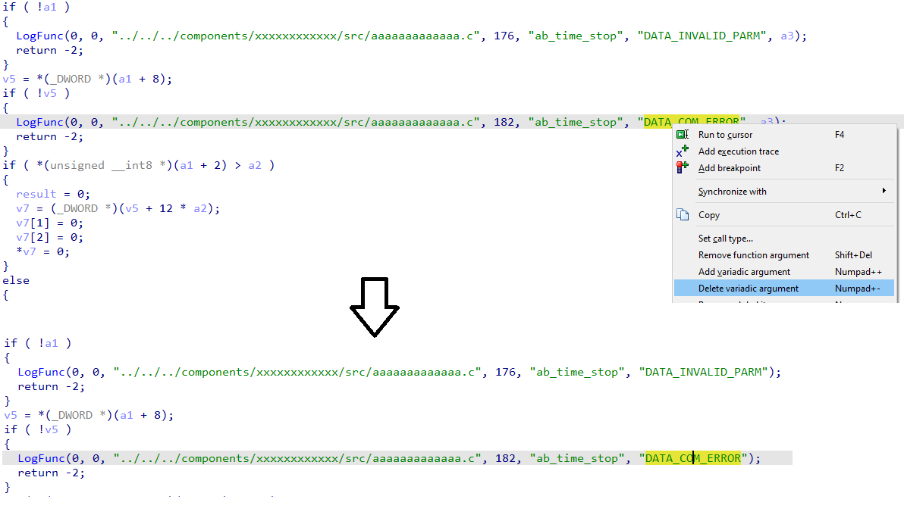
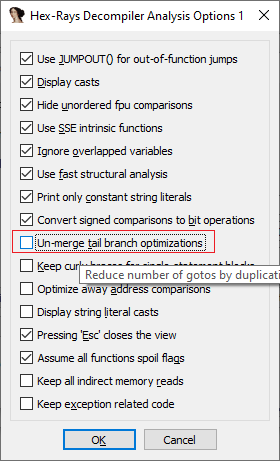
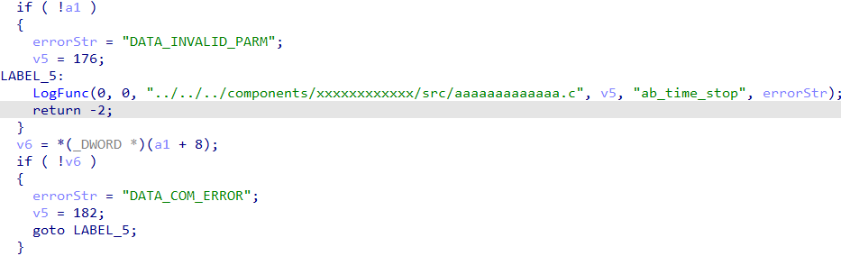

[Variadic functions](https://en.wikipedia.org/wiki/Variadic_function) are functions which accept different number of arguments depending on the needs of the caller. Typical examples include `printf` and `scanf` in C and C++ but there are other functions, or even some custom ones (specific to the binary being analyzed). Because each call of a variadic function may have a different set of arguments, they need special handling in the decompiler. In many cases the decompiler detects such functions and their arguments automatically but there may be situations where user intervention is required.  
变量函数是根据调用者的需要接受不同数量参数的函数。典型的例子包括 C 和 C++ 中的 `printf` 和 `scanf` ，但也有其他函数，甚至是一些自定义函数（针对被分析的二进制文件）。由于每次调用可变函数都可能有不同的参数集，因此反编译器需要对它们进行特殊处理。在许多情况下，反编译器会自动检测此类函数及其参数，但在某些情况下可能需要用户干预。

### Changing the function prototype  
更改函数原型

For standard variadic functions IDA usually applies the prototype from a [type library](https://hex-rays.com/blog/igors-tip-of-the-week-60-type-libraries/) but if there’s a non-standard function or IDA did not detect that a function is variadic, you can do it manually. For example, a decompiled prototype of unrecognized variadic function on ARM64 may look like this:  
对于标准的可变函数，IDA 通常会应用类型库中的原型，但如果存在非标准函数或 IDA 未检测到函数是可变的，则可以手动更改原型。例如，ARM64 上未识别的可变函数的反编译原型可能如下所示：

```
void __fastcall logfunc(
        const char *a1,
        __int64 a2,
        __int64 a3,
        __int64 a4,
        __int64 a5,
        __int64 a6,
        __int64 a7,
        __int64 a8,
        char a9)
```

But when you inspect the call sites, you see that most of the passed arguments are marked as possibly uninitialized (orange color):  
但在检查调用站点时，您会发现大部分传递的参数都被标记为可能未初始化（橙色）：



The first argument looks like a format string so the rest are likely variadic. So we can try to [change the prototype](https://hex-rays.com/blog/igors-tip-of-the-week-42-renaming-and-retyping-in-the-decompiler/) to:  
第一个参数看起来像格式字符串，因此其余的参数很可能是变量。因此，我们可以尝试将原型改为

```
void logfunc(const char *, ...);
```

which results in clean decompilation:  
这样反编译就会很干净：



### Adjusting variadic arguments  
调整可变参数

With correct prototypes, decompiler usually can guess the actual arguments passed to each invocation of the function.  However, in some cases the autodetection can misfire, especially if the function uses non-standard format specifiers or does not use a format string at all. In such case, you can adjust the actual number of arguments being passed to the call. This can be done via the context menu commands “Add variadic argument” and  “Delete variadic argument”, or the corresponding shortcuts Numpad + and Numpad -.  
有了正确的原型，反编译器通常可以猜出每次调用函数时传递的实际参数。不过，在某些情况下，自动检测可能会失灵，特别是当函数使用非标准格式指定符或根本不使用格式字符串时。在这种情况下，可以调整传给调用的实际参数数。这可以通过上下文菜单命令 "添加可变参数 "和 "删除可变参数"，或相应的快捷键 Numpad + 和 Numpad - 来实现。



### Variadic calls and tail branch optimization  
变量调用和尾分支优化

In some rare situations you may run into the following issue: when trying  to add or remove variadic arguments, the decompiler seems to ignore the action. This may occur in functions subjected to a specific optimization. For example, here’s pseudocode of a function which seems to have two calls to a logging function:  
在某些罕见的情况下，您可能会遇到以下问题：在尝试添加或删除变量参数时，反编译器似乎会忽略该操作。这种情况可能发生在经过特定优化的函数中。例如，下面是一个函数的伪代码，其中似乎有两次调用日志函数：



The decompiler has decided that `a3` is also passed to the calls, however we can see that the format strings do not have any format specifiers so a3 is a false positive and should be removed. However, using “Delete variadic argument” on the first call seems to have no effect. What’s happening?  
反编译器认为 `a3` 也被传递给了调用，但我们可以看到格式字符串中没有任何格式说明符，因此 a3 是一个误报，应予以删除。然而，在第一次调用时使用 "删除变量参数 "似乎没有任何效果。这是怎么回事？

This is one of the rare cases where switching to disassembly can clear things up. By pressing Tab, we can see a curious picture in the disassembly: there is only one call!  
这是极少数切换到反汇编后可以澄清问题的情况之一。按下 Tab ，我们可以在反汇编中看到一幅奇怪的画面：只有一个调用！



This is an example of so-called _tail branch merging_ optimization, where the same function call is reused with different arguments. For better code readability, the decompiler detects this situation and creates a duplicate call statement with the second set of arguments. Because the information about the number of variadic arguments is attached to the actual call instruction, it can’t be changed for the “fake” call inserted by the decompiler. You can change it for the “canonical” one which can be discovered by pressing Tab on the call (`BL` instruction). Removing the argument there affects both calls in the pseudocode.  
这就是所谓的尾部分支合并优化的一个例子，即相同的函数调用以不同的参数重复使用。为了提高代码的可读性，反编译器会检测到这种情况，并用第二组参数创建一个重复的调用语句。由于可变参数数的信息附在实际调用指令中，因此无法为反编译器插入的 "假 "调用进行修改。您可以为 "规范 "调用更改参数，通过在调用（ `BL` 指令）上按 Tab 可以发现规范调用。删除该参数会影响伪代码中的两个调用。



If you’re curious to see the “original” code, it can be done by turning off “Un-merge tail branch optimization” in the decompiler’s [Analysis Options 1](https://hex-rays.com/blog/igors-tip-of-the-week-56-string-literals-in-pseudocode/).  
如果你想看看 "原始 "代码，可以关闭反编译器分析选项 1 中的 "取消合并尾部分支优化"。



With it off, there is only one call just like in the disassembly, at the cost of an extra `goto` and some local variables:  
关闭后，与反汇编一样只有一个调用，但代价是多了一个 `goto` 和一些局部变量：



See also: 另请参见：

[Hex-Rays interactive operation: Add/del variadic arguments (hex-rays.com)  
Hex-Rays 交互式操作：添加/删除变量参数 (hex-rays.com)](https://www.hex-rays.com/products/decompiler/manual/cmd_variadic.shtml)