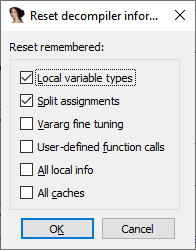

While working with pseudocode, you may make various changes to it, for example:  
在使用伪代码的过程中，您可能会对其进行各种修改，例如：

-   [add comments 添加注释](https://hex-rays.com/blog/igors-tip-of-the-week-43-annotating-the-decompiler-output/)
-   [rename local variables and change their types  
    重命名局部变量并更改其类型](https://hex-rays.com/blog/igors-tip-of-the-week-42-renaming-and-retyping-in-the-decompiler/)
-   [collapse code blocks  折叠代码块](https://hex-rays.com/blog/igors-tip-of-the-week-100-collapsing-pseudocode-parts/)
-   [map variables 映射变量](https://hex-rays.com/blog/igors-tip-of-the-week-77-mapped-variables/)
-   mark [skippable instructions](https://hex-rays.com/blog/igors-tip-of-the-week-68-skippable-instructions/)  
    标记可跳过指令
-   [split expressions  分割表达式](https://hex-rays.com/blog/igors-tip-of-the-week-69-split-expression/)
-   [adjust variadic arguments  
    调整变量参数](https://hex-rays.com/blog/igors-tip-of-the-week-101-decompiling-variadic-function-calls/)
-   select [union members](https://hex-rays.com/blog/igors-tip-of-the-week-75-working-with-unions/) 选择联合成员
-   and so on 等等

If the results of some actions do not look better, you can always undo, but what to do if you discover a problem long after the action which caused it?  
如果某些操作的结果看起来并不理想，您可以随时撤销，但如果在操作后很久才发现问题，该怎么办呢？

In fact, there is a way to reset specific or all user customizations at once.  
事实上，有一种方法可以一次性重置特定或所有用户自定义设置。

### Reset decompiler information  
重置反编译器信息

By Invoking Edit > Other > Reset decompiler information… you get the following dialog:  
调用 "编辑">"其他">"重置反编译器信息"......就会得到下面的对话框：

Here, you can pick what kinds of information to reset. The fist several options reset information specific to the current function while the last one also resets caches, such as the microcode and pseudocode caches, for all functions, as well as the [global cross references](https://hex-rays.com/blog/igors-tip-of-the-week-18-decompiler-and-global-cross-references/) cache.  
在这里，您可以选择要重置的信息种类。前几个选项会重置当前函数的特定信息，而最后一个选项也会重置所有函数的缓存，如微码和伪代码缓存，以及全局交叉引用缓存。

See also: 另请参见：

[Decompiler Manual: Interactive operation  
反编译器手册交互式操作](https://www.hex-rays.com/products/decompiler/manual/interactive.shtml#07)

[Igor’s tip of the week #101: Decompiling variadic function calls  
Igor 本周小贴士 #101：反编译变量函数调用](https://hex-rays.com/blog/igors-tip-of-the-week-101-decompiling-variadic-function-calls/) [IDA Teams: Documentation published  
IDA 团队：文档发布](https://hex-rays.com/blog/ida-teams-documentation-published/)