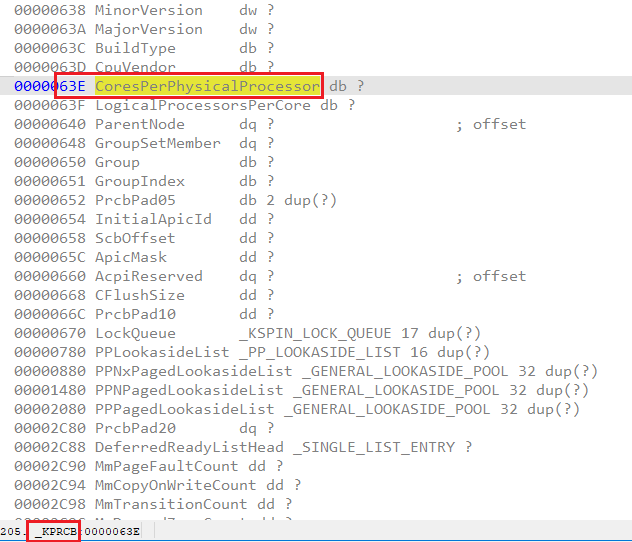
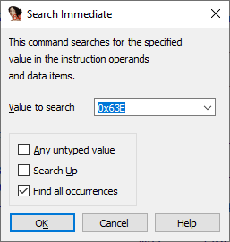
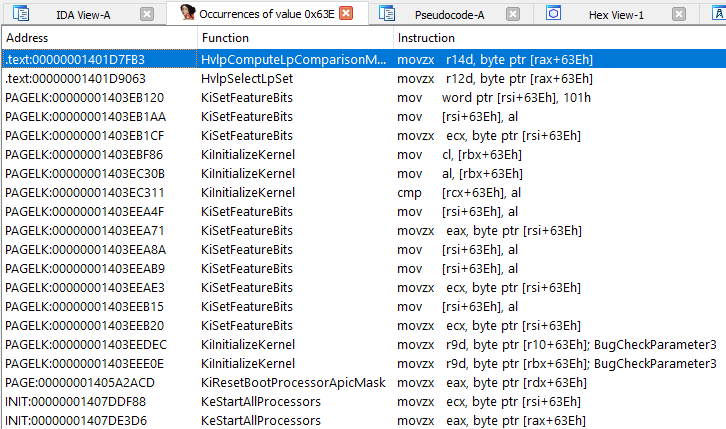

Immediate search is one of three main [search types](https://hex-rays.com/blog/igors-tip-of-the-week-48-searching-in-ida/) available in IDA. While not that known, it can be very useful in some situations. Here are some examples.  
立即搜索是 IDA 提供的三种主要搜索类型之一。虽然它并不为人所知，但在某些情况下却非常有用。下面是一些例子。

### Unique (magic) constants  
独特（神奇）常量

If you know some unique constants used by the program, looking for them can let you narrow down the range of code you have to analyze. For example, if a program reports a numerical error code, you could look for it to find the possible locations which may be returning this error.  
如果知道程序使用的一些独特常量，查找它们可以缩小需要分析的代码范围。例如，如果一个程序报告了一个数字错误代码，你就可以通过查找它来找到可能返回该错误的位置。

### Undiscovered cross-references in RISC processors  
RISC 处理器中未发现的交叉引用

Many RISC processors use fixed-width instructions which does not leave enough space for encoding full address values in the instruction. Thus they have to resort to building address values out of small pieces. For, example, in SPARC, loading of a 32-bit value has to be done as a [pair of instructions](https://arcb.csc.ncsu.edu/~mueller/codeopt/codeopt00/notes/sparc.html):  
许多 RISC 处理器使用固定宽度指令，这样就没有足够的空间在指令中编码完整的地址值。因此，它们不得不将地址值分成小块。例如，在 SPARC 中，32 位值的加载必须以一对指令的形式完成：

```
sethi %hi(Prompt),%o1
or    %o1,%lo(Prompt),%o1
```

Where `%hi` returns top 22 bits of the value and `%lo` returns the low 10 bits. Because such instructions may be not immediately next to each other, IDA may fail to “connect” them and recover the full 32-bit value, leading to missing cross references. So if you have, for example, a string constant at address `N`, which you think should be referenced from somewhere, doing an immediate search for `N&0x3FF` should produce a list of potential candidates for instructions referring to that address.  
其中 `%hi` 返回值的前 22 位，而 `%lo` 返回值的后 10 位。由于这些指令可能不是紧挨着的，IDA 可能无法 "连接 "它们并恢复完整的 32 位值，从而导致交叉引用丢失。举例来说，如果在地址 `N` 处有一个字符串常量，你认为应该从某处引用该常量，那么立即搜索 `N&0x3FF` 就会产生一个引用该地址的潜在候选指令列表。

## Structure field references  
结构字段引用

Sometimes you may have a structure with a field at a specific offset which is pretty unique (not a small or round value) and want to find where it is used in the program. For example, let’s look at a recent Windows kernel and the structure `_KPRCB`. At offset 63Eh, it has a field `CoresPerPhysicalProcessor:`  
有时，你可能会有一个结构，它的某个字段位于非常独特的特定偏移量处（不是一个小值或整数值），你想找到它在程序中的使用位置。例如，让我们看看最近的 Windows 内核和结构 `_KPRCB` 。在偏移量 63Eh 处有一个字段 `CoresPerPhysicalProcessor:`



How to find where it is used? Searching for the value 0x63e gives a list of instructions using that value.  
如何找到它的使用位置？搜索值 0x63e 可以得到使用该值的指令列表。

  


You can then inspect these instructions and see if they indeed reference the `_KPRCB` field and not something else.  
然后可以检查这些指令，看看它们是否确实引用了 `_KPRCB` 字段，而不是其他内容。

This is probably one of the best uses for immediate search but it does not replace manual analysis. For example:  
这可能是即时搜索的最佳用途之一，但不能取代人工分析。例如

1.  it may miss references which do not use the value directly but calculate it one way or another;  
    它可能会遗漏那些不直接使用数值但以某种方式计算数值的参考文献；
2.  false positives may happen, especially for common or small values  
    可能会出现误报，特别是对于常见或较小的值
3.  the field may be referenced indirectly via a bigger containing structure (e.g. `_KPCR` includes `_KPRCB` as a member, so references from `_KPCR` will have an additional offset).  
    字段可能会通过一个更大的包含结构被间接引用（例如， `_KPCR` 包含 `_KPRCB` 作为成员，因此来自 `_KPCR` 的引用将有一个额外的偏移量）。

See also: 另请参见：

[IDA Help: Search for next instruction/data with the specified operand  
IDA 帮助：搜索具有指定操作数的下一条指令/数据](https://www.hex-rays.com/products/ida/support/idadoc/574.shtml)