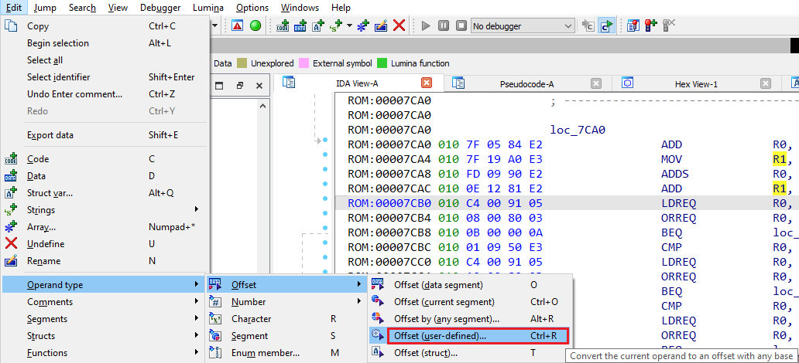
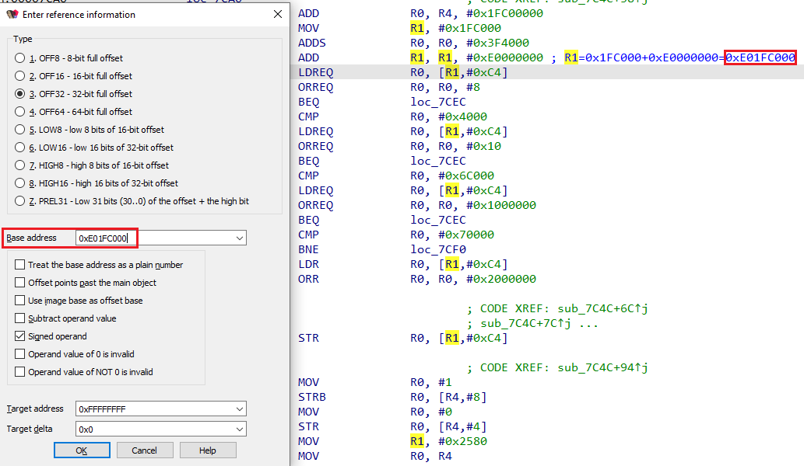
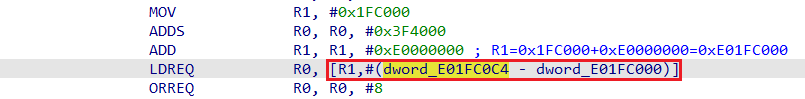

We’ve already covered [simple offsets](https://hex-rays.com/blog/igors-tip-of-the-week-95-offsets/), where an operand value or a data value matches an address in the program and so can be directly converted to an offset. However, programs may also employ more complex, or indirect ways of referring to a location. One common approach is using a small offset from some predefined base address.  
我们已经介绍过简单的偏移，即操作数值或数据值与程序中的地址相匹配，因此可以直接转换为偏移。不过，程序也可能采用更复杂或间接的方式来引用位置。一种常见的方法是从某个预定义的基址开始使用一个小偏移量。

### Offset (displacement) from a register  
寄存器偏移（位移

Many processors support instructions with addressing modes called “register with displacement”, “register with offset” or similar. Operands in such mode may use syntax similar to following:  
许多处理器支持 "带位移寄存器"、"带偏移寄存器 "或类似寻址模式的指令。这种模式下的操作数可以使用类似以下的语法：

1.  reg(offset)
2.  offset(reg) 偏移（注册）
3.  reg[offset] 注册[偏移］
4.  [reg, offset] [reg,偏移量］
5.  [reg+offset] [寄存器+偏移量］
6.  etc. 等等。

The basic logic is the same in all cases: offset is added to the value of the register and then used as a number or (more commonly) as an address. In the latter case it may be useful to have IDA calculate the final address for you and add the cross-reference to it. If you know the value of the register at the time this instruction is executed (e.g. it is set in the preceding instructions), it is very simple to do:  
在所有情况下，基本逻辑都是一样的：偏移量加到寄存器的值上，然后作为数字或（更常见的）地址使用。在后一种情况下，让 IDA 为你计算最终地址并添加交叉引用可能会有用。如果知道执行该指令时寄存器的值（例如在前面的指令中已经设置），那么操作就非常简单：

1.  With the cursor on the operand, Invoke Edit > Operand type > Offset > Offset (user-defined), or press Ctrl–R;  
    将光标放在操作数上，调用编辑 > 操作数类型 > 偏移 > 偏移（用户定义），或按 Ctrl - R ；  
    
2.  Enter the register value in the _Base address_ field;  
    在基地址字段中输入寄存器值；  
    
3.  Click OK; 点击 "确定"；
4.  IDA will calculate the final address, replace the offset value by an equivalent expression, and add a cross-reference to destination:  
    IDA 将计算最终地址，用等效表达式替换偏移值，并添加目标交叉引用：  
    

Now it is obvious that the location being referenced is  `dword_E01FC0C4`.  
现在很明显，被引用的位置是 `dword_E01FC0C4` 。

See also:  另请参见：  
[IDA Help: Convert operand to offset (user-defined base)  
IDA 帮助：将操作数转换为偏移量（用户定义基数）](https://www.hex-rays.com/products/ida/support/idadoc/470.shtml)  
[IDA Help: Complex Offset Expression  
IDA 帮助复杂偏移表达式](https://www.hex-rays.com/products/ida/support/idadoc/471.shtml)