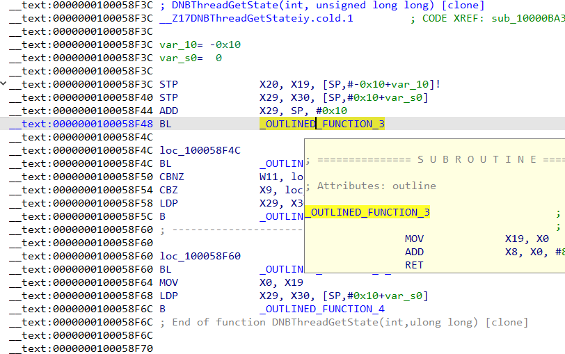
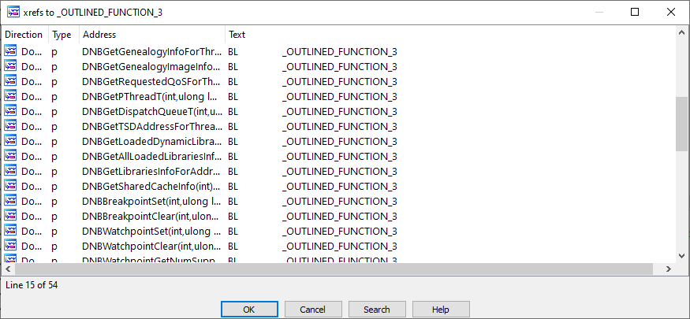
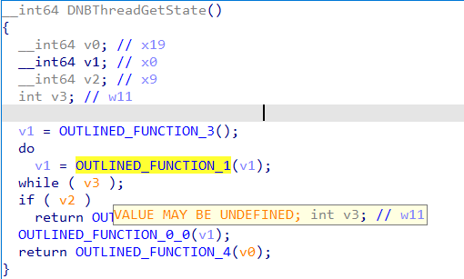
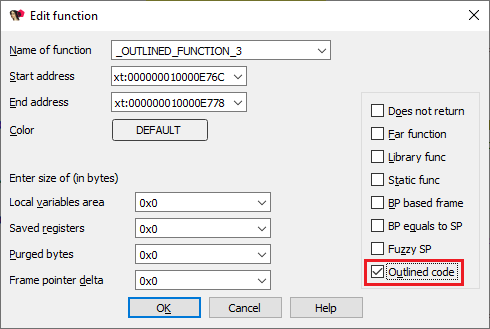
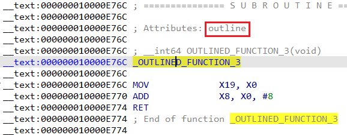
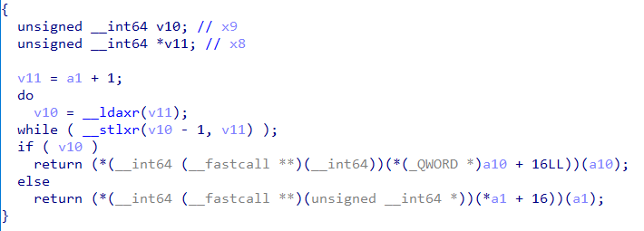
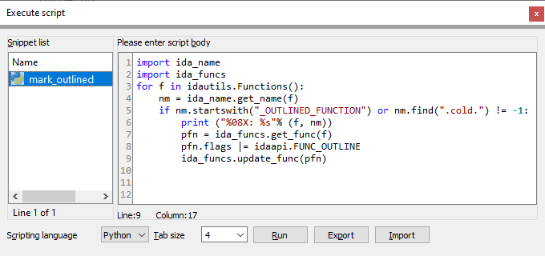

The release notes for [IDA 8.0](https://hex-rays.com/products/ida/news/8_0/) mention _outlined functions_. What are those and how to deal with them in IDA?  
IDA 8.0 的发行说明中提到了概述功能。它们是什么，如何在 IDA 中处理它们？

Function outlining is an optimization that saves code size by identifying recurring sequences of machine code and replacing each instance of the sequence with a call to a new function that contains the identified sequence of operations. It can be considered an extension of the [shared function tail](https://hex-rays.com/blog/igors-tip-of-the-week-87-function-chunks-and-the-decompiler/) optimization by sharing not only tails but arbitrary common parts of functions.  
函数大纲是一种优化方法，它通过识别机器代码中重复出现的序列，并将序列中的每个实例替换为对包含已识别操作序列的新函数的调用，从而节省代码量。它不仅能共享函数尾部，还能共享函数的任意公共部分，因此可视为共享函数尾部优化的扩展。

### Function outlining example  
函数大纲示例

For example, here’s a function from iOS’s `debugserver` with some calls to outlined fragments:  
例如，下面是 iOS 的 `debugserver` 中的一个函数，其中包含一些对概述片段的调用：



The first fragment contains only two instructions besides the return instruction so it may not sound like we’re saving much, but by looking at the cross-references you’ll see that it is used in many places:  
除了返回指令外，第一个片段只包含两条指令，因此听起来似乎并没有节省多少，但通过交叉引用，你会发现很多地方都用到了它：



So the savings accumulated across the whole program can be quite substantial.  
因此，整个程序累积起来可以节省相当可观的费用。

### Handling outlined functions in decompiler  
在反编译器中处理概述函数

If we decompile the function, the calls to outlined fragments are shown as is, and the registers used or set by them show up as potentially undefined (orange color):  
如果我们反编译该函数，对勾勒片段的调用将显示为原样，而这些调用所使用或设置的寄存器则显示为潜在的未定义（橙色）：



To tell the decompiler that the calls should be inlined into the function’s body, all the `OUTLINED_FUNCTION_NN` should be marked as outlined code. This can be done manually, via the Edit Function (Alt–P) dialog:  
为了告诉反编译器这些调用应被内联到函数的主体中，所有的 `OUTLINED_FUNCTION_NN` 都应被标记为轮廓代码。这可以通过编辑函数 ( Alt - P ) 对话框手动完成：



The added attribute is also displayed in the listing:  
添加的属性也会显示在列表中：



Once all outlined functions are marked up, the decompiler inlines them and there are no more possibly undefined variables:  
一旦所有概述函数都被标记出来，反编译器就会对其进行内联，这样就不会再有可能未定义的变量了：



### Automating outlined function processing  
自动处理概述函数

If you have a big binary with hundreds or thousands of functions, it may become pretty tedious to mark up outlined functions manually. In such case, making a small script may speed things up. For example, if you have symbols and outlined functions have a known naming pattern, the following Python snippet should work:  
如果您有一个包含成百上千个函数的大型二进制文件，那么手动标记概述函数可能会变得非常乏味。在这种情况下，编写一个小脚本可能会加快速度。例如，如果您有符号，并且概述函数有已知的命名模式，那么下面的 Python 代码段应该可以工作：

```
import idautils
import ida_name
import ida_funcs
for f in idautils.Functions():
    nm = ida_name.get_name(f)
    if nm.startswith("_OUTLINED_FUNCTION") or nm.find(".cold.") != -1:
        print ("%08X: %s"% (f, nm))
        pfn = ida_funcs.get_func(f) 
        pfn.flags |= idaapi.FUNC_OUTLINE 
        ida_funcs.update_func(pfn)
```

It can be executed using File > Script command… (Shift+F2)  
它可以通过文件 > 脚本命令来执行... ( Shift + F2 )



See also: 另请参见：

[IDA Help: Edit Function   
IDA 帮助：编辑功能](https://www.hex-rays.com/products/ida/support/idadoc/485.shtml)

[IDA Help: Function flags  
IDA 帮助函数标志](https://www.hex-rays.com/products/ida/support/idadoc/1729.shtml)