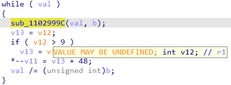
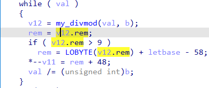

The Hex-Rays decompiler was initially created to decompile C code, so its pseudocode output uses (mostly) C syntax. However, the input binaries may be compiled using other languages: C++, Pascal, Basic, ADA, and many others. While the code of most of them can be represented in C without real issues, some have peculiarities which require [language extensions](https://hex-rays.com/blog/igors-tip-of-the-week-51-custom-calling-conventions/) or have to be handled with [user input](https://hex-rays.com/blog/igors-tip-of-the-week-71-decompile-as-call/). Still, some languages use approaches so different from standard compiled С code that special handling for that is necessary. For example, [Go](https://go.dev/) uses a [calling convention](https://go.dev/src/cmd/compile/abi-internal) (stack-based or register-based) so different from standard C calling conventions, that custom support for it had to be [added to IDA](https://hex-rays.com/products/ida/news/7_6/).   
Hex-Rays 反编译器最初是用来反编译 C 代码的，因此它的伪代码输出（大部分）使用 C 语法。不过，输入的二进制文件也可以使用其他语言编译：C++、Pascal、Basic、ADA 等等。虽然其中大多数语言的代码都可以用 C 语言表示而不会出现问题，但有些语言有其特殊性，需要进行语言扩展或通过用户输入来处理。不过，有些语言使用的方法与标准的编译С代码大相径庭，因此有必要对此进行特殊处理。例如，Go 使用的调用约定（基于堆栈或基于寄存器）与标准 C 调用约定大相径庭，因此必须在 IDA 中添加自定义支持。

### Multiple return values 多个返回值

Even with custom calling conventions, one fundamental limitation of IDA’s type system remains (as of IDA 8.0): a function may return only a single value. However, even in otherwise C-style programs you may encounter functions which return more than one value. One example is compiler helpers like `idivmod`/`uidivmod`. They return simultaneously the quotient and remainder of a division operation. The decompiler knows about the standard ones (e.g. `__aeabi_idivmod`for ARM EABI) but you may encounter a non-standard implementation, or an unrelated function using a similar approach (e.g. a function written manually in assembly).  
即使使用自定义调用约定，IDA 类型系统的一个基本限制仍然存在（截至 IDA 8.0）：一个函数只能返回一个值。然而，即使在 C 风格的程序中，您也可能会遇到返回一个以上值的函数。其中一个例子就是 `idivmod` / `uidivmod` 这样的编译器帮助函数。它们同时返回除法运算的商和余数。反编译器知道标准的函数（如 ARM EABI 的 `__aeabi_idivmod` ），但您可能会遇到非标准的实现，或使用类似方法的不相关函数（如用汇编手动编写的函数）。

Because the decompiler does not expect that function returns more than one value, you may need to inspect the disassembly or look at the place of the call to recognize such functions. For example, here’s a fragment of decompiled ARM32 code which seems to use an undefined register value:  
由于反编译器不希望函数返回一个以上的值，因此您可能需要检查反汇编或查看调用的位置来识别此类函数。例如，下面是一段反编译后的 ARM32 代码，它似乎使用了一个未定义的寄存器值：  


The function seems to modify the `R1` register, although normally the return values (for 32-bit types) are placed in R0. Possibly this is an equivalent of divmod function which returns quotient in `R0` and remainder in `R1`?  
该函数似乎修改了 `R1` 寄存器，尽管返回值（32 位类型）通常放在 R0 中。这可能等同于 divmod 函数，后者在 `R0` 中返回商，在 `R1` 中返回余数。

To handle this, we can use an artificial structure and a custom calling convention specifying the registers and/or stack locations where it should be placed. For example, add such struct to Local Types:  
为了解决这个问题，我们可以使用一个人工结构和一个自定义调用约定，指定寄存器和/或堆栈位置。例如，在本地类型中添加这样的结构：

```
struct divmod_t
{
  int quot;
  int rem;
};
```

and set the function prototype: `divmod_t __usercall my_divmod@<R1:R0>(int@<R0>, int@<R1>);`  
并设置函数原型： `divmod_t __usercall my_divmod@<R1:R0>(int@<R0>, int@<R1>);`

The decompiler then interprets the register values after the call as if they were structure fields:  
然后，反编译器会把调用后的寄存器值当作结构域来解释：



A similar approach may be used for languages with native support for functions with multiple return values: Go, Swift, Rust etc.  
对于本机支持多返回值函数的语言，也可以使用类似的方法：Go、Swift、Rust 等。

See also: 另请参见：

[Igor’s tip of the week #51: Custom calling conventions  
伊戈尔本周提示 51：自定义调用约定](https://hex-rays.com/blog/igors-tip-of-the-week-51-custom-calling-conventions/)