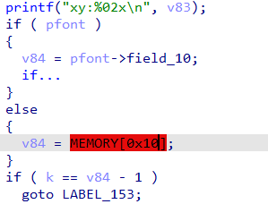
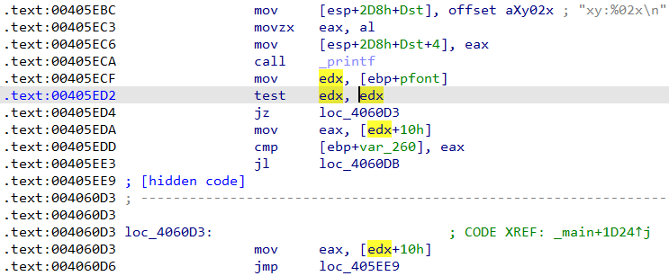

Sometimes in pseudocode you may encounter strange-looking code:  
在伪代码中，有时你会遇到一些看起来很奇怪的代码：

The code seems to dereference an array called`MEMORY` and is highlighted in red. However, this variable is not defined anywhere. What is it?  
代码似乎要取消引用一个名为 `MEMORY` 的数组，并用红色标出。但是，这个变量并没有在任何地方定义。这是什么？

Such notation is used by the decompiler when the code accesses memory addresses not present in the database. In most cases it indicates an error in the original source code. If we look at the disassembly for the example above, we’ll see this:  
当代码访问数据库中不存在的内存地址时，反编译器会使用这种符号。在大多数情况下，它表示原始源代码中存在错误。如果我们看一下上面例子的反汇编，就会发现这一点：

The variable `pfont` is loaded into register `edx` which is then compared against zero using `test edx, edx/jz` sequence. The jump to `loc_4060D3` can only occur if `edx` is zero, which means that the `mov eax, [edx+10h]` instruction will try to dereference the address `0x10`. Because the database does not contain the address `0x10`, it can’t be represented as a normal or a dummy variable so the decompiler represents it as a pseudo-variable `MEMORY` and uses the address as the index. The dereference is shown in red to bring attention to the potential error in the code. For example, judging by the assembly, in this binary the programmer tried reading a structure pointer even if it is NULL. A more modern compiler would probably even remove such code as dereferencing NULL pointer is undefined behavior.  
变量 `pfont` 被加载到寄存器 `edx` 中，然后使用 `test edx, edx/jz` 序列与零进行比较。只有当 `edx` 为零时，才能跳转到 `loc_4060D3` ，这意味着 `mov eax, [edx+10h]` 指令将尝试取消引用地址 `0x10` 。由于数据库中不包含地址 `0x10` ，因此无法将其表示为普通变量或虚拟变量，所以反编译器将其表示为伪变量 `MEMORY` 并使用该地址作为索引。反引用用红色显示，以引起对代码中潜在错误的注意。例如，从汇编程序来看，在这个二进制文件中，程序员试图读取一个结构指针，即使它是 NULL。更现代的编译器甚至可能会删除这样的代码，因为取消引用 NULL 指针是未定义的行为。

In cases where such access is **not** an error (for example, the code directly accesses memory-mapped hardware registers), creating a new segment for the accessed address range is usually the correct approach.  
在这种访问不是错误的情况下（例如，代码直接访问内存映射的硬件寄存器），为访问的地址范围创建一个新的段通常是正确的方法。