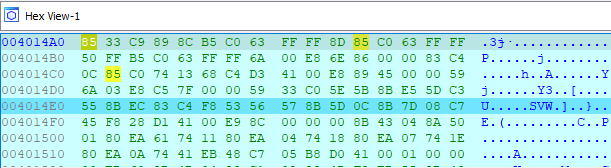
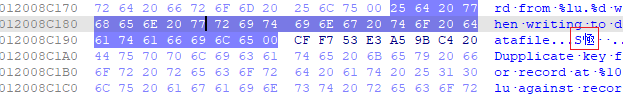
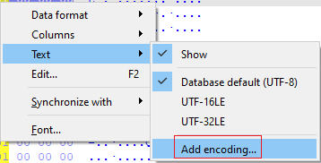
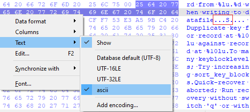
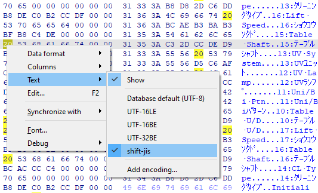

The Hex view is used to display the contents of the database as a hex dump. It is also used during debugging to display memory contents.  
十六进制视图用于以十六进制转储形式显示数据库内容。在调试过程中，它还用于显示内存内容。

By default it has a part on the right with the textual representation of the data. Usually the text part shows Latin letters or dots for unprintable characters but you may also encounter something unusual:  
默认情况下，它的右侧部分是数据的文本表示。通常情况下，文本部分显示的是拉丁字母或无法打印的字符点，但您也可能会遇到一些不寻常的情况：

Why is there Chinese among English? Is it a hidden message and the binary actually comes from China?  
为什么英文中会有中文？难道这是一个隐藏的信息，二进制实际上来自中国？

In fact, the mystery has a very simple explanation: the encoding used for showing text data in hex view uses the [database default](https://hex-rays.com/blog/igor-tip-of-the-week-13-string-literals-and-custom-encodings/) which is usually UTF-8, so a valid UTF-8 byte sequence may decode to Chinese, Japanese, Russian, Korean, or even emoji. If you prefer to see only the plain ASCII text, you can change the encoding using these simple steps:  
事实上，这个谜团有一个非常简单的解释：十六进制视图中用于显示文本数据的编码使用的是数据库默认值，通常是UTF-8，因此一个有效的UTF-8字节序列可能会解码为中文、日文、俄文、韩文甚至表情符号。如果你希望只看到纯 ASCII 文本，可以使用以下简单步骤更改编码：

1.  From the hex view’s context menu, invoke Text > Add encoding…  
    在十六进制视图的上下文菜单中，调用文本 > 添加编码...  
    
2.  Enter “ascii”; 输入 "ascii"；
3.  the new encoding will be added to the list and made default, so any bytes not falling into the ASCII range will be shown as unprintable:  
    新编码将被添加到列表中并设为默认编码，因此任何不在 ASCII 范围内的字节都将显示为不可打印：  
    

Instead of “ascii” you can use another encoding which matches the type of binary you’re analyzing. For example, if you work with legacy Japanese software, encodings like “Shift-JIS”, “cp932” or “EUC-JP” may help you discover otherwise hidden text.  
您可以使用与您正在分析的二进制类型相匹配的其他编码来代替 "ascii"。例如，如果你使用的是传统的日文软件，"Shift-JIS"、"cp932 "或 "EUC-JP "等编码可能会帮助你发现隐藏的文本。

See also: 另请参见：

[Igor’s tip of the week #13: String literals and custom encodings  
伊戈尔本周小贴士 #13：字符串字面量和自定义编码](https://hex-rays.com/blog/igor-tip-of-the-week-13-string-literals-and-custom-encodings/)