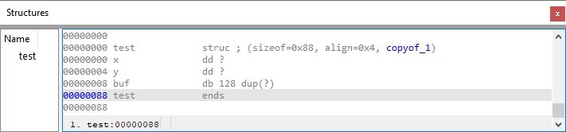

When reverse engineering a big program, you often run into information stored in structures. The standard way of doing it involves using the Structures window and adding fields one by one, similar to the way you format data items in disassembly. But are there other options? Let’s look at some of them.  
在逆向工程大型程序时，你经常会遇到存储在结构中的信息。标准的方法是使用 "结构 "窗口逐个添加字段，这与反汇编中格式化数据项的方法类似。但还有其他选择吗？让我们来看看其中的一些。

### Using already formatted data  
使用已格式化的数据

This was mentioned briefly in the [post on selection](https://hex-rays.com/blog/igor-tip-of-the-week-03-selection-in-ida/) but is worth repeating. If you happen to have some formatted data in your disassembly and want to group it into a structure, just select it and choose “Create struct from selection” in the context menu.  
这一点在关于选择的文章中已简要提及，但仍值得重复。如果你在反汇编中碰巧有一些格式化数据，并想将其组合成一个结构，只需选中它，然后在上下文菜单中选择 "从选区创建结构 "即可。

### Using Local Types 使用本地类型

The Local Types view shows the _high level_  or _C level_ types used in the database such as structs, enums and typedefs. It is most useful with the decompiler but can still be used for the _a__ssembler level_ types such as Structures and Enums. For example, open the Local Types (Shift–F1 or View > Open subviews > Local Types), then press Ins (or pick Insert.. from the context menu). In the new dialog enter a C syntax structure definition and click OK.  
本地类型视图显示数据库中使用的高级或 C 级类型，如结构体、枚举和类型定义。它在反编译器中最有用，但仍可用于汇编级类型，如结构和枚举。例如，打开本地类型（ Shift - F1 或视图 > 打开子视图 > 本地类型），然后按 Ins （或从上下文菜单中选择插入...）。在新对话框中输入 C 语法结构定义，然后单击 "确定"。

The structure appears in the list but cannot yet be used in disassembly.   
该结构将出现在列表中，但还不能用于反汇编。

To make it available, double-click it and answer “Yes”.  
要使其可用，请双击它并回答 "是"。

Now that a corresponding assembler level type has been created in the Structures view, it can be used in the disassembly.  
在 "结构 "视图中创建了相应的汇编级类型后，就可以在反汇编中使用它了。

For more info about using Local Types and two kinds of types check [this IDA Help topic](https://www.hex-rays.com/products/ida/support/idadoc/1042.shtml).  
有关使用本地类型和两种类型的更多信息，请查看 IDA 帮助主题。