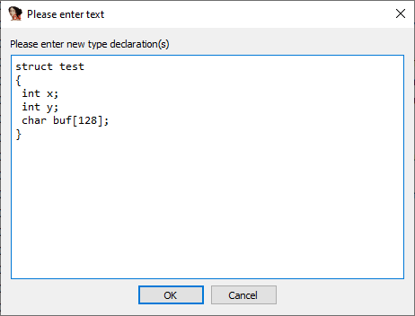

在逆向分析大型程序时，你经常会遇到以结构体形式存储的信息。标准的做法是使用 `Structures` 窗口，然后像在反汇编中格式化数据项那样，一次添加一个字段。但有没有其他更快捷的方法呢？我们来看几个选项。

### 使用已格式化的数据

这一点在之前的“[选区](https://hex-rays.com/blog/igor-tip-of-the-week-03-selection-in-ida/)”文章中曾简要提到，但值得重复说明。如果你在反汇编中已经有一些格式化好的数据，并且想将它们组合成一个结构体，只需选中它们，然后在右键菜单中选择 `Create struct from selection`（从选区创建结构体）。

### 使用本地类型（Local Types）

`Local Types` 视图会显示数据库中使用的高级类型或 C 语言级别的类型，例如 `struct`、`enum` 和 `typedef`。它在配合反编译器时最有用，但即使在汇编级别的类型（`Structures` 和 `Enums`）中也能使用。

打开 `Local Types`（快捷键 `Shift–F1` 或菜单 `View > Open subviews > Local Types`），按 `Ins`（或在右键菜单中选择 `Insert…`），在新对话框中输入 C 语法的结构体定义，然后点击 OK。

结构体会出现在列表中，但此时还不能在反汇编中使用。

双击该结构体，并在提示中选择 Yes。

此时，`Structures` 视图中会创建一个对应的汇编级别类型，它就可以在反汇编中使用了。

关于 Local Types 以及两种类型的更多信息，可以参考 [IDA 帮助文档](https://www.hex-rays.com/products/ida/support/idadoc/1042.shtml)中的相关主题。

原文地址：https://hex-rays.com/blog/igor-tip-of-the-week-11-quickly-creating-structures
