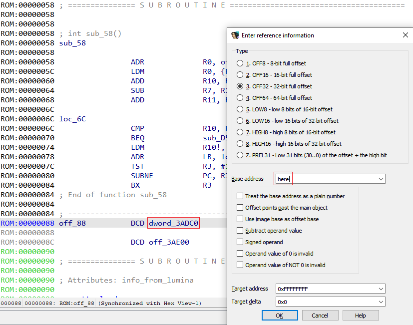
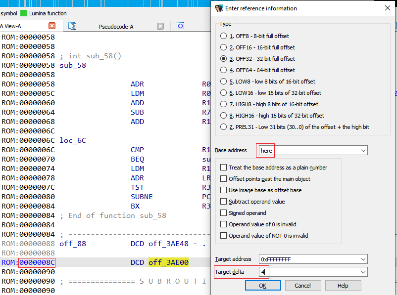

We’ve covered [offsets with base](https://hex-rays.com/blog/igors-tip-of-the-week-105-offsets-with-custom-base/) previously. There is a variation of such offsets commonly used in position-independent code which can be handled easily with a little trick.  
前面我们已经介绍过基数偏移。在独立于位置的代码中常用的偏移量有一种变体，只需一个小技巧就能轻松处理。

Let’s consider this ARM function from an ARM32 firmware:  
让我们来看看 ARM32 固件中的这个 ARM 函数：

```
ROM:00000058 ; int sub_58()
ROM:00000058 sub_58                                  ; CODE XREF: sub_10A4:loc_50↑j
ROM:00000058                                         ; DATA XREF: sub_8D40+20↓r ...
ROM:00000058                 ADR             R0, off_88 ; R0 = 0x88
ROM:0000005C                 LDM             R0, {R10,R11} ; R10 = 0x3ADC0, R11 = 0x3AE00
ROM:00000060                 ADD             R10, R10, R0 ; R10 = 0x3ADC0+0x88
ROM:00000064                 SUB             R7, R10, #1
ROM:00000068                 ADD             R11, R11, R0 ; R11 = 0x3AE00+0x88
ROM:0000006C
ROM:0000006C loc_6C                                  ; DATA XREF: sub_58+20↓o
ROM:0000006C                 CMP             R10, R11
ROM:00000070                 BEQ             sub_D50
ROM:00000074                 LDM             R10!, {R0-R3}
ROM:00000078                 ADR             LR, loc_6C
ROM:0000007C                 TST             R3, #1
ROM:00000080                 SUBNE           PC, R7, R3
ROM:00000084                 BX              R3
ROM:00000084 ; End of function sub_58
ROM:00000084
ROM:00000084 ; ---------------------------------------------------------------------------
ROM:00000088 off_88          DCD dword_3ADC0         ; DATA XREF: sub_58↑o
ROM:00000088                                         ; sub_58+4↑o
ROM:0000008C                 DCD off_3AE00
```

IDA has converted the values at addresses 88 and 8C to offsets because they happen to be valid addresses, but if you look at what the code does (I’ve added comments describing what happens), we’ll see that both values are added to the address from which they’re loaded (0x88), i.e. they’re relative to their own position (or self-relative).   
IDA 将地址 88 和 8C 处的值转换为偏移量，因为它们恰好是有效地址，但如果查看代码的执行情况（我添加了注释来描述发生了什么），我们会发现这两个值都被添加到了它们被加载的地址（0x88），即它们相对于自己的位置（或自相关）。

To get the final value they refer to, we can use the action Edit > Operand type > Offset >Offset (user-defined) (shortcut Ctrl–R), and enter as the base either the address value (0x88), or, for the case of the value at `00000088`, the IDC keyword `here`, which expands to the address under the cursor.  
要获得它们最终指向的值，我们可以使用编辑 > 运算符类型 > 偏移量 > 偏移量（用户定义）（快捷键 Ctrl - R ），然后输入地址值 (0x88)，或者，对于 `00000088` 处的值，输入 IDC 关键字 `here` ，它将扩展到光标下的地址。



IDA calculates the final address and replaces the value with an expression which uses a special symbol `.`, which denotes the current address on ARM:  
IDA 会计算最终地址，并将该值替换为使用特殊符号 `.` 的表达式，该符号表示 ARM 上的当前地址：

```
ROM:00000088 off_88          DCD off_3AE48 - .       ; DATA XREF: sub_58↑o
```

For the value at `0000008C`, `here` will not work since it expands to 0x8c while the addend is 0x88. There are several options we can use:  
对于 `0000008C` 的值， `here` 将不起作用，因为它扩展为 0x8c，而加数是 0x88。我们可以使用以下几种方法

1.  use the actual value `0x88` as the base  
    使用实际值 `0x88` 作为基数
2.  use the expression `here-4`which resolves to 0x88.  
    使用表达式 `here-4` ，解析为 0x88。
3.  use `here`, but specify 4 in the _Target delta_ field.   
    使用 `here` ，但在目标 delta 字段中指定 4。



IDA will use the delta as an additional adjustment for the expression:  
IDA 将使用 delta 作为表达式的额外调整：

```
ROM:0000008C                 DCD byte_3AE88+4 - .
```

Now we can see what addresses the function is actually using and analyze it further.  
现在我们可以查看函数实际使用的地址，并对其进行进一步分析。

See also: 另请参见：

[Igor’s tip of the week #105: Offsets with custom base  
伊戈尔的每周提示 #105：使用自定义基数的偏移量](https://hex-rays.com/blog/igors-tip-of-the-week-105-offsets-with-custom-base/)

[Igor’s tip of the week #21: Calculator and expression evaluation feature in IDA  
伊戈尔本周提示 #21：IDA 中的计算器和表达式评估功能](https://hex-rays.com/blog/igors-tip-of-the-week-21-calculator-and-expression-evaluation-feature-in-ida/)