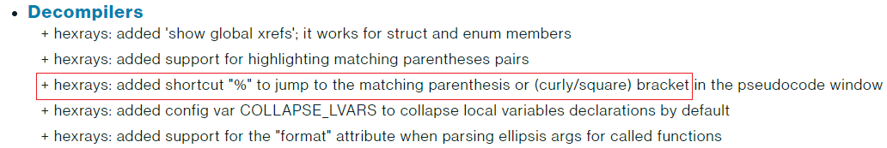
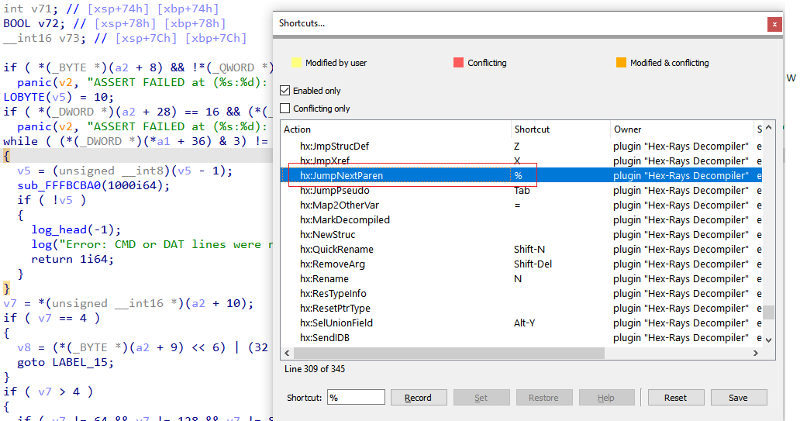

When working with big functions in the decompiler, it may be difficult to find what you need if the listing is long. While you can use [cross-references](https://hex-rays.com/blog/igors-tip-of-the-week-18-decompiler-and-global-cross-references/) to jump between uses of a variable or [collapse](https://hex-rays.com/blog/igors-tip-of-the-week-100-collapsing-pseudocode-parts/) parts of pseudocode to make it more compact, there is one simple shortcut which can make your life easier.  
在反编译器中处理大型函数时，如果列表很长，可能很难找到所需的内容。您可以使用交叉引用在变量的使用之间跳转，或折叠伪代码的部分内容使其更紧凑，但有一个简单的快捷方式可以让您的工作更轻松。

The shortcut is not currently (IDA 8.1) shown in the context menu, but it was mentioned in the [release notes for IDA 7.4](https://hex-rays.com/products/ida/news/7_4/):  
该快捷方式目前（IDA 8.1）并未显示在右键菜单中，但在 IDA 7.4 的发行说明中有所提及：

You can also discover it by opening the Options > Shortcuts… dialog while the cursor is positioned on a brace or parenthesis:  
您也可以在光标位于括号或括号上时打开 "选项">"快捷方式... "对话框来发现它：

This dialog can also be used to modify the shortcut to something you may find more convenient, for example Ctrl–]  
您还可以使用该对话框将快捷方式修改为更方便的快捷方式，例如 Ctrl - ]

See also: 另请参见：

[Igor’s tip of the week #06: IDA Release notes – Hex Rays  
伊戈尔的一周小贴士 #06：IDA 发行说明 - Hex Rays](https://hex-rays.com/blog/igor-tip-of-the-week-06-release-notes/)

[Igor’s tip of the week #02: IDA UI actions and where to find them – Hex Rays  
伊戈尔的一周小贴士 #02：IDA UI 操作和在哪里找到它们 - Hex Rays](https://hex-rays.com/blog/igor-tip-of-the-week-02-ida-ui-actions-and-where-to-find-them/)

[The IDA patfind plugin  
IDA patfind 插件](https://hex-rays.com/blog/the-ida-patfind-plugin/) [Plugin focus: HRDevHelper  
插件聚焦：HRDevHelper](https://hex-rays.com/blog/plugin-focus-hrdevhelper/)