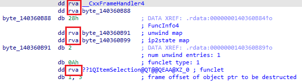
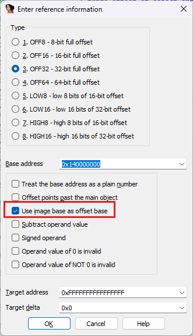
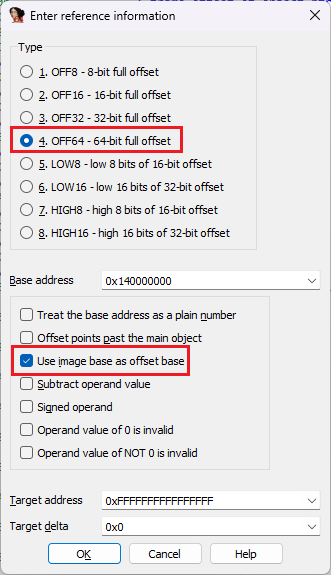
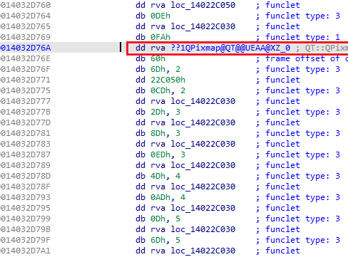

Image-relative offsets are values that represent an offset from the _image base_ of the current module (image) in memory. This means that they can be used to refer to other locations in the same module regardless of its real, final load address, and thus can be used to make the code position-independent (PIC), similarly to the [self-relative offsets](https://hex-rays.com/blog/igors-tip-of-the-week-110-self-relative-offsets/). The alternative name RVA means “Relative virtual address” and is often used in the context of the PE file format.  
映像相关偏移是指从内存中当前模块（映像）的映像基点出发的偏移值。这意味着，无论模块的实际、最终加载地址如何，它们都可以用来引用同一模块中的其他位置，因此可以用来使代码与位置无关（PIC），与自相关偏移类似。另一个名称 RVA 的意思是 "相对虚拟地址"，通常在 PE 文件格式中使用。

However, PIC is not the only advantage of RVAs. For example, on x64-bit platforms RVA values usually use 32 bits instead of 64 like a full pointer. While this makes their range more limited (4GiB from imagebase), the savings from pointer-type values can be substantial when accumulated over the whole binary.  
然而，PIC 并不是 RVA 的唯一优势。例如，在 x64 位平台上，RVA 值通常使用 32 位，而不是像全指针那样使用 64 位。虽然这使得 RVA 值的使用范围更加有限（imagebase 为 4GiB），但在整个二进制文件中累积起来，指针型 RVA 值可以节省大量资源。

For known RVA values, such as those in the PE headers or EH structures, IDA can usually convert them to an assembler-specific expression automatically:  
对于已知的 RVA 值，如 PE 头文件或 EH 结构中的 RVA 值，IDA 通常可以自动将其转换为特定于汇编程序的表达式：

However, sometimes there may be a need to do it manually, for example, when dealing with another update of the file format not yet handled by IDA, or a custom format/structure which uses RVAs for addressing. In that case, you can use yet another variation of the [User-defined offset](https://hex-rays.com/blog/igors-tip-of-the-week-105-offsets-with-custom-base/). The option to turn on is _Use image base as offset base_. When it’s enabled, IDA will ignore the entered offset base and will always use the imagebase.  
不过，有时可能需要手动转换，例如，在处理 IDA 尚未处理的另一种文件格式更新或使用 RVA 寻址的自定义格式/结构时。在这种情况下，可以使用用户定义偏移的另一种变体。打开的选项是 "使用图像基准作为偏移基准"。启用后，IDA 将忽略输入的偏移基数，并始终使用图像基数。

However, even if you use this approach in a 64-bit program, you may fail to reach the desired effect: the value will be displayed in red to indicate an error and not show a nice expression with the final address, as expected.  
不过，即使在 64 位程序中使用这种方法，也可能达不到预期效果：值将显示为红色，表示出错，而不是像预期的那样显示一个漂亮的最终地址表达式。

This happens because the command defaults to OFF32 for 32-bit values, but the final address does not fit into 32 bits. The fix is simple: select OFF64 instead of OFF32.  
出现这种情况的原因是，对于 32 位数值，命令默认为 OFF32，但最终地址并不适合 32 位。解决方法很简单：选择 OFF64 而不是 OFF32。

 

NOTE: for ARM binaries, the `imagerel` keyword is used instead of `rva`.  
注意：对于 ARM 二进制文件，应使用 `imagerel` 关键字而不是 `rva` 。

See also: 另请参见：

[Igor’s tip of the week #105: Offsets with custom base  
伊戈尔的每周提示 #105：使用自定义基数的偏移量](https://hex-rays.com/blog/igors-tip-of-the-week-105-offsets-with-custom-base/)

[Igor’s tip of the week #110: Self-relative offsets  
伊戈尔的本周提示 #110：自相关偏移量](https://hex-rays.com/blog/igors-tip-of-the-week-110-self-relative-offsets/)