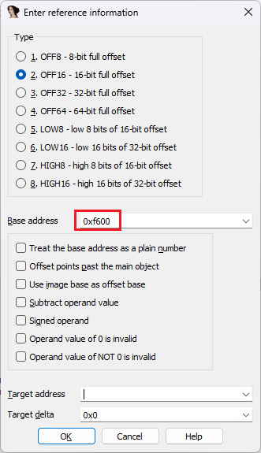
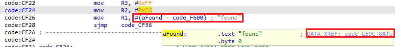
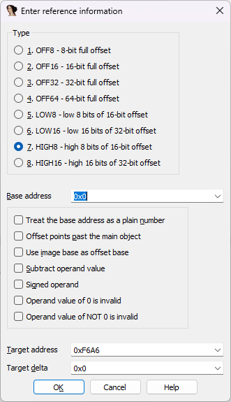
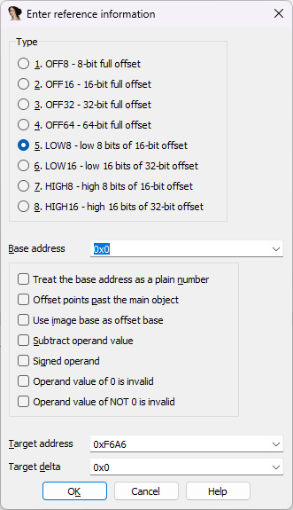
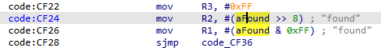
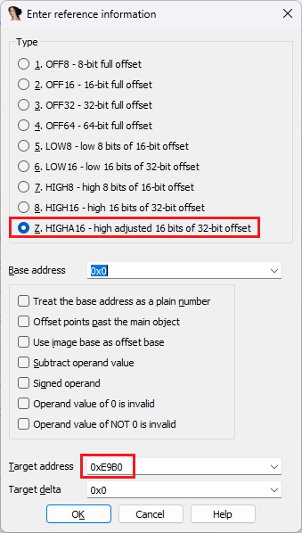
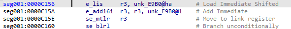

Previously, we have [covered](https://hex-rays.com/blog/igors-tip-of-the-week-95-offsets/) [offset](https://hex-rays.com/blog/igors-tip-of-the-week-105-offsets-with-custom-base/) [expressions](https://hex-rays.com/blog/igors-tip-of-the-week-110-self-relative-offsets/) which fit into a single instruction operand or data value. But this is not always the case, so let’s see how IDA can handle offsets which may be built out of multiple parts.  
前面，我们介绍了适合单一指令操作数或数据值的偏移表达式。但情况并非总是如此，因此让我们看看 IDA 如何处理可能由多个部分组成的偏移量。

### 8-bit processors 8 位处理器

Although slowly dying out, the 8-bit processors — especially the venerable 8051 — can still appear in current hardware, and of course we’ll be dealing with legacy systems for many years to come. Even though their registers can store only 8 bits af data, most of them can address 16-bit (64KiB) or more of memory which means that the addresses may need to be built by parts.  
尽管 8 位处理器（尤其是古老的 8051）正在慢慢消亡，但它仍然可以出现在当前的硬件中，当然，在未来的许多年里，我们还将与传统系统打交道。尽管这些处理器的寄存器只能存储 8 位数据，但它们中的大多数都能寻址 16 位（64KiB）或更多的内存，这意味着可能需要通过部件来构建地址。

For example, consider this sequence of instructions from an 8051 firmware:  
例如，请看 8051 固件中的这一指令序列：

```
code:CF22    mov     R3, #0xFF
code:CF24    mov     R2, #0xF6
code:CF26    mov     R1, #0xA6
code:CF28    sjmp    code_CF36
```

The code for 8051 is often compiled using Keil C51 compiler, and this pattern is a typical way of initializing a [generic pointer to code memory](https://www.keil.com/support/man/docs/c51/c51_le_genptrs.htm). The address being referenced is `0xF6A6`, but can we make the instructions look “nice” and create cross references to it?  
8051 的代码通常使用 Keil C51 编译器编译，这种模式是初始化代码存储器通用指针的典型方式。被引用的地址是 `0xF6A6` ，但我们能否让指令看起来 "漂亮 "一些，并创建对它的交叉引用呢？

One possibility is to use [offset with custom base](https://hex-rays.com/blog/igors-tip-of-the-week-105-offsets-with-custom-base/) on the last move and specify the base of `0xF600`:  
一种可能性是在最后一次移动时使用带有自定义基数的偏移，并指定 `0xF600` 的基数：



This does calculate the final address and create a cross-reference but the code is not quite “nice looking” and the other instruction remains a plain number:  
这确实可以计算出最终地址并创建交叉引用，但代码看起来不太 "美观"，而且另一条指令仍然是一个普通数字：



In fact, a better option is to use the high8/low8 offsets for the two instructions. Because each instruction provides only a part of the full offset, it alone cannot be used by IDA for calculating the full address which needs to be provided by the user.  
事实上，更好的办法是使用这两条指令的 high8/low8 偏移量。因为每条指令只提供了全部偏移量的一部分，IDA 无法单独使用它来计算需要由用户提供的全部地址。

R2 provides the top 8 bits of the address, so we should use the `HIGH8` offset type for it. We also need to fill in the full address (`0xF6A6`) in the _Target address_ field. Base address should be reset to 0.  
R2 提供地址的前 8 位，因此我们应使用 `HIGH8` 偏移量类型。我们还需要在目标地址字段中填写完整地址（ `0xF6A6` ）。基地址应重置为 0。



For R1, `LOW8` and the same target can be used:  
对于 R1，可以使用 `LOW8` 和相同的目标：



After applying both offsets, IDA displays them using matching assembler operators:  
应用这两个偏移后，IDA 使用匹配的汇编运算符显示它们：



### RISC processors RISC 处理器

RISC processors often use fixed-width instructions and may not be able to reach the full range of the address space with the limited space for the immediate operand in the instruction. This include SPARC, MIPS, PowerPC and some others. As an example, let’s look at this PowerPC VLE snippet:  
RISC 处理器通常使用固定宽度的指令，因此可能无法利用指令中有限的直接操作数空间达到地址空间的全部范围。这包括 SPARC、MIPS、PowerPC 和其他一些处理器。举例来说，让我们看看这个 PowerPC VLE 代码段：

```
seg001:0000C156         e_lis     r3, 1 # Load Immediate Shifted
seg001:0000C15A         e_add16i  r3, r3, -0x1650 # 0xE9B0
seg001:0000C15E         se_mtlr   r3
seg001:0000C160         se_blrl
```

The code calculates an address of a function in `r3` and then calls it. IDA helpfully shows the final address in a comment, but we can also use custom offsets to represent them nicely. For the `e_add16i` instruction, we can use the `LOW16` type, as expected, but in case of `e_lis`, the processor-specific type `HIGHA16` should be used instead of `HIGH16`. This is because the low 16 bits are used here not as-is but as a sign-extened addend, with the high 16 bits of the final address becoming 0 after the addition (0x10000-0x1650=0xE9B0).  
代码计算 `r3` 中的函数地址，然后调用它。IDA 在注释中显示了最终地址，但我们也可以使用自定义的偏移来很好地表示它们。对于 `e_add16i` 指令，我们可以按照预期使用 `LOW16` 类型，但对于 `e_lis` 指令，应使用处理器专用的 `HIGHA16` 类型，而不是 `HIGH16` 类型。这是因为低 16 位在这里不是按原样使用，而是作为符号扩展的加法，加法后最终地址的高 16 位变为 0（0x10000-0x1650=0xE9B0）。



After converting both parts, IDA uses special assembler operators to show the final address:  
转换两部分后，IDA 使用特殊的汇编运算符显示最终地址：



Now we can go to the target and create a function there.  
现在，我们可以转到目标地址，并在那里创建一个函数。

Note: specifically for PowerPC, IDA will automatically convert such sequences to offset expression if the target address exists and has instructions or data. But the manual approach can still be useful for other processors or complex situations (for example, the two instructions are too far apart).  
注意：专门针对 PowerPC，如果目标地址存在且有指令或数据，IDA 会自动将此类序列转换为偏移表达式。但对于其他处理器或复杂情况（例如两条指令相距太远），手动方法仍然有用。