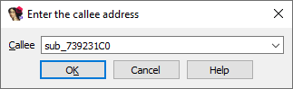

[Cross-references](https://hex-rays.com/blog/igor-tip-of-the-week-16-cross-references/) is one of the most useful features of IDA. For example, they allow you to see where a particular function is being called or referenced from, helping you to see how the function is used and understand its behavior better or discover potential bugs or vulnerabilities. For direct calls, IDA adds cross-references automatically, but in modern programs there are also many indirect calls which can’t always be resolved at disassembly time. In such cases, it is useful to have an option to set the target call address manually.  
交叉引用是 IDA 最有用的功能之一。例如，通过交叉引用，您可以查看特定函数被调用或引用的位置，帮助您了解函数的使用情况，更好地理解函数的行为，或发现潜在的错误或漏洞。对于直接调用，IDA 会自动添加交叉引用，但在现代程序中也有许多间接调用，在反汇编时并不总能解决。在这种情况下，提供手动设置目标调用地址的选项是非常有用的。

### Indirect call types 间接调用类型

Most instruction sets have some kind of an indirect call instruction. The most common one uses a processor register which holds the address of the function to be called:  
大多数指令集都有某种间接调用指令。最常见的是使用处理器寄存器来保存要调用函数的地址：

x86/x64 and ARM can use almost any general-purpose register:  
x86/x64 和 ARM 可以使用几乎任何通用寄存器：

```
call edi (x86)
call rax (x64)
BLX R12 (ARM32)
BLX R3
BLR X8 (ARM64)
```

PowerPC is more limited and has to use dedicated `ctr` or `lr` registers:  
PowerPC 的限制较多，必须使用专用的 `ctr` 或 `lr` 寄存器：

```
mtlr r12
blrl

mr r12, r9
mtctr r9
bctrl
```

in MIPS, in theory any register can be used, but binaries conforming to the standard PIC ABI tend to use the register t9:  
在 MIPS 中，理论上可以使用任何寄存器，但符合标准 PIC ABI 的二进制文件倾向于使用寄存器 t9：

```
la      $t9, __cxa_finalize
lw      $a0, (_fdata - 0x111E0)($v0)  # void *
jalr    $t9 ; __cxa_finalize
```

In addition to simple register, some processors support more complex expressions. For example, on x86/x64 it is possible to use a register with offset, allowing to read a pointer value and jump to it in a single instruction:  
除了简单的寄存器，有些处理器还支持更复杂的表达式。例如，在 x86/x64 中，可以使用带有偏移量的寄存器，这样就可以在一条指令中读取指针值并跳转到该值：

```
call    dword ptr [eax+0Ch] (x86)
call    qword ptr [rax+98h] (x64)
```

### Setting callee address 设置调用者地址

In some simple situations (e.g. the register is initialized shortly before the call), IDA is able to resolve it automatically and adds a comment with the target address, like in the MIPS example above, or this one:  
在一些简单的情况下（如寄存器在调用前不久被初始化），IDA 能够自动解决，并添加目标地址注释，如上面的 MIPS 示例或这个示例：


In more complicated situations, especially involving multiple memory dereferences or runtime calculations, it is possible to specify the target address manually.  For this, use the standard plugin command available in Edit > Plugins > Change the callee address. The default shortcut is Alt–F11.  
在更复杂的情况下，特别是涉及多个内存引用或运行时计算时，可以手动指定目标地址。为此，可使用 "编辑">"插件">"更改受话者地址 "中的标准插件命令。默认快捷方式为 Alt - F11 。


The plugin will ask you to enter the target address (you can also use a function name):  
插件会要求您输入目标地址（也可以使用函数名）：



The call instruction will gain a comment with the target address, as well as a cross-reference:  
调用指令将获得目标地址注释以及交叉引用：


Currently the plugin is implemented for x86/x64, ARM and MIPS. If you need to set or access this information programmatically, you can check how it works by consulting the source code in the SDK, under `plugins/callee`.  
目前，该插件适用于 x86/x64、ARM 和 MIPS。如果需要以编程方式设置或访问这些信息，可以查阅 SDK 中 `plugins/callee` 下的源代码，了解其工作原理。