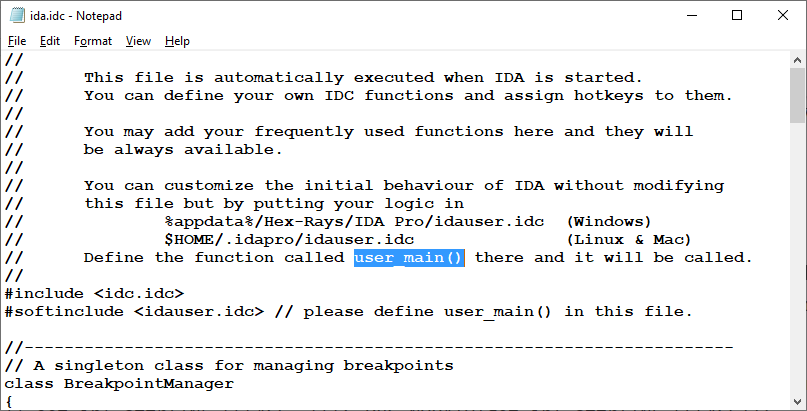

IDA’s behavior and defaults can be configured using the [Options](https://hex-rays.com/blog/igors-tip-of-the-week-25-disassembly-options/) dialog, saved [desktop layouts](https://hex-rays.com/blog/igors-tip-of-the-week-22-ida-desktop-layouts/), or [config files](https://hex-rays.com/blog/igors-tip-of-the-week-33-idas-user-directory-idausr/). However, sometimes the behavior you need depends on something in the input file and can’t be covered by a single option, or you may want IDA to do something additional after the file is loaded. Of course, there is always the possibility of making a plugin or a loader using IDA SDK or IDAPython, but it could be an overkill for simple situations. Instead, you can make use of several startup files used by IDA every time it loads a new file or even a previously saved database, and do the necessary work there.  
IDA 的行为和默认值可以通过选项对话框、保存的桌面布局或配置文件进行配置。不过，有时你需要的行为取决于输入文件中的某些内容，而单个选项无法涵盖，或者你可能希望 IDA 在加载文件后做一些额外的事情。当然，您也可以使用 IDA SDK 或 IDAPython 制作插件或加载器，但对于简单的情况来说，这样做可能有些矫枉过正。相反，您可以利用 IDA 每次加载新文件或甚至以前保存的数据库时使用的几个启动文件，并在其中执行必要的工作。

The following files can be used for such purpose:  
以下文件可用于此目的：

### ida.idc

This file in `idc` subdirectory if IDA’s install is automatically loaded on each run of IDA and can be used to perform any actions you may need. The default implementation defines a utility class for managing breakpoints and a small helper function, but you can add there any other code you need. As an example, it has  a commented call to change a global setting:  
如果 IDA 安装在 `idc` 子目录下，则该文件会在每次运行 IDA 时自动加载，可用于执行任何需要的操作。默认实现定义了一个用于管理断点的实用程序类和一个小的辅助函数，但你也可以在其中添加任何其他需要的代码。例如，它有一个用于更改全局设置的注释调用：

```
// uncomment this line to remove full paths in the debugger process options:
// set_inf_attr(INF_LFLAGS, LFLG_DBG_NOPATH|get_inf_attr(INF_LFLAGS));
```

Instead of editing the file itself (which may have been installed in a read-only location), you can create a file `idauser.idc` with a function `user_main()` and put it in the [user directory](https://hex-rays.com/blog/igors-tip-of-the-week-33-idas-user-directory-idausr/). If found, IDA will parse it and the main function of `ida.idc` will try to call `user_main()`. This feature allows you to keep the custom behaviour across multiple IDA installs and versions, without having to edit `ida.idc` every time.  
与其编辑文件本身（可能已安装在只读位置），不如创建一个带有函数 `user_main()` 的文件 `idauser.idc` 并将其放在用户目录下。如果找到该文件，IDA 将对其进行解析，并尝试调用 `ida.idc` 的主函数 `user_main()` 。此功能可让您在多个 IDA 安装和版本中保持自定义行为，而无需每次都编辑 `ida.idc` 。



### onload.idc

This file is similar to `ida.idc`, but is only executed for _newly loaded files_. In it you can, for example, do some additional parsing and formatting to augment the behavior of the default file loader(s). The default implementation detects when a DOS driver (EXE or COM file with `.sys` or `.drv` extension) is loaded and tries to format its header.  
该文件与 `ida.idc` 类似，但只对新加载的文件执行。例如，你可以在其中进行一些额外的解析和格式化，以增强默认文件加载器的行为。默认实现会检测是否加载了 DOS 驱动程序（扩展名为 `.sys` 或 `.drv` 的 EXE 或 COM 文件），并尝试格式化其文件头。

Similarly to `ida.idc`, instead of editing the file itself, you can create a file named `userload.idc` in the user directory and define a function `userload`.  
与 `ida.idc` 类似，你可以在用户目录下创建一个名为 `userload.idc` 的文件，并定义一个函数 `userload` ，而不是编辑文件本身。

```
//      If you want to add your own processing of newly created databases,
//      you may create a file named "userload.idc":
//
//      #define USERLOAD_IDC
//      static userload(input_file,real_file,filetype) {
//              ... your processing here ...
//      }
//

#softinclude &lt;userload.idc&gt;

// Input parameteres:
//      input_file - name of loaded file
//      real_file  - name of actual file that contains the input file.
//                   usually this parameter is equal to input_file,
//                   but is different if the input file is extracted from
//                   an archive.
//      filetype   - type of loaded file. See FT_.. definitions in idc.idc
```

### idapythonrc.py

Unlike the previous examples, this a Python file, so it is only loaded if you have IDAPython installed and working. If the file is found in the [user directory](https://hex-rays.com/blog/igors-tip-of-the-week-33-idas-user-directory-idausr/), it will be loaded and executed on startup of IDAPython, so you can put there any code to perform fine-tuning of IDA, add utility functions to be called from the [CLI](https://hex-rays.com/blog/igors-tip-of-the-week-73-output-window-and-logging/), or run any additional scripts.  
与前面的示例不同，这是一个 Python 文件，因此只有安装并运行 IDAPython 后才会加载该文件。如果在用户目录中找到该文件，它将被加载并在 IDAPython 启动时执行，因此您可以在其中添加任何代码来执行 IDA 的微调、添加从 CLI 调用的实用程序函数或运行任何附加脚本。

### Useful functions 实用功能

Some functions which can be called from the startup files to configure IDA:  
可以从启动文件中调用一些函数来配置 IDA：

[`get_inf_attr()`/ `set_inf_attr()`/`set_flag()`](https://www.hex-rays.com/products/ida/support/idadoc/285.shtml): read and set various flags controlling IDA’s behavior. For example, `INF_AF` can be used to change various [analysis options](https://hex-rays.com/blog/igors-tip-of-the-week-98-analysis-options/).  
`get_inf_attr()` / `set_inf_attr()` / `set_flag()` ：读取和设置控制 IDA 行为的各种标志。例如， `INF_AF` 可用于更改各种分析选项。

[`process_config_directive()`](https://www.hex-rays.com/products/ida/support/idadoc/642.shtml): change a setting using keyword=value syntax. Most settings from `ida.cfg` can be used, as well as some processor-specific or debugger-specific ones.  A few examples:  
0#：使用关键字=值语法更改设置。可以使用 `ida.cfg` 中的大多数设置，也可以使用某些处理器专用或调试器专用的设置。举几个例子

-   `process_config_directive("ABANDON_DATABASE=YES");`: do not save the database on exit. Please note that this setting has a side effect in that it disables most user actions which change the database, for example `MakeUnknown` (U) or `MakeCode` (C).  
    `process_config_directive("ABANDON_DATABASE=YES");` : 退出时不保存数据库。请注意，该设置有一个副作用，即它会禁用大多数更改数据库的用户操作，例如 `MakeUnknown` ( U ) 或 `MakeCode` ( C ) 。
-   `process_config_directive("PACK_DATABASE=2");`: set the default database packing option to “deflate”;  
    `process_config_directive("PACK_DATABASE=2");` ：将默认数据库打包选项设置为 "deflate"；
-   `process_config_directive("GRAPH_OPCODE_BYTES=4");`: enable display of opcode bytes in graph mode;  
    `process_config_directive("GRAPH_OPCODE_BYTES=4");` : 启用图形模式下的操作码字节显示；
-   for more examples, see `ida.cfg` (open it in any text editor).  
    更多示例，请参阅 `ida.cfg` （在任何文本编辑器中打开）。