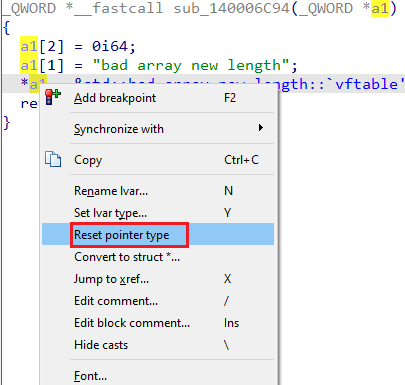
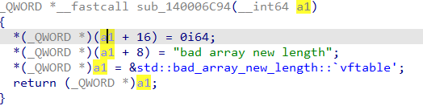

While currently (as of version 8.1) the Hex-Rays decompiler does not try to perform full type recovery, it does try to deduce some types based on operations done on the variables, or using the type information for the API calls from [type libraries](https://hex-rays.com/blog/igors-tip-of-the-week-60-type-libraries/).  
虽然目前（截至 8.1 版）Hex-Rays 反编译器并不尝试执行完全类型恢复，但它确实会尝试根据对变量所做的操作，或使用类型库的 API 调用类型信息来推断某些类型。

One simple type deduction performed by the decompiler is creation of typed pointers when a variable is being dereferenced, for example:  
反编译器进行的一个简单类型推导是在对变量进行取消引用时创建类型化指针：

```
_QWORD *__fastcall sub_140006C94(_QWORD *a1)
{
  a1[2] = 0i64;
  a1[1] = "bad array new length";
  *a1 = &amp;std::bad_array_new_length::`vftable';
  return a1;
}
```

Unfortunately, such conversions are not always correct, as can be seen in the example: we have a mix of integer and pointer elements in one array, so it’s more likely a structure. Also, due to C’s array indexing rules, the array indexes are multiplied by the element size (so, for example, `a1[2]` actually corresponds to  the byte offset 16). If you prefer seeing “raw” offsets, you can  change the variable’s type to a plain integer. This can, of course, be done by manually changing the variable’s type but there is a convenience command in the context menu which can be used to do it quickly:  
遗憾的是，这种转换并不总是正确的，从示例中可以看出：我们在一个数组中混合了整数和指针元素，因此它更可能是一个结构体。此外，由于 C 的数组索引规则，数组索引乘以元素大小（因此，例如 `a1[2]` 实际上对应于字节偏移 16）。如果希望看到 "原始 "偏移量，可以将变量类型改为普通整数。当然，这可以通过手动更改变量类型来实现，但上下文菜单中有一个方便的命令，可以快速完成更改：



After resetting, the variable becomes a simple integer type and all dereferences now use explicit byte offsets and casts:  
重置后，变量将变为简单的整数类型，所有引用现在都使用显式字节偏移和转换：



Now you can, for example, create a structure corresponding to these accesses, or choose an existing one.  
例如，现在你可以创建一个与这些访问相对应的结构，或者选择一个现有的结构。

See also:  另请参见：

[Hex-Rays Decompiler: Interactive operation  
Hex-Rays 反编译器交互式操作](https://www.hex-rays.com/products/decompiler/manual/interactive.shtml)