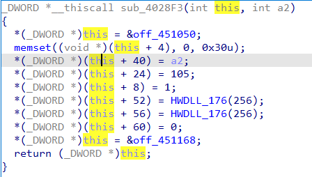
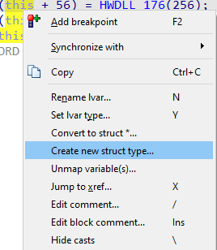
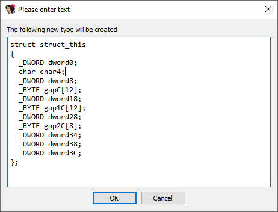
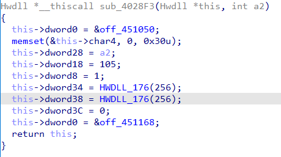

We’ve covered structure creation using [disassembly or Local Types](https://hex-rays.com/blog/igor-tip-of-the-week-11-quickly-creating-structures/), but there is also a way of doing it from the decompiler, especially when dealing with unknown, custom types used by the program.  
我们已经介绍了使用反汇编或本地类型创建结构的方法，但还有一种从反编译器创建结构的方法，尤其是在处理程序使用的未知自定义类型时。

Whenever you see code dereferencing a variable with different offsets, it is likely a structure pointer and the function is accessing different fields of it.  
每当你看到代码以不同的偏移引用变量时，它很可能是一个结构指针，函数正在访问其中的不同字段。

You can, of course, create the structure manually and change the variable’s type, but it is also possible to ask the decompiler to come up with a suitable layout. For this, use “Create new struct type…” from the context menu on the variable:  
当然，你可以手动创建结构并更改变量的类型，但也可以要求反编译器生成合适的布局。为此，请使用变量上下文菜单中的 "Create new struct type...（创建新结构类型...）"：

If you don’t see the action, you may need to [reset the pointer type](https://hex-rays.com/blog/igors-tip-of-the-week-117-reset-pointer-type/) first. After you invoke it, the decompiler will analyze accesses to the variables and come up with a candidate structure type which matches them:  
如果看不到该操作，可能需要先重置指针类型。调用后，反编译器将分析对变量的访问，并生成与之匹配的候选结构类型：

You can accept the suggestion as-is, or make any suitable adjustments (for example, change the structure name, or edit some of the fields). After confirming, the structure is added to Local Types and the variable is converted to the corresponding pointer type:  
您可以按原样接受建议，也可以进行适当调整（例如更改结构名称或编辑部分字段）。确认后，结构将添加到本地类型中，变量也将转换为相应的指针类型：

You can, of course, keep refining the structure as you continue with your analysis and discover how the fields are used in other functions and what they mean. Renaming fields can be done directly from the pseudocode view, while for adding or rearranging them you’ll likely need to use Local Types or Structures window.  
当然，您还可以在继续分析的过程中不断完善结构，发现字段在其他函数中的使用方 式和含义。重命名字段可以直接在伪代码视图中完成，而添加或重新排列字段则可能需要使用本地类型或结构窗口。

See also: [Hex-Rays interactive operation: Create new struct type](https://www.hex-rays.com/products/decompiler/manual/cmd_new_struct.shtml)  
另请参见 Hex-Rays 交互式操作：创建新结构类型