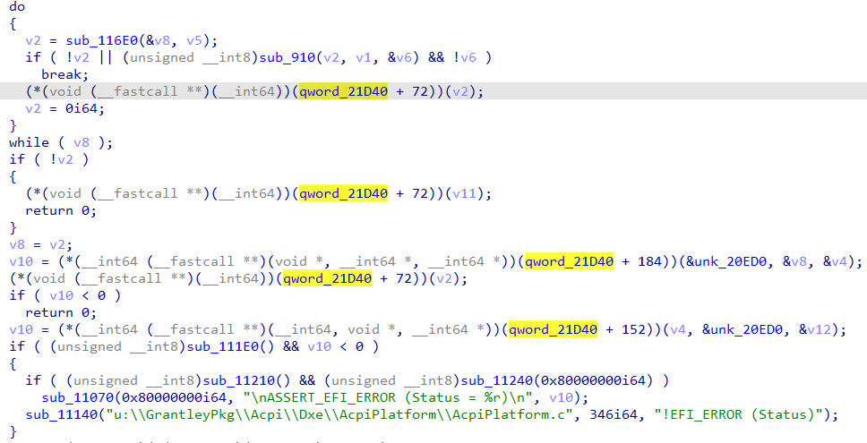
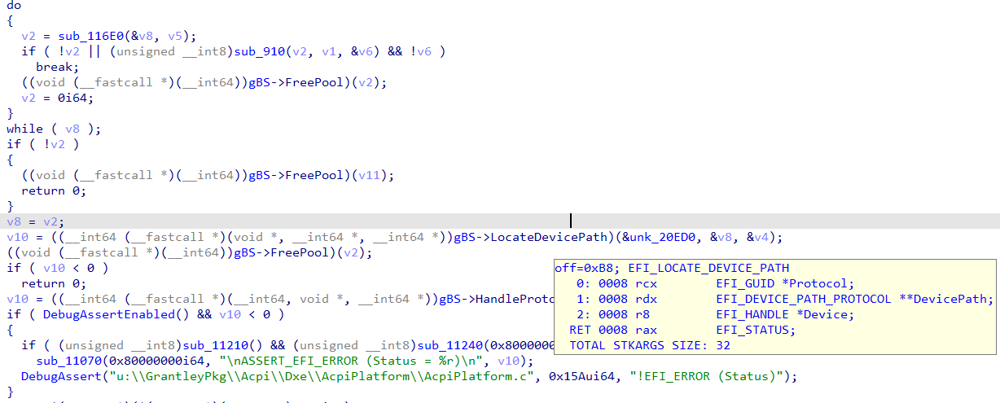
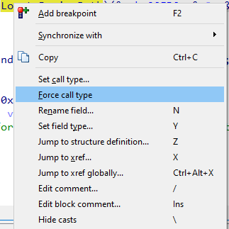
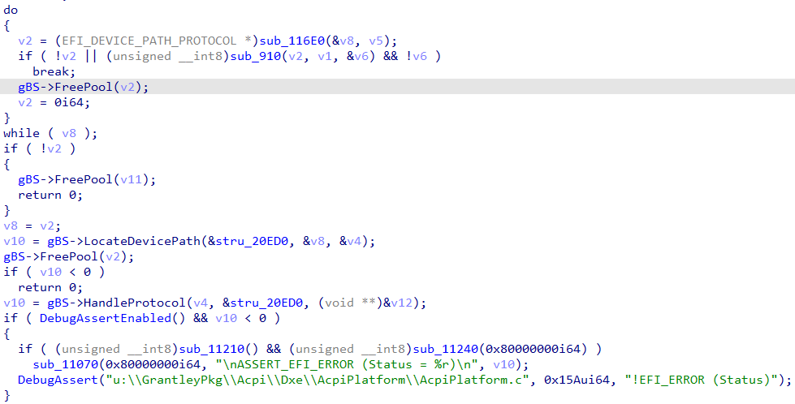

When dealing with compile binary code, the decompiler lacks information present in the source code, such as function prototypes and so must guess it or rely on the information provided by the user (where its interactive features come handy).  
在处理编译二进制代码时，反编译器缺乏源代码中存在的信息，如函数原型，因此必须猜测或依赖用户提供的信息（这时反编译器的交互功能就派上用场了）。

One especially tricky situation is indirect calls: without exact information about the destination of the call, the decompiler can only try to analyze registers or stack slots initialized before the call and try to deduce the potential function prototype this way. For example, check this snippet from a UEFI module:  
一种特别棘手的情况是间接调用：在没有关于调用目的地的确切信息的情况下，反编译器只能尝试分析调用前初始化的寄存器或堆栈槽，并尝试通过这种方法推断出潜在的函数原型。例如，请查看 UEFI 模块中的这个片段：



For several indirect calls involving `qword_21D40`, the decompiler had to guess the arguments and add casts.  
对于几个涉及 `qword_21D40` 的间接调用，反编译器不得不猜测参数并添加转换。

If we analyze the module from the entry point, we can find the place where the variable is initialized and figure out that it is, in fact, the standard UEFI global variable `gBS` of the type `EFI_BOOT_SERVICES *`:  
如果我们从入口点分析该模块，就能找到变量初始化的地方，并发现它实际上是 `EFI_BOOT_SERVICES *` 类型的标准 UEFI 全局变量 `gBS` ：

```
EFI_STATUS __fastcall UefiBootServicesTableLibConstructor(EFI_HANDLE ImageHandle, EFI_SYSTEM_TABLE *SystemTable)
{
  gImageHandle = ImageHandle;
  if ( DebugAssertEnabled() &amp;&amp; !gImageHandle )
    DebugAssert(
      "u:\\MdePkg\\Library\\UefiBootServicesTableLib\\UefiBootServicesTableLib.c",
      0x33ui64,
      "gImageHandle != ((void *) 0)");
  gST = SystemTable;
  if ( DebugAssertEnabled() &amp;&amp; !gST )
    DebugAssert(
      "u:\\MdePkg\\Library\\UefiBootServicesTableLib\\UefiBootServicesTableLib.c",
      0x39ui64,
      "gST != ((void *) 0)");
  // gBS was qword_21D40  
  gBS = SystemTable-&gt;BootServices;
  if ( DebugAssertEnabled() &amp;&amp; !gBS )
    DebugAssert(
      "u:\\MdePkg\\Library\\UefiBootServicesTableLib\\UefiBootServicesTableLib.c",
      0x3Fui64,
      "gBS != ((void *) 0)");
  return 0i64;
}
```

After renaming and changing the type of the global variable, the original function is slightly improved thanks to the type information from the standard UEFI type library:  
重命名并更改全局变量的类型后，由于有了标准 UEFI 类型库中的类型信息，原始函数得到了些许改进：



Even though the decompiler now has prototypes of function pointers such as `LocateDevicePath` (shown in the pop-up) or `FreePool`, it has to add casts because the arguments which are passed to the calls do not match the prototype. To tell the decompiler to rely on the type information instead of guessing the arguments, use the command _Force call type_ from the context menu:  
尽管反编译器现在已经有了函数指针的原型，如 `LocateDevicePath` （如弹出窗口所示）或 `FreePool` ，但由于传递给调用的参数与原型不匹配，所以它必须添加转换。要让反编译器依赖类型信息而不是猜测参数，请使用右键菜单中的强制调用类型命令：



When running the command on the indirect calls, the decompiler also uses the type information to update the types of the arguments (except those already set by the user), making the pseudocode much cleaner:  
在间接调用中运行该命令时，反编译器也会使用类型信息更新参数类型（用户已设置的参数除外），从而使伪代码更加简洁：



See also: [Hex-Rays interactive operation: Force call type](https://www.hex-rays.com/products/decompiler/manual/cmd_force_call_type.shtml)  
另请参见Hex-Rays 交互式操作：强制调用类型