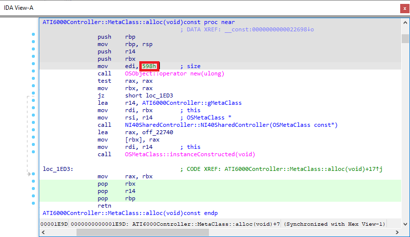
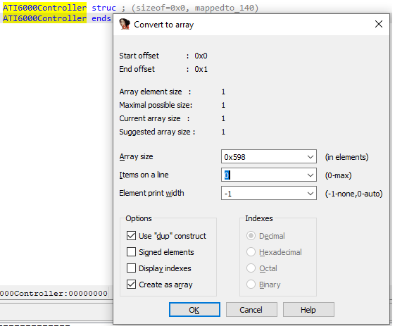
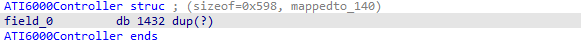
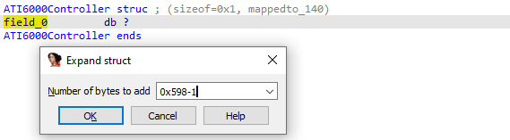
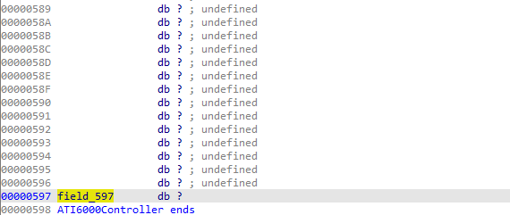
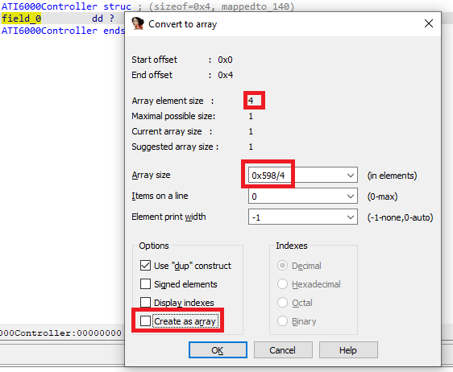
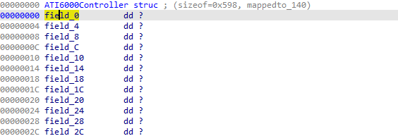
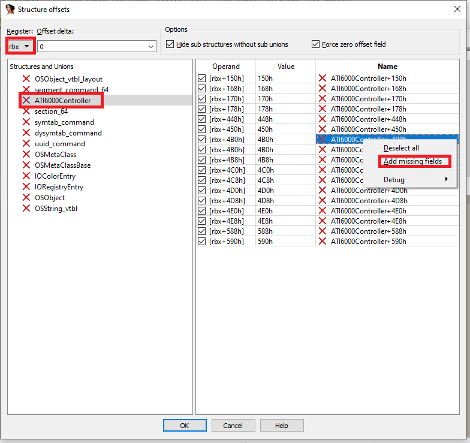
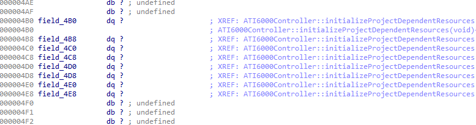

Sometimes you know the structure size but not the actual layout yet. For example, when the size of memory being allocated for the structure is fixed:  
有时，我们知道结构大小，但还不知道实际布局。例如，为结构分配的内存大小是固定的：

### 

In such cases, you can quickly make a dummy structure and then modify it as you analyze code which works with it. There are several approaches which can be used here.  
在这种情况下，您可以快速创建一个虚拟结构，然后在分析使用该结构的代码时对其进行修改。这里可以使用几种方法。

### Fixed-size structure 1: single array  
固定大小结构 1：单数组

This is the fastest option but makes struct modification a little awkward.  
这是最快的方法，但在修改结构时会有些麻烦。

1.  create the struct (go to Structures view, press Ins and specify a name);  
    创建结构体（转到结构体视图，按 Ins 并指定名称）；
2.  create the array (position cursor at the start of the struct, press * and enter the size (decimal or hex)  
    创建数组（将光标置于结构体的起始位置，按 * 键并输入大小（十进制或十六进制）

 

When you need to create a field in the middle, press * to resize the array so it ends before the field, create the field, then create another array after it to pad the struct to the full size again.  
当需要在中间创建一个字段时，按 * 键调整数组大小，使其在字段之前结束，创建字段，然后在字段之后创建另一个数组，再次将结构填满。

### Fixed-size structure 2: big gap in the middle  
固定大小结构 2：中间有很大空隙

1.  create the struct (go to Structures view, press Ins and specify a name);  
    创建结构体（进入结构体视图，按 Ins 并指定名称）；
2.  create a byte field (press D);  
    创建字节字段（按 D ）；
3.  add a gap (Ctrl–E or “Expand struct type..” in context menu) and enter the size minus 1;  
    添加一个间隙（ Ctrl - E 或右键菜单中的 "扩展结构类型..."）并输入减 1 的大小；
4.  (optional but recommended) On `field_0` which is now at the end of the struct, press N, Del, Enter. This will reset the name to match the actual offset and will not hinder creation of another `field_0` at offset 0 if needed.  
    (可选但推荐）在现在位于结构体末尾的 `field_0` 上，按 N , Del , Enter 。这将重置名称，使其与实际偏移量相匹配，并且不会妨碍在需要时在偏移量 0 处创建另一个 `field_0` 。



To create fields in the middle of the gap, go to the specific offset in the struct (G can be used for big structs).  
要在间隙中间创建字段，请转到结构中的特定偏移量（ G 可用于大结构）。

### Fixed-size structure 3: fill with dummy fields  
固定大小结构 3：填充虚拟字段

1.  create the struct (go to Structures view, press Ins and specify a name);  
    创建结构体（转到结构体视图，按 Ins 并指定名称）；
2.  create one dummy field (e.g. a dword);  
    创建一个虚拟字段（例如 dword）；
3.  press * and enter the size (divided by the field size if different from byte). Uncheck “Create as array” and click OK.  
    按 * 并输入大小（如果与字节不同，则除以字段大小）。取消选中 "创建为数组"，然后点击确定。

 

### Automatically create fields from code  
从代码中自动创建字段

Using a structure with a gap in the middle (option 2 above) is especially useful when analyzing functions that work with it using a fixed register base. For example, this function uses `rbx` as the base for the structure:  
在分析使用固定寄存器基数的函数时，使用中间有间隙的结构（上述选项 2）特别有用。例如，该函数使用 `rbx` 作为结构体的基数：

```
ATI6000Controller::initializeProjectDependentResources(void) proc near
  push    rbp
  mov     rbp, rsp
  push    rbx
  sub     rsp, 8
  mov     rbx, rdi
  lea     rax, `vtable for'NI40SharedController
  mov     rdi, rbx        ; this
  call    qword ptr [rax+0C30h]
  test    eax, eax
  jnz     loc_25CD
  mov     rax, [rbx+168h]
  mov     [rbx+4B8h], rax
  mov     rax, [rbx+178h]
  mov     [rbx+4C0h], rax
  mov     rax, [rbx+150h]
  mov     [rbx+4C8h], rax
  mov     [rbx+4B0h], rbx
  mov     rax, [rbx+448h]
  mov     [rbx+4D0h], rax
  mov     rcx, [rbx+170h]
  mov     [rbx+4D8h], rcx
  mov     rcx, [rax]
  mov     [rbx+4E0h], rcx
  mov     eax, [rax+8]
  mov     [rbx+4E8h], rax
  call    NI40PowerPlayManager::createPowerPlayManager(void)
  mov     [rbx+450h], rax
  test    rax, rax
  jnz     short loc_2585
  mov     eax, 0E00002BDh
  jmp     short loc_25CD
---------------------------------------------------------------

loc_2585:
  mov     rcx, [rax]
  lea     rsi, [rbx+4B0h]
  ...
```

To automatically create fields for all rbx-based accesses:  
为所有基于 rbx 的访问自动创建字段：

1.  select all instructions using `rbx`;  
    使用 `rbx` 选择所有指令；
2.  from context menu, choose “Structure offset” (or press T);  
    从上下文菜单中选择 "结构偏移"（或按 T ）；
3.  in the dialog, make sure Register is set to `rbx`, select the created struct (a red cross simply means that it has no fields at the matching offsets _currently_);  
    在对话框中，确保 Register 设置为 `rbx` ，选择创建的结构体（红叉表示当前在匹配的偏移处没有字段）；
4.  from the right pane’s context menu, choose “Add missing fields”.  
    在右窗格的右键菜单中选择 "添加缺失字段"。



You can then repeat this for all other functions working with the structure to create other missing fields.  
然后，您可以对与结构体相关的所有其他函数重复上述操作，以创建其他缺失字段。