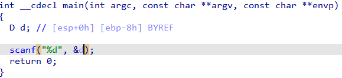
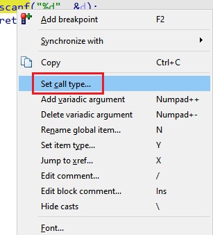
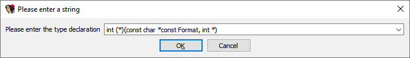
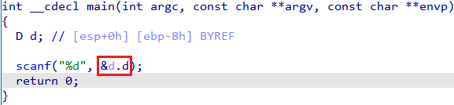

Previously we’ve described how to use available type info to make decompilation of calls more precise [when you have type information](https://hex-rays.com/blog/igors-tip-of-the-week-119-force-call-type/), but there may be situations where you don’t have it or the existing type info does not quite match the actual call arguments, and you still want to adjust the decompiler’s guess.  
前面我们介绍了在有类型信息的情况下，如何使用可用的类型信息使调用的反编译更精确，但也可能会出现没有类型信息或现有类型信息与实际调用参数不完全匹配的情况，这时仍需要调整反编译器的猜测。

One common example is variadic functions (e.g. `printf`, `scanf` and several others from the C runtime library, as well as custom functions specific to the binary being analyzed). The decompiler knows about the standard C functions and tries to analyze the format string to guess the actually passed arguments. However, such guessing can still fail and show wrong arguments being passed.  
一个常见的例子是可变函数（例如 `printf` 、 `scanf` 和 C 运行时库中的其他一些函数，以及针对被分析二进制文件的自定义函数）。反编译器了解标准 C 函数，并尝试分析格式字符串以猜测实际传递的参数。不过，这种猜测仍有可能失败，并显示传递了错误的参数。

For simple situations, [adjusting variadic arguments](https://hex-rays.com/blog/igors-tip-of-the-week-101-decompiling-variadic-function-calls/) may work, but it’s not always enough. For example, some calling conventions pass floating-point data in different registers from integers, so the decompiler needs to know which arguments are floating-point and which are not. You can, of course, change the prototype of the function to make the additional arguments explicit instead of variadic, but this affects all call sites instead of just the one you need.  
对于简单的情况，调整变量参数可能有效，但并不总是足够。例如，某些调用约定在不同的寄存器中传递浮点数据和整数数据，因此反编译器需要知道哪些参数是浮点参数，哪些不是。当然，你可以改变函数的原型，使附加参数显式化，而不是变式化，但这会影响所有调用点，而不仅仅是你需要的调用点。

Another difficulty can arise when dealing with the `scanf` family functions. Because the variadic arguments to such functions are usually passed by address, any variable type may be used for a specific format specifier. Consider the following example source code:  
在处理 `scanf` 族函数时，还会出现另一个困难。因为此类函数的可变参数通常是通过地址传递的，所以任何变量类型都可以用于特定的格式规范。请看下面的示例源代码：

```
struct D
{
  int d;
  int e;
};


#include 
int main()
{
 D d;
 scanf("%d", &amp;d.d);
}
```

When we decompile the compiled binary, even after creating the struct and changing the local variable type, the following output is shown:  
当我们反编译编译后的二进制文件时，即使创建了结构并更改了局部变量类型，仍会显示如下输出：



We get `&d` instead of `&d.d` because `d` is situated at the very start of the structure so both expressions are equivalent on the binary level. To get the desired expression, we need to hint the decompiler that the extra argument is actually an `int *`. This can be done using the “Set call type…” action from the context menu on the call site:  
我们得到的是 `&d` 而不是 `&d.d` ，因为 `d` 位于结构体的最开始，所以这两个表达式在二进制层面上是等价的。为了得到所需的表达式，我们需要提示反编译器额外的参数实际上是 `int *` 。这可以通过调用站点上下文菜单中的 "设置调用类型... "操作来实现：



We can explicitly specify type of the extra argument:  
我们可以明确指定额外参数的类型：



The decompiler takes it into account and uses the proper expression to match the new prototype:  
反编译器会考虑到这一点，并使用适当的表达式来匹配新的原型：



See also: [Hex-Rays interactive operation: Set call type](https://www.hex-rays.com/products/decompiler/manual/cmd_set_call_type.shtml)  
另请参阅Hex-Rays 交互式操作：设置调用类型