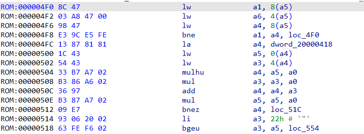
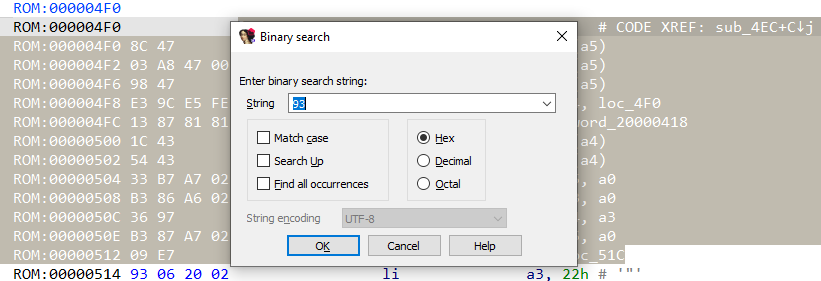

When performing a [search](https://hex-rays.com/blog/igors-tip-of-the-week-48-searching-in-ida/) in IDA, it by default starts from the current position and continues up to the maximum address in the database (or to the minimal for searches “Up”). This works well enough for small to average files, but can get pretty slow for big ones, or especially in case of debugging where the database may include not just the input file but also multiple additional modules loaded at runtime.  
在 IDA 中执行搜索时，默认情况下会从当前位置开始，一直搜索到数据库中的最大地址（或搜索到 "Up "时的最小地址）。这对于小到一般的文件来说已经足够好了，但对于大文件来说可能会相当慢，尤其是在调试时，数据库可能不仅包括输入文件，还包括运行时加载的多个附加模块。

To skip areas you’re not interested in and improve the speed, you can limit the search to an address range. For this, IDA relies on selection. For example, consider this disassembly snippet:  
为了跳过您不感兴趣的区域并提高搜索速度，您可以将搜索限制在一个地址范围内。为此，IDA 依赖于选择。例如，请看下面的反汇编片段：



If you perform a binary search for the value `93`, the instruction at `00000514` will be found:  
如果对值 `93` 执行二进制搜索，则会找到位于 `00000514` 的指令：

```
Searching down CASE-INSENSITIVELY for binary pattern:
93
Search completed. Found at 00000514.
```

However, if you select a range which does not include that address before invoking the search, the search will fail:  
但是，如果在调用搜索之前选择了一个不包括该地址的范围，则搜索将失败：



```
Searching down CASE-INSENSITIVELY for binary pattern:
93
Search failed.
Command "AskBinaryText" failed
```

Selecting large areas with the mouse or by holding Shift can be quite tedious, so it may be more convenient to use the [anchor selection](https://hex-rays.com/blog/igor-tip-of-the-week-03-selection-in-ida/):  
用鼠标或按住 Shift 键选择大面积区域可能会比较繁琐，因此使用锚点选择可能会更方便：

1.  Move to the start or end of the intended selection and invoke Edit > Begin selection (or press Alt–L ).  
    移动到目标选区的起点或终点，然后调用编辑 > 开始选区（或按 Alt - L ）。
2.  Navigate to the other end of the selection using any means (cursor keys, Jump actions, Functions or Sgments window, Navigation bar etc.).  
    使用任何方法（光标键、跳转操作、功能或分段窗口、导航栏等）导航到选区的另一端。
3.  Invoke the binary search command. The search will be performed in the selection only.  
    调用二进制搜索命令。搜索将仅在选区中执行。