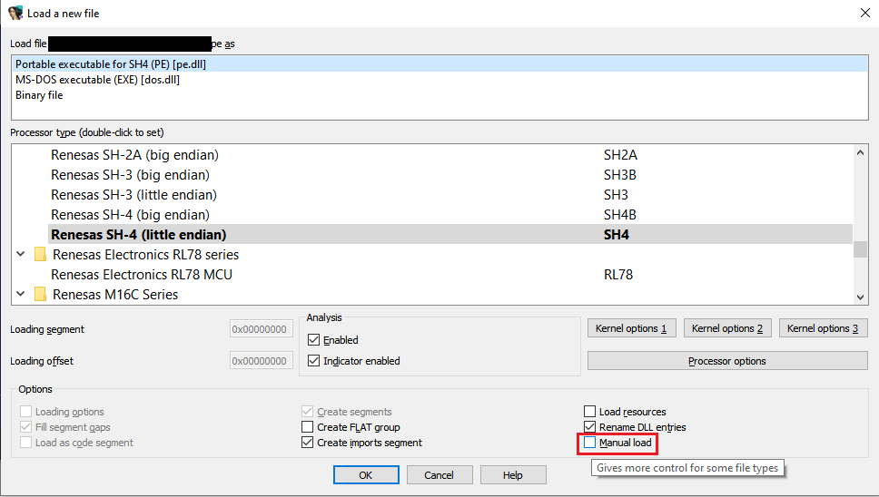
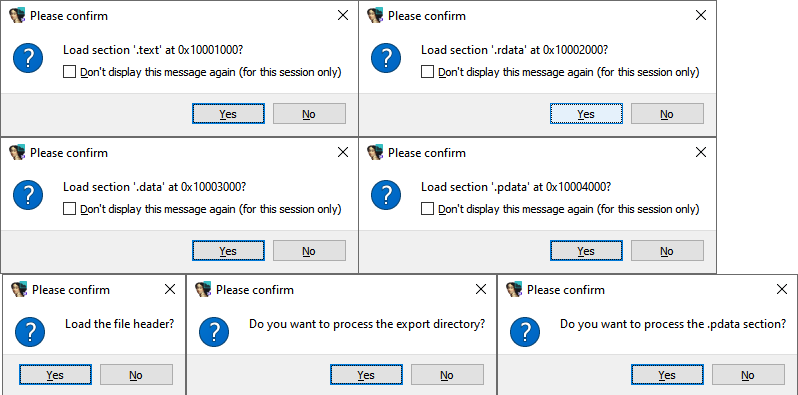
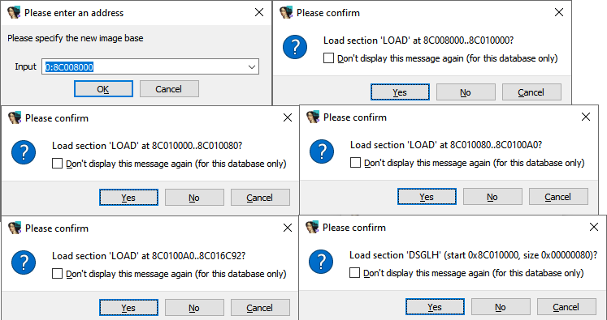

To save on analysis time and database size, by default IDA only tries to load relevant parts of the binary (e.g. those that are expected or known to contain code). However, there may be cases when you want to see more, or even everything the binary contains. You can always load the file as plain binary and mark it up manually, using IDA as a sort of a hybrid hex editor, but this way you lose the features handled by the built-in loaders such as names from the symbol table, automatic function boundaries from the file metadata and so on. So it may be interesting to have more granular control over the file loading process.  
为了节省分析时间和数据库大小，默认情况下，IDA 只尝试加载二进制文件的相关部分（例如，预计或已知包含代码的部分）。然而，在某些情况下，您可能希望看到二进制文件的更多内容，甚至全部内容。您可以将文件加载为普通二进制文件，然后使用 IDA 作为混合十六进制编辑器对其进行手动标记，但这样就会失去内置加载器处理的功能，例如符号表中的名称、文件元数据中的自动函数边界等。因此，对文件加载过程进行更精细的控制可能会很有趣。

To support such scenarios, IDA offers the _Manual load_ checkbox in the initial load dialog.  
为了支持这种情况，IDA 在初始加载对话框中提供了手动加载复选框。



What happens when the option is checked depends on the loader. For example, the PE loader may allow you to pick another load base (image base), choose which sections to load, and whether to parse some optional metadata which could, for example, be corrupted and result in bad analysis.  
选中该选项后会发生什么取决于加载器。例如，PE 加载器可能允许您选择另一个加载基础（映像基础），选择加载哪些部分，以及是否解析某些可选元数据，这些元数据可能会损坏并导致错误分析。



The ELF loader behaves in a similar manner  
ELF 加载器的行为方式与此类似



If you want IDA to always load all PE sections, you can edit `cfg/pe.cfg` and set the option `PE_LOAD_ALL_SECTIONS`:  
如果希望 IDA 始终加载所有 PE 部分，可以编辑 `cfg/pe.cfg` 并设置选项 `PE_LOAD_ALL_SECTIONS` ：

```
// Always load all sections of a PE file?
// If no, sections like .reloc and .rsrc are skipped

PE_LOAD_ALL_SECTIONS = YES
```

See also: 另请参见：

[IDA Help: Load file dialog  
IDA 帮助：加载文件对话框](https://www.hex-rays.com/products/ida/support/idadoc/242.shtml)