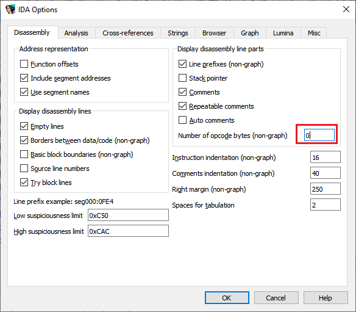
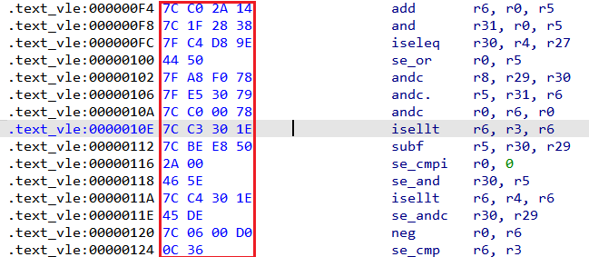
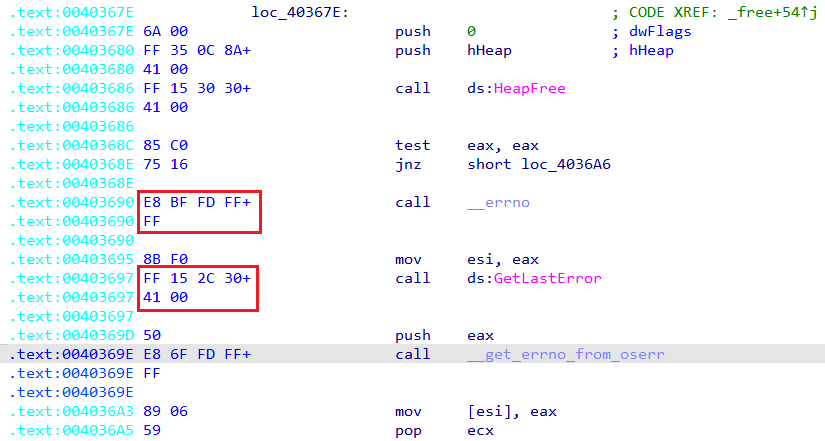
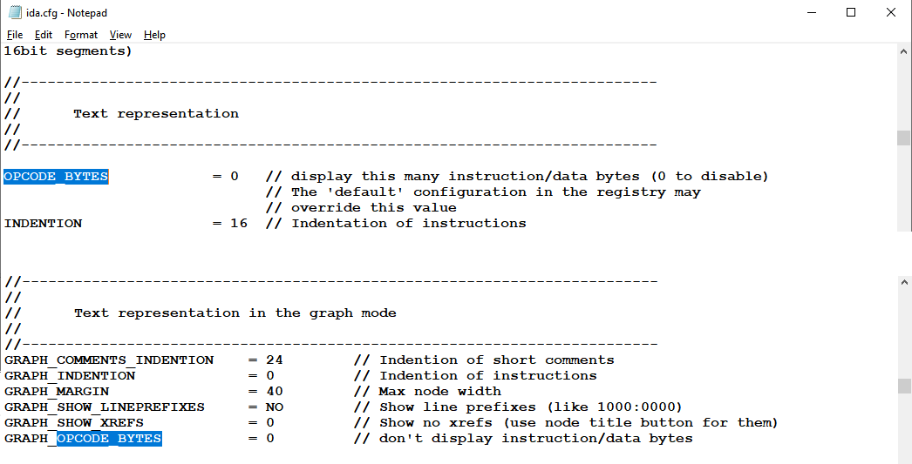

When disassembling, you are probably more interested in seeing the code (disassembly or pseudocode) rather than the raw file data, but there may be times you need to see what actually lies behind the instructions.  
反汇编时，你可能更感兴趣的是查看代码（反汇编或伪代码）而不是原始文件数据，但有时你可能需要查看指令背后的实际内容。

One option is to use [the Hex View](https://hex-rays.com/blog/igors-tip-of-the-week-38-hex-view/), possibly docked and synchronized with IDA View.  
一种方法是使用六进制视图，也可以与 IDA 视图对接和同步。

But probably a simpler solution is the [disassembly option](https://hex-rays.com/blog/igors-tip-of-the-week-25-disassembly-options/) _Number of opcode bytes_.  
但更简单的解决方案可能是反汇编选项 "操作码字节数"（Number of opcode bytes）。

By setting it to a non-zero value, IDA will use the specified number of columns to display the bytes of the instructions at the start of the disassembly line.  
将其设置为非零值后，IDA 将使用指定的列数显示反汇编行起始处的指令字节。

If the instruction is longer than the specified number of bytes, extra lines will be used to display the remainder of the opcode:  
如果指令长度超过指定字节数，将使用额外行显示操作码的剩余部分：

If you prefer to have IDA simply truncate the long opcodes instead of using extra lines, specify a negative value (e.g. -4).  
如果您希望 IDA 直接截断长操作码而不使用额外行数，请指定一个负值（例如 -4）。

### Showing opcode bytes by default  
默认显示操作码字节数

If you prefer to always see opcode bytes, you can use the `OPCODE_BYTES` setting in `ida.cfg` (either the one in your IDA install, or the override in [user directory](https://hex-rays.com/blog/igors-tip-of-the-week-33-idas-user-directory-idausr/)). This enables opcode bytes in the text view only; for the graph view use the setting `GRAPH_OPCODE_BYTES`.  
如果希望始终看到操作码字节，可以使用 `ida.cfg` 中的 `OPCODE_BYTES` 设置（可以是 IDA 安装中的设置，也可以是用户目录中的覆盖设置）。这将仅在文本视图中启用运算码字节；在图形视图中使用 `GRAPH_OPCODE_BYTES` 设置。

Another possibility is set up the opcode bytes (and other disassembly options) as you like and save the current [desktop layout as default](https://hex-rays.com/blog/igors-tip-of-the-week-22-ida-desktop-layouts/); it will be used for all new databases.  
另一种方法是按自己的喜好设置操作码字节（以及其他反汇编选项），并将当前的桌面布局保存为默认设置；它将用于所有新的数据库。

See also: 另请参见：

[IDA Help: Text Representation Dialog  
IDA 帮助：文本表示对话框](https://www.hex-rays.com/products/ida/support/idadoc/605.shtml)

[Igor’s tip of the week #38: Hex view – Hex Rays  
伊戈尔的每周小贴士 #38：十六进制视图 - 十六进制射线](https://hex-rays.com/blog/igors-tip-of-the-week-38-hex-view/)

[Igor’s tip of the week #25: Disassembly options  
伊戈尔本周提示 #25：反汇编选项](https://hex-rays.com/blog/igors-tip-of-the-week-25-disassembly-options/)

[Igor’s tip of the week #22: IDA desktop layouts  
伊戈尔本周小贴士 #22：IDA 桌面布局](https://hex-rays.com/blog/igors-tip-of-the-week-22-ida-desktop-layouts/)