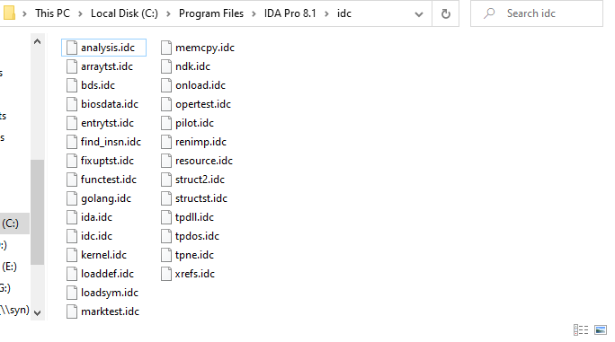
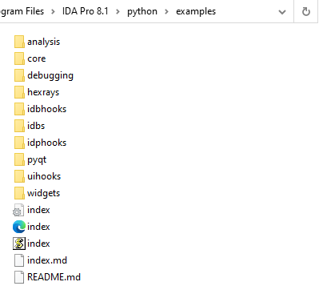
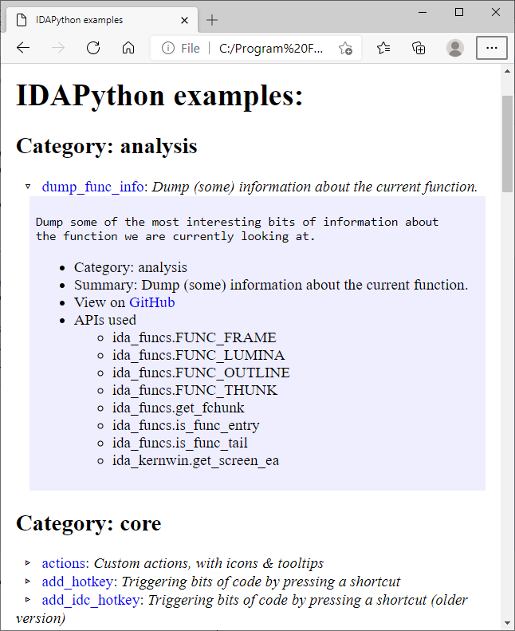

Although IDA was initially created for interactive usage and tries to automate as much of the tedious parts of RE as possible, it still cannot do everything for you and doing the still necessary work manually can take a long time. To alleviate this, IDA ships with IDC and IDAPython scripting engines, which can be used for automating some repetitive tasks. But it can be difficult to know where to start, so let’s see where you can find some examples to get started.  
虽然 IDA 最初是为交互式使用而创建的，并试图尽可能自动化 RE 的繁琐部分，但它仍然无法为您完成所有工作，而且手动完成仍然必要的工作可能需要很长时间。为了缓解这一问题，IDA 附带了 IDC 和 IDAPython 脚本引擎，可用于自动完成一些重复性任务。但是，要知道从哪里开始可能会很困难，所以让我们看看在哪里可以找到一些示例来开始。

### IDC samples IDC 样本

Although IDC is quite old fashioned, it has the advantage of being built-in into IDA and does not require any additional software. It is also the only scripting language available in [IDA Free](https://www.hex-rays.com/ida-free/). For some sample IDC scripts, see the `idc` directory in IDA’s install location:  
虽然 IDC 相当老式，但它的优点是内置于 IDA 中，不需要任何额外软件。它也是 IDA Free 中唯一可用的脚本语言。有关一些 IDC 脚本示例，请参见 IDA 安装位置中的 `idc` 目录：

Please note that some of these files are not stand-alone scripts but are used by IDA for various tasks such as [customized startup actions](https://hex-rays.com/blog/igors-tip-of-the-week-116-ida-startup-files/) (`ida.idc`, `onload.idc`) or [batch analysis](https://hex-rays.com/blog/igor-tip-of-the-week-08-batch-mode-under-the-hood/) (`analysis.idc`).  
请注意，其中一些文件不是独立的脚本，而是 IDA 用于各种任务的脚本，如自定义启动操作 ( `ida.idc` , `onload.idc` ) 或批量分析 ( `analysis.idc` ) 。

A few user-contributed scripts are also available under the “User contributions” section in our [Download center](https://hex-rays.com/download-center/). Note that due to their age and the big [API refactoring](https://hex-rays.com/products/ida/news/7_0/docs/api70_porting_guide/) which unified IDA API  and IDC, some of them may need adjustments to run in recent IDA versions.  
在我们下载中心的 "用户贡献 "部分也提供了一些用户贡献的脚本。需要注意的是，由于这些脚本的使用年限较长，而且 API 重构后 IDA API 和 IDC 得到了统一，因此其中一些脚本可能需要调整才能在最近的 IDA 版本中运行。

### IDAPython examples IDAPython 示例

IDAPython project had examples from the beginning, and you can find them [in the source repository](https://github.com/idapython/src/tree/master/examples), but we’re also shipping them with IDA, in the `python/examples` directory.  
IDAPython 项目从一开始就有一些示例，您可以在源码库中找到它们，但我们也将它们与 IDA 一起发布在 `python/examples` 目录中。

The provided `index.html` can be opened in a browser to see the list of the examples with short descriptions and also a list of used IDAPython APIs/keywords to help you find examples of a specific API’s usage.  
可在浏览器中打开所提供的 `index.html` 查看带有简短说明的示例列表，还可查看已使用的 IDAPython API/关键词列表，以帮助您查找特定 API 的使用示例。

There are also countless examples of IDAPython scripts and plugins created by our users. Some of then can be found on our [plugin contest pages](https://hex-rays.com/contests/) and [plugin repository](https://plugins.hex-rays.com/), while even more might be found on code-sharing websites (GitHub, GitLab etc.), or individual authors’ websites and blogs. Oftentimes, searching for an API name on the Web can bring you to examples of its usage.  
我们的用户还创建了无数的 IDAPython 脚本和插件示例。其中一些可以在我们的插件竞赛页面和插件库中找到，而更多的可以在代码共享网站（GitHub、GitLab 等）或作者个人的网站和博客中找到。通常，在网上搜索 API 名称就能找到其使用示例。

In addition to the examples made just for demonstration purposes, there are a few Python-based loaders and processors modules shipped with IDA. They can be found by looking for `.py` files under `loader` and `procs` directories of IDA.  
除了为演示目的而制作的示例外，IDA 还提供了一些基于 Python 的加载器和处理器模块。您可以在 IDA 的 `loader` 和 `procs` 目录下查找 `.py` 文件。    