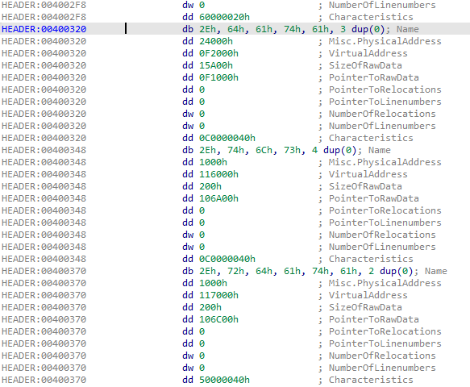
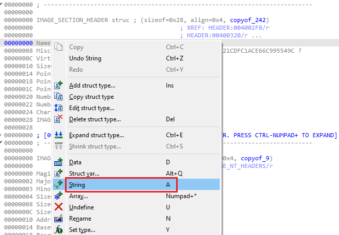
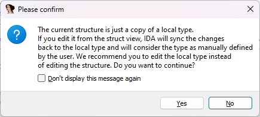
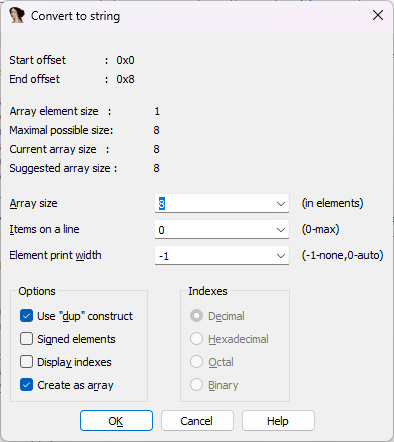
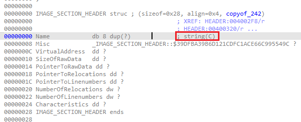
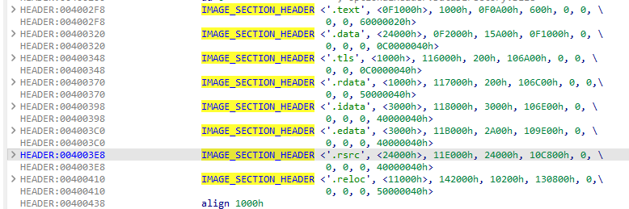
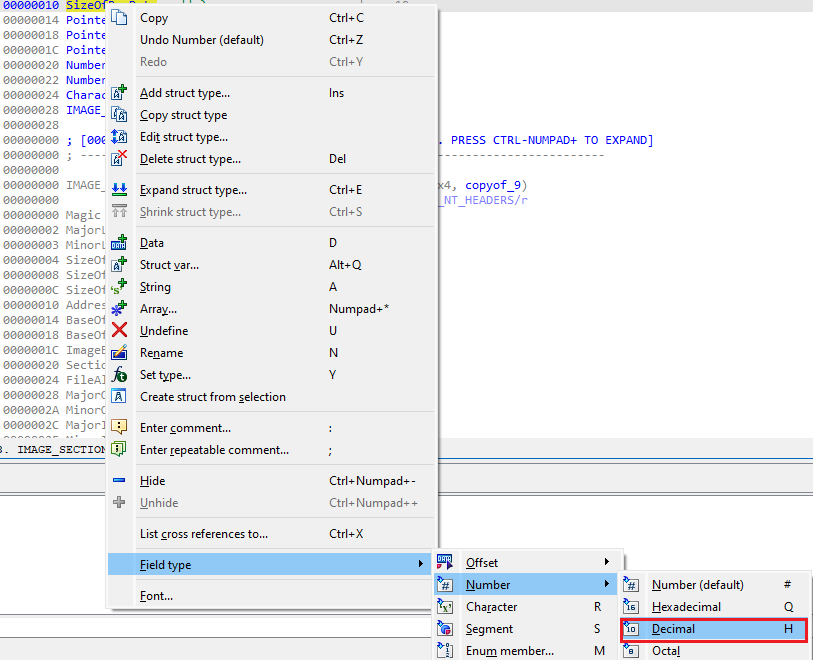

When dealing with structure instances in disassembly, sometimes you may want to change how IDA displays them, but how to do it is not always obvious. Let’s have a look at some examples.  
在反汇编中处理结构体实例时，有时您可能想改变 IDA 显示结构体实例的方式，但如何做并不总是显而易见的。让我们来看几个例子。

### Win32 section headers Win32 部件头

Let’s say you have loaded the PE file header using [manual load](https://hex-rays.com/blog/igors-tip-of-the-week-122-manual-load/), or found an embedded PE file in your binary, and want to format its PE header nicely. Thanks to the [standard type libraries](https://hex-rays.com/blog/igors-tip-of-the-week-60-type-libraries/), you can import standard Win32 structures such as `[IMAGE_NT_HEADERS](https://learn.microsoft.com/en-us/windows/win32/api/winnt/ns-winnt-image_nt_headers32)` or [IMAGE_SECTION_HEADER](https://learn.microsoft.com/en-us/windows/win32/api/winnt/ns-winnt-image_section_header) and apply them to the header area:  
比方说，您使用手动加载方式加载了 PE 文件头，或在二进制文件中发现了一个嵌入式 PE 文件，并希望能很好地格式化 PE 文件头。借助标准类型库，您可以导入标准的 Win32 结构，如 `[IMAGE_NT_HEADERS](https://learn.microsoft.com/en-us/windows/win32/api/winnt/ns-winnt-image_nt_headers32)` 或 IMAGE_SECTION_HEADER，并将它们应用到标题区域：

However, because the `Name` field is declared simply as a `BYTE` array in the original structure, IDA shows them as bytes instead of nice readable string. Without the struct, we could use  the Create string (A) command, but it is also possible to show the string as part of the structure instance.  
不过，由于 `Name` 字段在原始结构中被简单声明为 `BYTE` 数组，因此 IDA 将其显示为字节而非漂亮的可读字符串。如果没有结构体，我们可以使用创建字符串（ A ）命令，但也可以将字符串显示为结构体实例的一部分。

### Changing structure field representation  
更改结构字段表示

To change how a specific fiield should be formatted in the disassembly, go to it in the structure definition in the Structures window and use Edit or the context menu. For example,  use the String (A) action to have IDA format the Name byte array as a string.  
要更改反汇编中特定字段的格式，请在 "结构（Structures）"窗口的结构定义中找到该字段，然后使用 "编辑（Edit）"或上下文菜单。例如，使用 String ( A ) 操作可让 IDA 将 Name 字节数组格式化为字符串。

When you edit an imported structure for the first time, you may get this warning:  
首次编辑导入的结构时，可能会收到以下警告：

Because the field type representation cannot be specified in Local Types, we have to edit the structure, so answer Yes to continue. A dialog to specify the string length will be displayed, just confirm it:  
因为字段类型表示法不能在本地类型中指定，所以我们必须编辑结构，请回答 "是 "继续。此时将显示一个指定字符串长度的对话框，只需确认即可：

The field will gain a comment indicating that the array is now a string:  
字段将获得一个注释，表明数组现在是一个字符串：

And the struct instances in the binary will now show the first field as a string:  
二进制文件中的结构体实例将显示第一个字段为字符串：

In addition to strings, you can ofcourse change representation of other structure fields similarly to [operand representation](https://hex-rays.com/blog/igors-tip-of-the-week-46-disassembly-operand-representation/) for instructions. For example, you can change the `SizeOfRawData` field to be printed in decimal  instead of the default hex.  
除字符串外，您当然还可以改变其他结构字段的表示法，就像指令的操作数表示法一样。例如，可以将 `SizeOfRawData` 字段改为十进制打印，而不是默认的十六进制。

See also:  另请参见：

[IDA Help: Assembler level and C level types  
IDA 帮助：汇编器级和 C 级类型](https://www.hex-rays.com/products/ida/support/idadoc/1042.shtml)

[Igor’s tip of the week #46: Disassembly operand representation  
伊戈尔本周小贴士 #46：反汇编操作数表示法](https://hex-rays.com/blog/igors-tip-of-the-week-46-disassembly-operand-representation/)