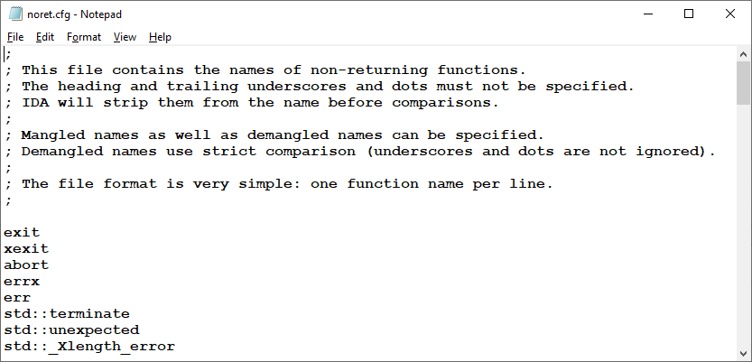
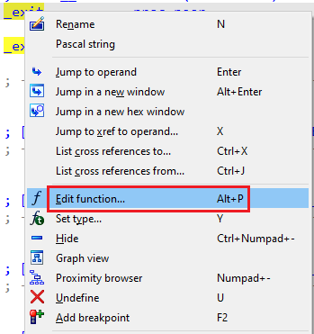
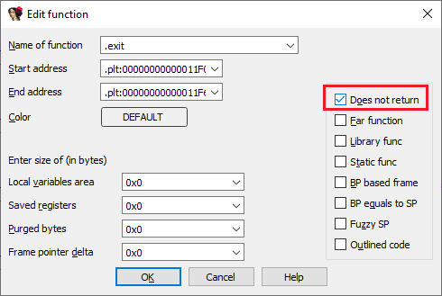
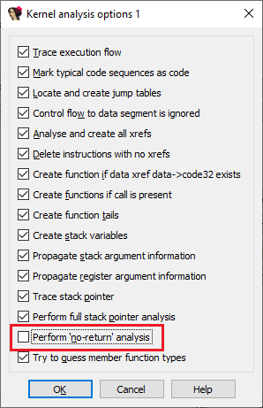
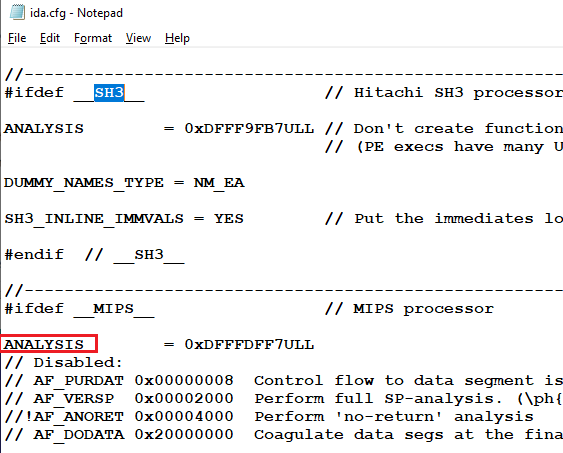

Some functions in programs do not return to caller: well-known examples include C runtime functions like `exit()`, `abort()`, `assert()` but also many others. Modern compilers can exploit this knowledge to optimize the code better: for example, the code which would normally follow such a function call does not need to be generated which decreases the program size. Other functions, which call non-returning functions unconditionally also become non-returning, which can lead to further optimizations.  
程序中的某些函数不会返回给调用者：众所周知的例子包括 C 运行时函数 `exit()` 、 `abort()` 、 `assert()` 以及许多其他函数。现代编译器可以利用这一知识更好地优化代码：例如，通常在这种函数调用之后不需要生成代码，从而减少了程序的大小。无条件调用非返回函数的其他函数也会变成非返回函数，从而进一步优化程序。

### Well-known functions 众所周知的函数

IDA uses function names to mark well-known non-returning functions. The list of such names is stored in the file `cfg/noret.cfg`, which can be edited to add more names if necessary:  
IDA 使用函数名来标记著名的非返回函数。此类名称的列表存储在文件 `cfg/noret.cfg` 中，如有必要，可以编辑该文件以添加更多名称：

### Marking non-returning functions manually  
手动标记非返回函数

Instead of editing `noret.cfg`, you can also mark a function as non-returning manually on a case-by-case basis. This can be done by editing function properties: _Edit > Functions > Edit Function…_ in the main menu, _Edit Function…_ in the context menu or the Alt–P shortcut.  
除了编辑 `noret.cfg` 之外，您还可以根据具体情况手动将函数标记为不返回。这可以通过编辑函数属性来实现：编辑 > 函数 > 编辑函数...（主菜单）、编辑函数...（右键菜单）或使用 Alt - P 快捷键。

Another option is to edit the function’s prototype and add the [`__noreturn` keyword](https://hex-rays.com/blog/igors-tip-of-the-week-52-special-attributes/).  
另一种方法是编辑函数的原型并添加 `__noreturn` 关键字。

### Identifying no-return calls  
识别无返回调用

Incorrectly identified non-returning calls may lead to various problems during analysis: functions being truncated too early; decompiled pseudocode missing big parts of the function and so on. One option is to inspect each function being called to see if it has the _Does not return_ flag set (or `Attributes: noreturn` mentioned in a comment) but this can take a long time with many calls. So there are indicators which may be easier to spot:  
不正确识别不返回调用可能会在分析过程中导致各种问题：函数被过早截断；反编译伪代码丢失函数的大部分内容等。一种方法是检查每个被调用的函数，看其是否设置了不返回标志（或注释中提到的 `Attributes: noreturn` ），但这可能需要很长时间才能完成许多调用。因此，有一些指标可能更容易发现：

### Enabling or disabling no-return analysis  
启用或禁用无返回分析

If you find that IDA’s treatment of non-returning functions does not work well with your specific binary or set of binaries, you can turn it off. This can be done in the first set of the [analysis options](https://hex-rays.com/blog/igors-tip-of-the-week-98-analysis-options/) at the initial load time or afterwards. Conversely, you can enable it for processors which do not enable it by default.  
如果您发现 IDA 对非返回函数的处理对您的特定二进制文件或二进制文件集效果不佳，您可以将其关闭。这可以在初始加载时或之后的第一组分析选项中进行。反之，您也可以为默认情况下不启用该功能的处理器启用该功能。

If you need to permanently enable or disable it for all new databases, edit the `ANALYSIS` value in `ida.cfg` to include or not the `AF_ANORET` flag. NB: you should edit the value under `#ifdef` for the specific processor you need.  
如果需要在所有新数据库中永久启用或禁用它，请编辑 `ida.cfg` 中的 `ANALYSIS` 值，以包括或不包括 `AF_ANORET` 标志。注意：应针对所需的特定处理器编辑 `#ifdef` 下的值。

See also: [IDA Help: Function flags](https://www.hex-rays.com/products/ida/support/idadoc/1729.shtml)  
另请参阅IDA 帮助：函数标志