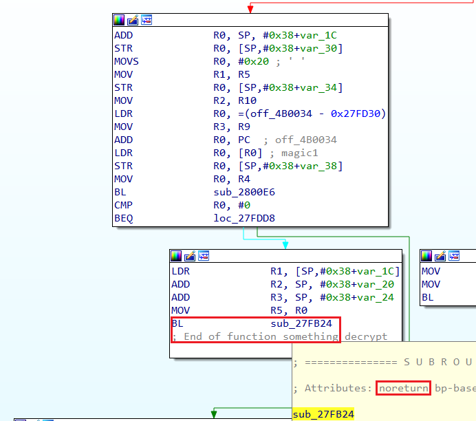
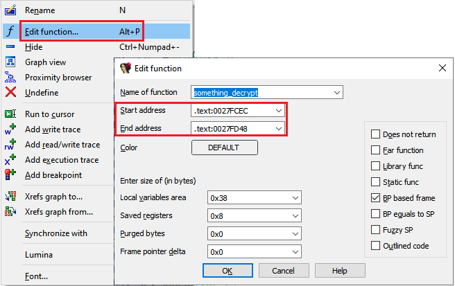
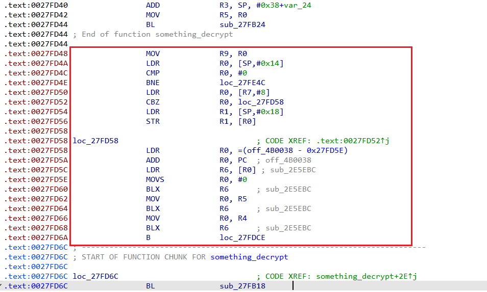

When analyzing regular, well-formed binaries, you can usually rely on IDA’s autoanalysis to create functions and detect their boundaries correctly. However, there may be situations when IDA’s guesses need to be adjusted.  
在分析常规的、格式良好的二进制文件时，通常可以依靠 IDA 的自动分析功能来创建函数并正确检测其边界。不过，在某些情况下，IDA 的猜测可能需要调整。

### Non-returning calls 非返回调用

One example could be calls to [non-returning functions](https://hex-rays.com/blog/igors-tip-of-the-week-126-non-returning-functions/). Let’s say a function has been misdetected by IDA as non-returning:  
其中一个例子是对非返回函数的调用。比方说，一个函数被 IDA 误判为不返回：

But on further analysis you realize that it actually returns and remove the no-return flag. However, IDA has already truncated the function after the call and now you need to extend it to include the code after call. How to do it?  
但在进一步分析后，你发现它实际上是返回的，于是删除了不返回标记。然而，IDA 已经在调用后截断了函数，现在您需要扩展它以包含调用后的代码。如何扩展？

### Recreating the function 重新创建函数

This is probably the quickest approach which can be used in simple situations:  
这可能是在简单情况下最快捷的方法：

1.  Go to the start of the function (for example, by double-clicking the function in the [Functions list](https://hex-rays.com/blog/igors-tip-of-the-week-28-functions-list/)), or via key sequence Ctrl–P, Enter.  
    转到函数的起始位置（例如，双击函数列表中的函数），或通过键序 Ctrl - P , Enter .
2.  Delete the function (from the Functions list), or Ctrl–P, Del. If you were in Graph view, IDA will switch to the text view.  
    删除函数（从函数列表中），或按 Ctrl - P , Del 。 如果您在图形视图中，IDA 将切换到文本视图。
3.  Create it again (Create function… from context menu), or press P.  
    再次创建（从上下文菜单中创建函数...），或按 P 。

This works well if the changes were enough to fix the original problem. You may need to repeat this a few times when fixing problems one by one. Note that deleting the function may destroy some of the information attached to it (such as the function comment), so this is not always the best choice.  
如果所做的更改足以解决原来的问题，那么这个方法就很有效。在逐个解决问题时，可能需要重复几次。需要注意的是，删除函数可能会破坏附加在函数上的某些信息（如函数注释），因此这并不总是最佳选择。

### Editing function bounds 编辑函数边界

The _Edit function_ dialog has fields for function’s start and end addresses:  
编辑函数 "对话框有函数开始和结束地址字段：

They can be edited to expand or shrink the function, but there are some limitations:  
可以编辑它们来扩展或缩小函数，但有一些限制：

1.  The new function bounds may not intersect with another function or a [function chunk](https://hex-rays.com/blog/igors-tip-of-the-week-86-function-chunks/). They also may not cross a segment boundary.  
    新函数边界不得与其他函数或函数块相交。它们也不得与程序段边界相交。
2.  The function start must be a valid instruction.  
    函数起始地址必须是有效指令。

Keep in mind that the end address is exclusive, i.e. it is the address **after** the last instruction of the function.  
请记住，结束地址是排他的，即它是函数最后一条指令之后的地址。

### Changing the function end  
更改功能结束

To move the current or preceding function’s end only, you can use the hotkey E (Set function end). If there is a function or a chunk at the current address, it is truncated to end just after the current instruction. If the current address does not belong to a function, the nearest preceding function or chunk is extended instead. If the extension causes function chunks to be immediately next to each other, they’re merged together.  
使用热键 E （设置函数结束符）可以仅移动当前或前一个函数的结束符。如果当前地址处有函数或块，它将被截断，在当前指令后结束。如果当前地址不属于函数，则会扩展最靠近的函数或块。如果扩展导致函数块彼此紧邻，则会将它们合并在一起。

For example, consider this situation:  
例如

The instructions in the red rectangle should be part of the function but they’re currently “independent” (this can also be seen by the color of the address prefix which is brown and not black like for instructions inside a function). To make them part of the function, we can move its end to the last one (`0027FD6A`). Putting the cursor there and invoking Edit > Functions > Set function end (shortcut E) will move the function end from `0027FD44` to `0027FD6A`. Because this makes the function adjacent to its own chunk, IDA merges the chunk with the function and the function is expanded to cover all newly reachable instructions.  
红色矩形中的指令应该是函数的一部分，但它们目前是 "独立 "的（从地址前缀的颜色也可以看出这一点，它是棕色的，而不是函数内部指令的黑色）。为了使它们成为函数的一部分，我们可以将其结尾移到最后一条（ `0027FD6A` ）。将光标放在这里，然后调用编辑 > 函数 > 设置函数结束（快捷键 E ），就会将函数结束从 `0027FD44` 移到 `0027FD6A` 。由于这使得函数与它自己的语块相邻，IDA 将语块与函数合并，函数将被扩展以覆盖所有新的可达指令。

See also:  另请参见：

[IDA Help: Edit Function  
IDA 帮助：编辑函数](https://www.hex-rays.com/products/ida/support/idadoc/485.shtml)

[IDA Help: Set Function End  
IDA 帮助设置函数结束](https://www.hex-rays.com/products/ida/support/idadoc/487.shtml)