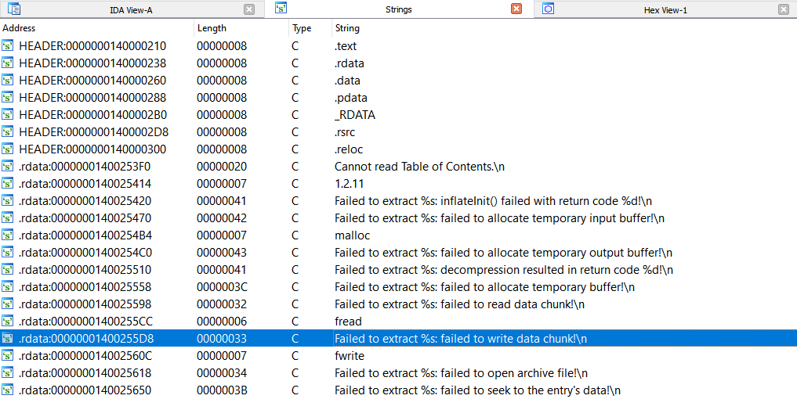
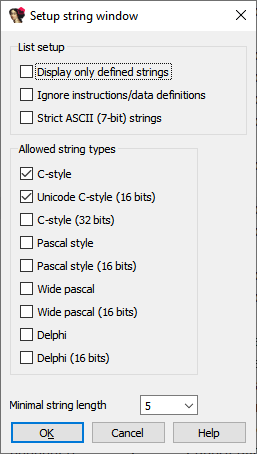

When exploring an unfamiliar binary, it may be difficult to find interesting places to start from. One common approach is to check what strings are present in the program – this might give some hints about its functionality and maybe some starting places for analysis. While you can scroll through the listing and look at the strings as you come across them, it is probably more convenient to see them all in one place. IDA offer this functionality as the _Strings_ view.  
在探索一个陌生的二进制程序时，可能很难找到有趣的切入点。一种常见的方法是查看程序中有哪些字符串--这可能会为程序的功能提供一些提示，或许还能为分析提供一些切入点。虽然您可以滚动查看列表中的字符串，但在一个地方查看所有字符串可能更方便。IDA 提供了字符串视图这一功能。

### Opening String list 打开字符串列表

To open the list, use the menu View > Open subviews > Strings, or the shortcut Shift–F12. Note that the first time IDA will scan the whole database so it may take some time on big files. If you have a really big binary, it may be useful to [select a range](https://hex-rays.com/blog/igor-tip-of-the-week-03-selection-in-ida/) before invoking the command will so that the scan is limited to the selection.  
要打开列表，可使用菜单 "视图" > "打开子视图" > "字符串"，或使用快捷键 Shift - F12 。请注意，第一次 IDA 会扫描整个数据库，因此扫描大文件可能需要一些时间。如果您的二进制文件非常大，那么在调用命令之前选择一个范围可能会很有用，这样扫描就仅限于所选范围。

The view includes the string’s address, length (in characters, including the terminating one), type (e.g. `C` for standard 8-bit strings or `C16` for Unicode (UTF-16)), and the text of the string. Double-clicking an entry will jump to the string in the binary, and you can, for example, check the [cross-references](https://hex-rays.com/blog/igor-tip-of-the-week-16-cross-references/) to see where it’s used.  
视图包括字符串的地址、长度（以字符为单位，包括终止符）、类型（例如 `C` 表示标准 8 位字符串， `C16` 表示 Unicode (UTF-16)）以及字符串的文本。双击一个条目将跳转到二进制中的字符串，例如，你可以检查交叉引用，查看它在哪里被使用。

### String list options 字符串列表选项

The default settings are somewhat conservative so if you think some items are missing (or, conversely, you see a lot of useless entries), changing scan options can be useful. For this, use “Setup..” from the context menu.  
默认设置有些保守，因此如果你认为缺少了一些项目（或者相反，你看到了很多无用的条目），更改扫描选项可能会很有用。为此，请使用上下文菜单中的 "Setup...（设置...）"。

-   _Display only defined strings_ will have IDA include only explicitly defined string literals (e.g. strings discovered in a middle of undefined areas won’t be included).  
    只显示已定义的字符串将使 IDA 只包含明确定义的字符串字面量（例如，在未定义区域中间发现的字符串将不会包含在内）。
-   _Ignore instructions/data definitions_ makes IDA look for text inside code or non-string data.  
    忽略指令/数据定义可使 IDA 查找代码内的文本或非字符串数据。
-   _Strict ASCII (7-bit) strings_ option shows only strings with characters in the basic ASCII range.   
    严格 ASCII（7 位）字符串选项只显示包含基本 ASCII 范围内字符的字符串。
-   _Allowed string types_ lets you choose what string types you are interested in.  
    允许的字符串类型可让您选择感兴趣的字符串类型。
-   _Minimal string length_ sets the lower limit on the length the string must have to be included in the list. Raising the limit may be useful to filter out false positives.  
    最小字符串长度设置了要包含在列表中的字符串长度的下限。提高该限制可能有助于过滤误报。

Note that you will likely need to invoke “Rebuild…” from the context menu to refresh the list after changing the options.  
请注意，在更改选项后，您可能需要从上下文菜单中调用 "重建... "来刷新列表。

See also: [IDA Help: Strings window](https://www.hex-rays.com/products/ida/support/idadoc/1379.shtml)  
另请参阅IDA 帮助：字符串窗口