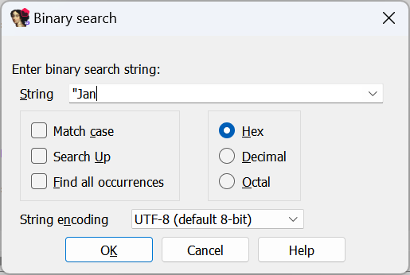
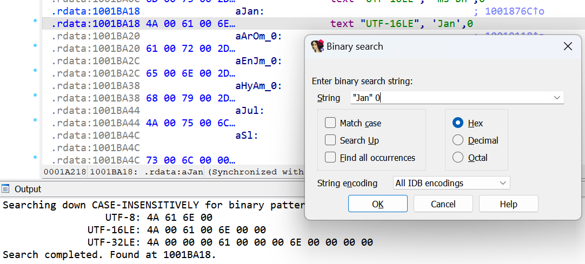

Using the [string list](https://hex-rays.com/blog/igors-tip-of-the-week-128-strings-list/) is one way to look for text in the binary but it has its downsides: building the list takes time for big binaries, some strings may be missing initially so you may need several tries to get the options right, and then you need to actually find what you need in the list.  
使用字符串列表是在二进制文件中查找文本的一种方法，但它也有缺点：对于大型二进制文件来说，建立列表需要时间，最初可能会丢失一些字符串，因此你可能需要多次尝试才能找到正确的选项，然后你需要在列表中找到你需要的内容。

If you already know the text you want to find (e.g. from the output of the program), there is a quicker way.  
如果您已经知道要查找的文本（例如从程序的输出中），有一种更快捷的方法。

### Using binary search for text  
使用二进制搜索文本

The binary search action can be invoked via Search > Sequence of bytes… menu, or the Alt–B shortcut. Although its primary use is for binding known byte sequences, you can also use it for finding text embedded in the binary. For this, surround the text string with double quotes (`"`). The closing quote is optional.  
可以通过搜索 > 字节序列...菜单或 Alt - B 快捷键调用二进制搜索操作。虽然二进制搜索的主要用途是绑定已知的字节序列，但也可以用来查找嵌入二进制中的文本。为此，请用双引号 ( `"` ) 包围文本字符串。结尾引号是可选的。



Once a quote is present in the input box, the _String encoding_ dropdown is enabled. It allows you to choose in which [encoding](https://hex-rays.com/blog/igor-tip-of-the-week-13-string-literals-and-custom-encodings/)(s) to look for the string.  
一旦输入框中出现引号，就会启用字符串编码下拉菜单。它允许你选择查找字符串的编码。

After confirming, IDA will print in the Output window the exact byte patterns it’s looking for:  
确认后，IDA 将在输出窗口中打印所查找的确切字节模式：

```
Searching down CASE-INSENSITIVELY for binary patterns:
UTF-8: 4A 61 6E
UTF-16LE: 4A 00 61 00 6E 00
UTF-32LE: 4A 00 00 00 61 00 00 00 6E 00 00 00
Search completed. Found at 1001A9C4.
```

You can also mix string literals and byte values. For example, to find “Jan” but not “January”, add `0` for the C string terminator:  
您还可以混合使用字符串字面形式和字节值。例如，要查找 "Jan "而不是 "January"，可在 C 字符串结束符中添加 `0` ：



To continue the search, use Search > Next sequence of bytes…, or shortcut Ctrl–B.  
要继续搜索，请使用搜索 > 下一字节序列...，或使用快捷键 Ctrl - B 。

See also: 另请参见：

[Igor’s tip of the week #48: Searching in IDA  
伊戈尔本周提示 #48：在 IDA 中搜索](https://hex-rays.com/blog/igors-tip-of-the-week-48-searching-in-ida/)

[IDA Help: Search for substring in the file  
IDA 帮助：在文件中搜索子串](https://www.hex-rays.com/products/ida/support/idadoc/579.shtml)

[IDA Help: Binary string format  
IDA 帮助：二进制字符串格式](https://www.hex-rays.com/products/ida/support/idadoc/528.shtml)