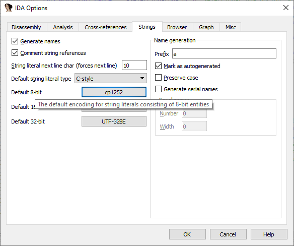

大多数 IDA 用户分析的软件通常使用英语或其他基于拉丁字母的语言。因此，IDA 默认的字符串字面量编码（Windows 上使用操作系统的系统编码，Linux/macOS 上使用 UTF-8）通常已经足够。但有时你会遇到使用其他语言的程序。

## Unicode 字符串

如果程序使用宽字符串，通常只需在创建字符串字面量时选择相应的 `Unicode C-style` 选项即可。

一般来说，Windows 程序倾向于使用 16 位宽字符串（`wchar_t` 为 16 位），而 Linux 和 macOS 使用 32 位宽字符串（`wchar_t` 为 32 位）。

当然也有例外，你需要根据具体的二进制文件来选择。

小技巧：可以使用快捷键快速创建特定类型的字符串，例如 `Alt–A, U` 用于 16 位 Unicode。

### 自定义编码

有时被分析的二进制文件使用的编码与 IDA 默认选择的不同，甚至在同一个文件中存在多种互不兼容的编码。这种情况下，你可以：

为单个字符串字面量单独设置编码，或者全局设置所有新字符串的默认编码。

#### 添加新的编码

要将自定义编码加入默认列表（通常包含 UTF-8、UTF-16LE 和 UTF-32LE）：

1. 打开 `Options > String literals…` (`Alt–A`)
1. 点击 `Currently:` 旁边的按钮
1. 在菜单中选择 `Insert…` (`Ins`)
1. 指定编码名称

编码名称可以是：

- Windows 代码页（如 866、CP932、windows-1251）
- 常见字符集名称（如 Shift-JIS、UTF-8、Big5）
- 在 Linux/macOS 上，可以运行 `iconv -l` 查看可用编码

⚠️ 注意：部分编码并非所有系统都支持，因此你的 IDB 文件可能会变得依赖于具体系统。

#### 为特定字符串字面量设置编码

1. 打开 `Options > String literals…` (`Alt–A`)
1. 点击 `Currently:` 旁边的按钮
1. 选择要使用的编码
1. 如果是新建字符串，点击相应的按钮（如 C-Style）；如果是修改已有字符串，直接点击 OK 即可

#### 设置默认编码

1. 打开 `Options > String literals…` (`Alt–A`)
1. 点击 `Manage defaults`
1. 在 `Default 8-bit` 旁边选择要使用的编码

从此以后，快捷键 `A` 创建的字符串字面量将使用新的默认编码，但你仍然可以在具体情况下覆盖它。

原文地址：https://hex-rays.com/blog/igor-tip-of-the-week-13-string-literals-and-custom-encodings