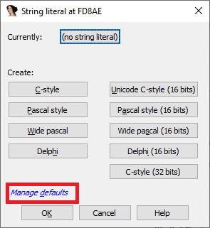

Most of IDA users probably analyze software that uses English or another Latin-based alphabet. Thus the defaults used for string literals – the OS system encoding on Windows and UTF-8 on Linux or macOS – are usually good enough. However, occasionally you may encounter a program which does use another language.  
大多数 IDA 用户可能会分析使用英语或其他拉丁字母的软件。因此，用于字符串字面量的默认值（Windows 上的操作系统系统编码和 Linux 或 macOS 上的 UTF-8）通常已经足够好了。不过，偶尔也会遇到使用其他语言的程序。

### Unicode strings 统一字符串

In case the program uses _wide strings_, it is usually enough to use the corresponding “Unicode C-style” option when creating a string literal:  
如果程序使用宽字符串，通常只需在创建字符串字面时使用相应的 "Unicode C-style "选项即可：

In general, Windows programs tend to use 16-bit wide strings (`wchar_t` is 16-bit) while Linux and Mac use 32-bit ones (`wchar_t` is 32-bit). That said, exceptions happen and you can use either one depending on a specific binary you’re analyzing.  
一般来说，Windows 程序倾向于使用 16 位宽字符串（ `wchar_t` 为 16 位），而 Linux 和 Mac 则使用 32 位字符串（ `wchar_t` 为 32 位）。不过也有例外情况，你可以根据分析的特定二进制文件使用其中一种。

Hint: you can use accelerators to quickly create specific string types, for example Alt–A, U for Unicode 16-bits.  
提示：您可以使用加速器快速创建特定的字符串类型，例如 Alt - A , U 用于 Unicode 16 位。

### Custom encodings 自定义编码

There may be situations when the binary being analyzed uses an encoding different from the one picked by IDA, or even multiple mutually incompatible encodings in the same file. In that case you can set the encoding separately for individual string literals, or globally for all new strings.  
在某些情况下，被分析的二进制文件使用的编码可能与 IDA 选定的编码不同，甚至在同一文件中存在多个互不兼容的编码。在这种情况下，你可以为单个字符串字面分别设置编码，或为所有新字符串全局设置编码。

##### Add a new encoding  
添加新编码

To add a custom encoding to the default list (usually UTF-8, UTF-16LE and UTF-32LE):  
在默认列表（通常为 UTF-8、UTF-16LE 和 UTF-32LE）中添加自定义编码：

1.  Options > String literals… (Alt–A);  
    选项 > 字符串文字... ( Alt - A )；
2.  Click the button next to “Currently:”;  
    单击 "当前："旁边的按钮；
3.  In context menu, “Insert…” (Ins);  
    在上下文菜单中，"插入..."（Ins）；
4.  Specify the encoding name.  
    指定编码名称。

For the encoding name you can use:  
编码名称可以使用

-   Windows codepages (e.g. 866, CP932, windows-1251)  
    Windows 代码页（如 866、CP932、windows-1251）
-   Well-known charset names (e.g. Shift-JIS, UTF-8, Big5)  
    知名字符集名称（如 Shift-JIS、UTF-8、Big5）

On Linux or macOS, run `iconv -l` to see the available encodings.  
在 Linux 或 macOS 上，运行 `iconv -l` 查看可用编码。

Note: some encodings are not supported on all systems so your IDB may become system-specific.  
注意：某些编码并非在所有系统上都受支持，因此你的 IDB 可能与系统相关。

##### Use the encoding for a specific string literal  
使用特定字符串字面的编码

1.  Invoke Options > String literals… (Alt–A);  
    调用选项 > 字符串文字... ( Alt - A )；
2.  Click the button next to “Currently:”;  
    单击 "Currently:（当前：）"旁边的按钮；
3.  Select the encoding to use;  
    选择要使用的编码；
4.  Click the specific string button (e.g. C-Style) if creating a new literal or just OK if modifying an existing one.  
    如果要创建新字符串，请单击特定字符串按钮（如 C 样式）；如果要修改现有字符串，请单击 "确定 "按钮。

##### Set an encoding as default for all new string literals  
为所有新字符串文字设置默认编码

1.  Invoke Options > String literals… (Alt–A);  
    调用选项 > 字符串文字... ( Alt - A )；
2.  Click “Manage defaults”;  
    单击 "管理默认值"；
3.  Click the button next to “Default 8-bit” and select the encoding to use.  
    单击 "默认 8 位 "旁边的按钮，选择要使用的编码。

From now on, the A shortcut will create string literals with the new default encoding, but you can still override it on a case-by-case basis, as described above.  
从现在起， A 快捷键将使用新的默认编码创建字符串字面量，但你仍可以根据具体情况覆盖它，如上所述。