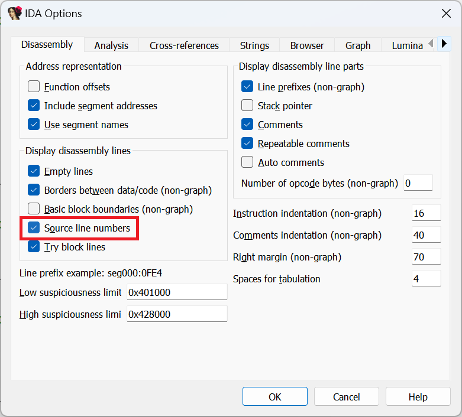
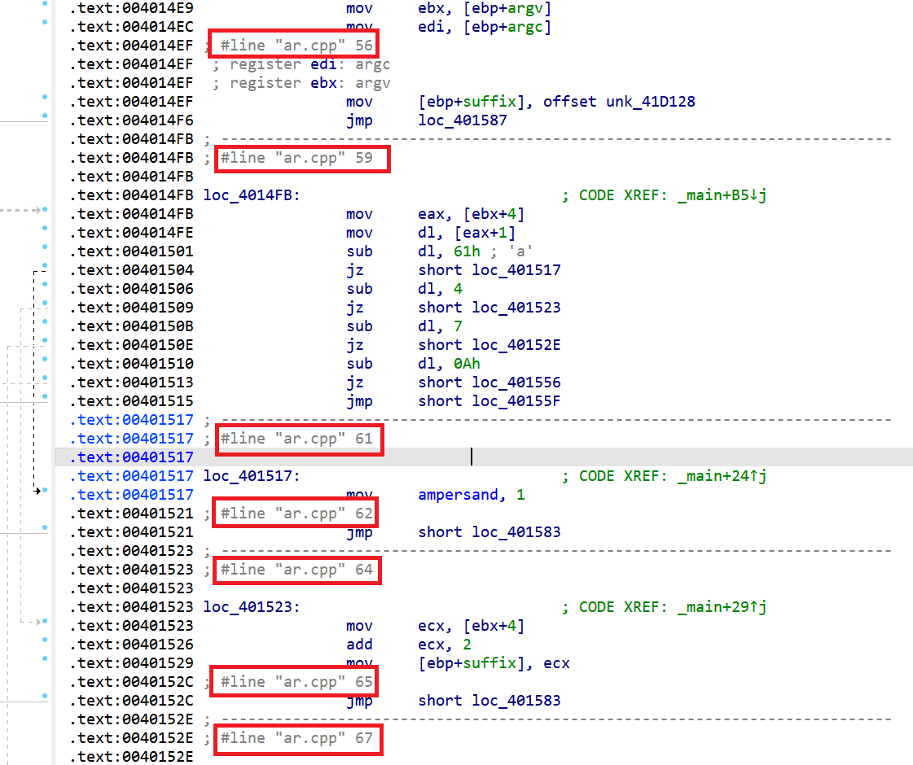
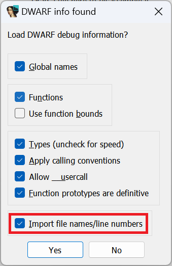

Debug information, whether present in the binary or [loaded separately](https://hex-rays.com/blog/igors-tip-of-the-week-55-using-debug-symbols/), can contain not only symbols such as function or variable names, but also mapping of binary’s instructions to the original source files. It can be used by IDA’s debugger for [source-level debugging](https://hex-rays.com/blog/igors-tip-of-the-week-85-source-level-debugging/), but what if you want to see this mapping during static analysis?  
无论是二进制文件还是单独加载的调试信息，不仅包含函数或变量名等符号，还包含二进制文件指令与原始源文件的映射。IDA 的调试器可以使用这些信息进行源代码级调试，但如果您想在静态分析过程中看到这些映射，该怎么办呢？

### Enabling source line number display  
启用源代码行号显示

Assuming the line number info was available and has been imported, it can be enabled in the Options > General… dialog, Disassembly tab:  
如果行号信息可用并已导入，则可在 "选项">"常规... "对话框的 "反汇编 "选项卡中启用：

Once enabled, IDA will add automatic comments with the file name and line number in the disassembly listing:  
启用后，IDA 将在反汇编列表中自动添加包含文件名和行号的注释：

To enable this for all new databases by default, change `SHOW_SOURCE_LINNUM` setting in `ida.cfg`.  
要在所有新数据库中默认启用此功能，请更改 `ida.cfg` 中的 `SHOW_SOURCE_LINNUM` 设置。

### Importing line numbers from DWARF  
从 DWARF 导入行号

DWARF debug format can also include line number information, but by default it’s skipped because it’s rarely needed in the database itself and can take a long time to load for big files. If you do need it, you should enable the corresponding option when prompted by IDA:  
DWARF 调试格式也可以包含行号信息，但默认情况下是跳过的，因为数据库本身很少需要行号信息，而且加载大文件可能需要很长时间。如果确实需要，应在 IDA 提示时启用相应选项：

To always import line numbers from DWARF debug info, enable `DWARF_IMPORT_LNNUMS` in `cfg/dwarf.cfg`.  
要始终从 DWARF 调试信息中导入行号，请在 `cfg/dwarf.cfg` 中启用 `DWARF_IMPORT_LNNUMS` 。

See also: 另请参见：

[Igor’s tip of the week #55: Using debug symbols  
伊戈尔本周小贴士 #55：使用调试符号](https://hex-rays.com/blog/igors-tip-of-the-week-55-using-debug-symbols/)

[Igor’s tip of the week #85: Source-level debugging  
伊戈尔的每周秘诀 #85：源代码级调试](https://hex-rays.com/blog/igors-tip-of-the-week-85-source-level-debugging/)