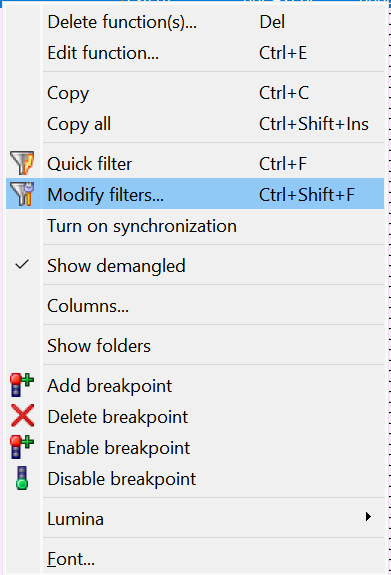
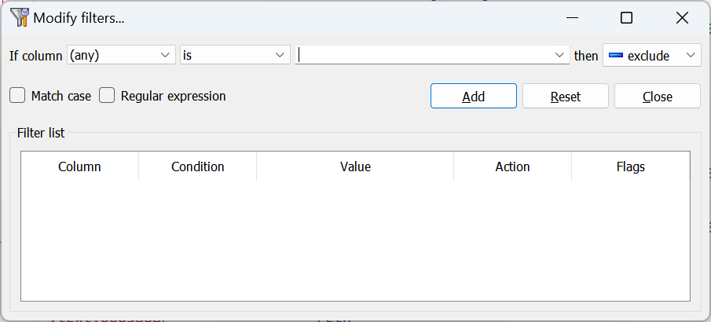
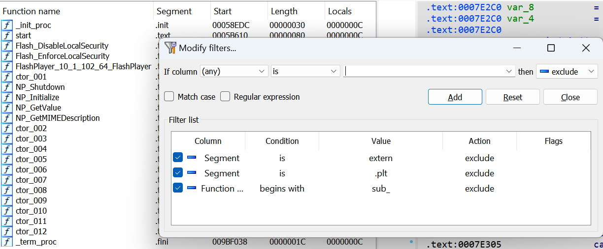
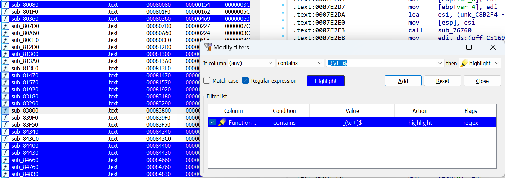
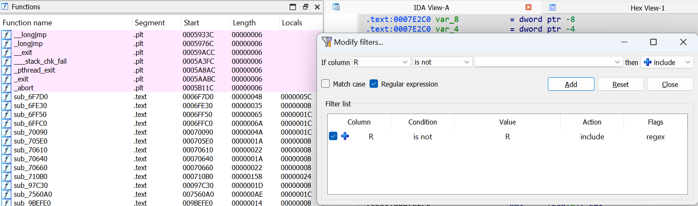

 We’ve covered choosers [previously](https://hex-rays.com/blog/igors-tip-of-the-week-36-working-with-list-views-in-ida/) and talked about searching, sorting and filtering. The default filter (Ctrl–F shortcut) is pretty simple: it performs case-insensitive match on any column of the list.  
我们之前介绍过选择器，并谈到了搜索、排序和筛选。默认过滤器（ Ctrl - F 快捷方式）非常简单：它对列表中的任意列执行大小写不敏感匹配。

### Advanced filters  高级筛选器

Advanced filter dialog is accessible via the context menu entry “Modify filters…” or the shortcut Ctrl–Shift–F  
通过右键菜单项 "修改筛选器... "或快捷键 Ctrl - Shift - F 可以访问高级筛选器对话框。

 

In the dialog you can:  
在对话框中您可以

-   match any or a specific column;  
    匹配任何列或特定列；
-   perform an exact match (is/is not) or partial (contains/doesn’t contain, begins/ends with);  
    执行精确匹配（是/不是）或部分匹配（包含/不包含，以开始/以结束）；
-   perform a lexicographical comparison (less than/more than);  
    执行词典比较（小于/大于）；
-   decide whether a specific filter excludes, includes, or highlights matches;  
    决定特定筛选器是否排除、包含或突出显示匹配项；
-   disable and enable filters individually;  
    单独禁用和启用过滤器；
-   use case-sensitive matching or regular expressions.  
    使用大小写敏感匹配或正则表达式。

### Examples 示例

The following set of filters excludes functions which start with `sub_`, or situated in segments `extern` (external functions) and `.plt` (PLT thunks for external functions). This way only the functions defined inside the binary which have non-[dummy names](https://hex-rays.com/blog/igors-tip-of-the-week-34-dummy-names/) are shown:  
以下筛选器排除了以 `sub_` 开头或位于 `extern` 段（外部函数）和 `.plt` 段（外部函数的 PLT 块）的函数。这样，只有在二进制文件中定义的、名称不是虚假的函数才会显示出来：

Highlight any function with name ending in _NNN where NNN is a sequence of decimal numbers:  
高亮显示名称以 _NNN 结尾的所有函数，其中 NNNN 为十进制数序列：

The highlight color can be changed by clicking the “Highlight button”.  
点击 "高亮按钮 "可更改高亮颜色。

Show only functions which were detected by IDA as [non-returning](https://hex-rays.com/blog/igors-tip-of-the-week-126-non-returning-functions/):  
只显示 IDA 检测到不返回的函数：

NOTE: the examples listed apply to the Functions list but these filters are available in any chooser (list view) in IDA: Imports, Exports, Names, Local Types etc.  
注意：列出的示例适用于函数列表，但 IDA 中的任何选择器（列表视图）都可以使用这些筛选器：导入、导出、名称、本地类型等。

See also: 另请参见：

[Igor’s tip of the week #36: Working with list views in IDA  
本周伊戈尔小贴士 #36：在 IDA 中使用列表视图](https://hex-rays.com/blog/igors-tip-of-the-week-36-working-with-list-views-in-ida/)