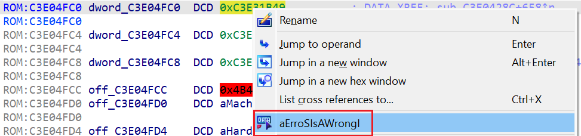

When analyzing firmware or other binaries without metadata, IDA is not always able to discover and analyze all functions which means the cross-references can be missing. Let’s say you found a string in the binary (e.g. in the [String list](https://hex-rays.com/blog/igors-tip-of-the-week-128-strings-list/)) which has no cross references, but you’re reasonably sure it’s actually used. How to discover where?  
在分析没有元数据的固件或其他二进制文件时，IDA 并不总是能够发现和分析所有功能，这意味着交叉引用可能会丢失。比方说，你在二进制文件中（例如在字符串列表中）发现了一个没有交叉引用的字符串，但你有理由确定它确实被使用了。如何找到它？

### Finding addresses using binary search  
使用二进制搜索查找地址

One possibility is that the string is referred to by its address value, either from a pointer somewhere, or as an immediate value embedded directly in the instruction (the latter case is more common for CISC instruction sets such as x86). In such case, looking for the address value should discover it.  
一种可能的情况是，字符串是由其地址值指向的，它可能来自某个指针，也可能是直接嵌入指令的直接值（后一种情况在 CISC 指令集（如 x86）中更为常见）。在这种情况下，查找地址值就能发现它。

For example, here’s a string in an ARM firmware which currently has no cross-references:  
例如，下面是 ARM 固件中的一个字符串，目前没有交叉引用：

We can try the following:  
我们可以尝试以下方法：

1.  Select and copy to clipboard the string’s address (`C3E31B49`);  
    选择字符串地址 ( `C3E31B49` ) 并复制到剪贴板；
2.  Go to the start of the database (Ctrl–PgUp or Home, Home, Home);  
    转到数据库的起始位置 ( Ctrl - PgUp 或 Home , Home , Home )；
3.  Invoke binary search (Search > Sequence of bytes…, or Alt–B);  
    调用二进制搜索（搜索 > 字节序列...，或 Alt - B ）；
4.  Paste the address and make sure that _Hex_ is selected. It is also recommended to enable _Match case_ to avoid false positives:  
    粘贴地址并确保选择十六进制。还建议启用匹配大小写以避免误报：  
    
5.  Click OK. IDA will automatically convert the value into a byte sequence corresponding to the processor endianness and look for it in the database:  
    单击 "确定"。IDA 会自动将该值转换为与处理器字节序相对应的字节序，并在数据库中查找：  
    

The value may be initially displayed as a raw number or even separate bytes. To convert it to an offset so that xref is created you can usually use the O or Ctrl–O shortcuts, or the context menu:  
该值最初可能显示为原始数字，甚至是单独的字节。要将其转换为偏移量以便创建 xref，通常可以使用 O 或 Ctrl - O 快捷键或上下文菜单：  

Now the string has a cross-reference and you can look further at where exactly it is used:  
现在字符串有了交叉引用，你可以进一步查看它的具体使用位置：  

### Finding addresses using immediate search  
使用即时搜索查找地址

Binary search works for addresses embedded as-is into the binary. However, there may be situations where an address is embedded into an instruction not on a byte boundary, or split between several instructions. For example, RISC-V usually has to use at least two instructions to load a 32-bit value into a register (high 20 bits and low 12 bits). In case these instructions are next to each other, IDA can combine them into a single macroinstruction and calculate the full value, but because it’s split between two instructions, binary search won’t find it. However, immediate search (Search > Immediate value…, or Alt–I) should work. Note that if you copy the address from the listing, you’ll need to add 0x so that it can be parsed as hexadecimal by IDA.  
二进制搜索适用于原封不动嵌入二进制的地址。但是，在某些情况下，地址可能被嵌入到一条不在字节边界上的指令中，或者被分割到几条指令中。例如，RISC-V 通常需要使用至少两条指令才能将一个 32 位的值加载到寄存器中（高位 20 位，低位 12 位）。如果这些指令彼此相邻，IDA 可以将它们合并为一条宏指令，并计算出完整的值，但由于它被分割在两条指令之间，二进制搜索将无法找到它。不过，立即搜索（搜索 > 立即值...，或 Alt - I ）应该可以。注意，如果从列表中复制地址，则需要添加 0x，以便 IDA 将其解析为十六进制。

NOTE: this approach will succeed only under the following conditions:  
注意：这种方法只有在以下条件下才能成功：

1.  the instruction(s) using the address were actually decoded. You can try the approach described in [Tip #04](https://hex-rays.com/blog/igor-tip-of-the-week-04-more-selection/) to try disassembling the whole binary before looking for cross-references;  
    使用该地址的指令实际上已被解码。您可以尝试提示 #04 中所述的方法，在查找交叉引用之前尝试反汇编整个二进制文件；
2.  the instructions were actually combined into a macro with the full address. For example, if they are interleaved with unrelated instructions, IDA won’t be able to combine them and you may need to look for each part separately.  
    这些指令是否实际合并为一个具有完整地址的宏。例如，如果这些指令与不相关的指令交错在一起，IDA 将无法将它们组合起来，您可能需要分别查找每个部分。

Unfortunately, even the methods described here are not always enough. For example, [self-relative offsets](https://hex-rays.com/blog/igors-tip-of-the-week-110-self-relative-offsets/) will likely require analyzing the code to figure out what they refer to.  
遗憾的是，即使是这里介绍的方法也不一定足够。例如，自相关偏移可能需要分析代码才能找出它们所指的是什么。

See also:  另请参见：

[Igor’s tip of the week #95: Offsets  
伊戈尔本周提示 #95：偏移量](https://hex-rays.com/blog/igors-tip-of-the-week-95-offsets/)

[Igor’s Tip of the Week #114: Split offsets  
伊戈尔的每周窍门 #114：分割偏移量](https://hex-rays.com/blog/igors-tip-of-the-week-114-split-offsets/)