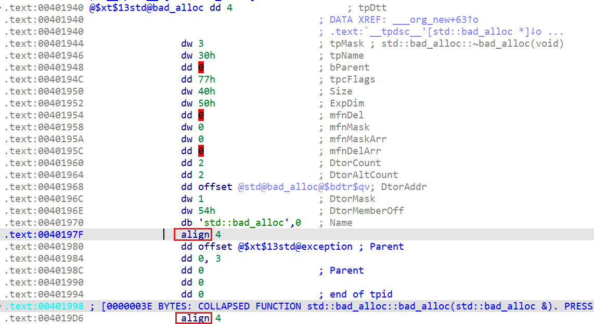
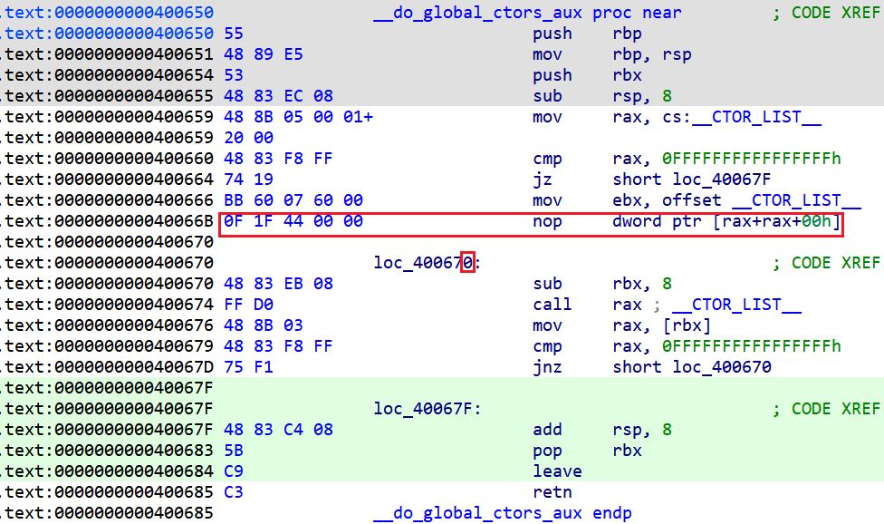
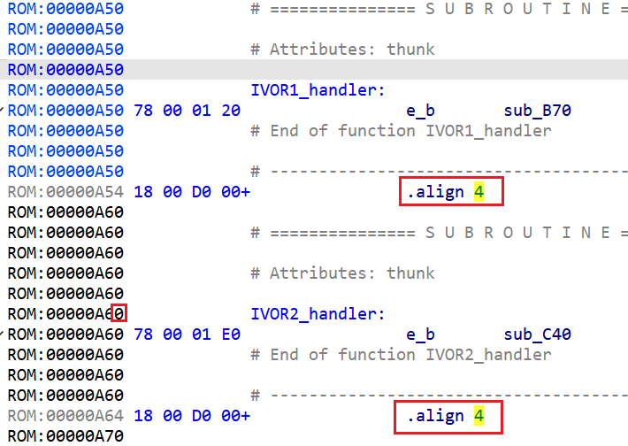
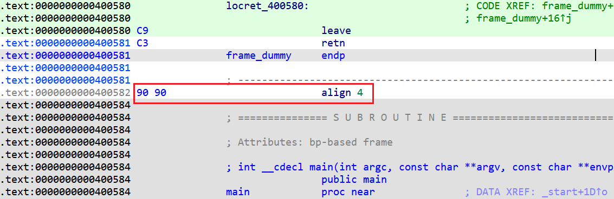
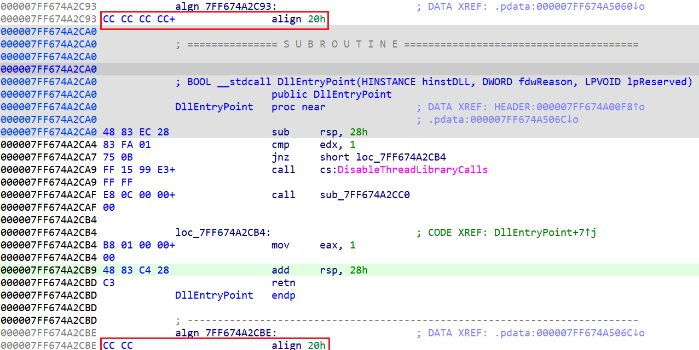
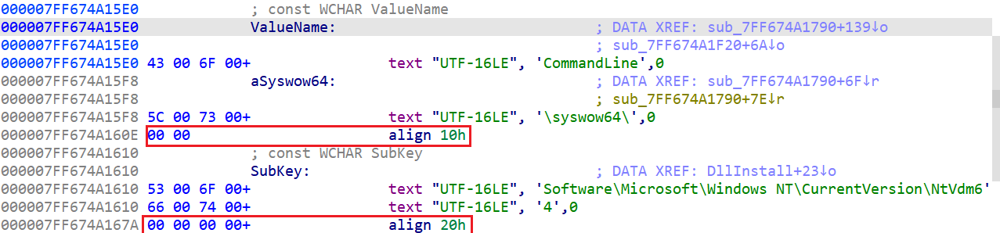
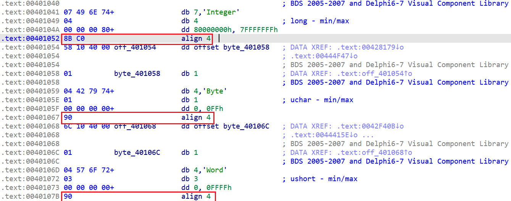
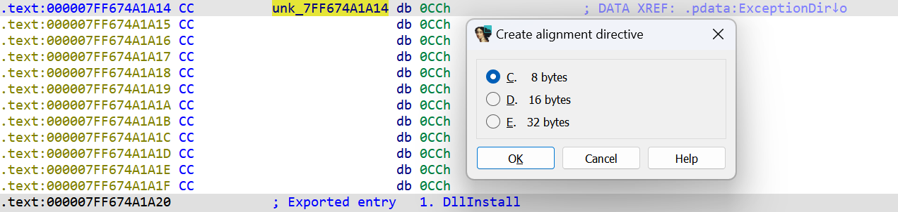

Sometimes you may see mysterious `align` keywords in the disassembly, which can appear both in code and data areas:  
有时，你可能会在反汇编中看到神秘的 `align` 关键字，这些关键字既可能出现在代码区，也可能出现在数据区：

Usually they’re only apparent in the text view.  
通常只有在文本视图中才能看到。

These directives are used by many assemblers to indicate alignment to a specific address boundary, usually a power of two. IDA uses it to replace potentially irrelevant bytes by a short one-liner, both for more compact listing and to indicate that this part of the binary is probably not interesting.   
许多汇编程序使用这些指令来指示与特定地址边界（通常是二的幂次）的对齐。IDA 使用它来用简短的单行替换潜在的不相关字节，既可以使列表更紧凑，又可以表明二进制文件的这一部分可能并不有趣。

Depending on the processor and the assembler chosen, different keyword can be used (e.g. `align` or `.align`), and the number after the directive can mean either the number of bytes or the power of two (i.e. 1 means aligning to two bytes, 2 to four, 4 to sixteen and so on).  
根据处理器和汇编程序的不同，可以使用不同的关键字（如 `align` 或 `.align` ），指令后面的数字可以是字节数，也可以是二的幂次（如 1 表示对齐到两个字节，2 表示对齐到四个字节，4 表示对齐到十六个字节，依此类推）。

The alignment items can appear in the following situations:  
对齐项可能出现在以下情况：

### Code alignment padding 代码对齐填充

Many processors use instruction caches which speed up execution of often-executed code (for example, loops). This is why it may be useful to ensure that start of a loop is aligned on a specific address boundary (usually 16 bytes). For this, the compiler needs to insert instructions which do not affect the behavior of the function, i.e. NOP (no-operation) instructions. Which specific instructions are used depends on the processor and compiler.   
许多处理器使用指令缓存来加速经常执行的代码（如循环）的执行。因此，确保循环的起始位置与特定地址边界（通常为 16 字节）对齐可能很有用。为此，编译器需要插入不影响函数行为的指令，即 NOP（无操作）指令。具体使用哪种指令取决于处理器和编译器。

For example, here GCC used a so-called “long NOP” to align the loop on 16 bytes (obvious thanks to the hexadecimal address ending with 0). Because this instruction is actually executed, IDA shows it as code and not as an align expression (which is considered non-executable and would break disassembly), but you can still convert it manually.  
例如，在这里 GCC 使用了所谓的 "长 NOP "来对齐 16 字节的循环（由于十六进制地址以 0 结尾，这一点显而易见）。由于这条指令是实际执行的，因此 IDA 将其显示为代码，而不是对齐表达式（后者被认为是不可执行的，会破坏反汇编），但您仍然可以手动转换它。

There may also be hardware requirements. On some processors the interrupt handlers must be aligned, like in this example from PowerPC:  
可能还有硬件要求。在某些处理器上，中断处理程序必须对齐，如 PowerPC 的这个例子：  

Here, 4 is a power-of-two value, i.e. alignment to 16-byte boundary.  
这里的 4 是 2 的幂次，即对齐到 16 字节边界。

### Function padding 函数填充

Similarly to loops, whole functions can benefit from the alignment, so they’re commonly (but not always!) aligned to at least four bytes. Because the functions are usually placed one after the other but the function size is not always a multiple of the alignment, extra padding has to be inserted by the compiler and/or the linker. Two common approaches are used:  
与循环类似，整个函数也可以从对齐中获益，因此通常（但并不总是！）至少对齐四个字节。由于函数通常一个接一个，但函数大小并不总是对齐方式的倍数，因此编译器和/或链接器必须插入额外的填充。常用的方法有两种

1.  executable NOP instructions, just like for the loop alignment. This is the approach commonly used by GCC and derived compilers:  
    可执行的 NOP 指令，就像循环对齐一样。这是 GCC 和派生编译器常用的方法：  
    
2.  invalid or trapping instructions. This can be useful to catch bugs where execution is diverted to an address between functions, for example due to a bug or an exploit. Microsoft Visual C++, for example, tends to use 0xCC (breakpoint instruction) to pad the space between functions on x86:  
    无效指令或陷阱指令。这对于捕捉由于错误或漏洞等原因导致执行转移到函数间地址的错误非常有用。例如，Microsoft Visual C++ 倾向于使用 0xCC（断点指令）来填充 x86 上函数之间的空间：  
    

### Data alignment padding 数据对齐填充

Many processors have alignment requirements: some can’t even load data from unaligned addresses, and others can usually fetch aligned data faster. So the compilers often try to ensure that data items are placed on an aligned address boundary (usually at least 4 bytes). Most commonly, zero-fill padding is used:  
许多处理器都有对齐要求：有些处理器甚至无法从未对齐的地址加载数据，而其他处理器通常可以更快地获取已对齐的数据。因此，编译器通常会设法确保数据项放置在对齐的地址边界上（通常至少 4 字节）。最常见的做法是使用零填充：  

Although NOP-like fillers may be used by some compilers too, especially for constant data placed in executable areas:  
尽管有些编译器也会使用类似 NOP 的填充器，特别是对于放在可执行区域中的常量数据：  

## Converting alignment items  
转换对齐项

While rare, it may be necessary for you to change IDA’s decision concerning an alignment item. Because they’re mostly equivalent to data items, you can use the usual shortcut U to undefine them (convert to plain bytes), and then C to convert to code (in case they correspond to valid instructions).  
虽然很少见，但你可能有必要改变 IDA 关于对齐项的决定。由于对齐项大多等同于数据项，因此您可以使用常用的快捷方式 U 来取消对齐项的定义（转换为普通字节），然后使用 C 来转换为代码（如果对齐项对应的是有效指令）。

To go the other way (convert instructions or undefined bytes) to an alignment item, use Edit > Other > Create alignment directive…, or just the shortcut L. IDA will check at what address is the next defined instruction or data item and will offer possibly several alignment options depending on its address. For example, in this situation:  
要反其道而行之（将指令或未定义字节）转换为对齐项，请使用 "编辑">"其他">"创建对齐指令..."，或使用快捷键 L 。 IDA 将检查下一个已定义的指令或数据项位于哪个地址，并根据其地址提供多种对齐选项。例如，在这种情况下  
  
The current address is divisible by 4 so any alignment less than 4 is not applicable. The following defined address ( `7FF674A1A20`) is divisible by 32, so IDA offers options 8, 16 and 32. Note that if you choose 8, the alignment item will only cover the first 4 bytes (up to `7FF674A1A18`), so in this situation 16 or 32 makes the most sense.  
当前地址可被 4 整除，因此任何小于 4 的对齐方式都不适用。下面定义的地址（ `7FF674A1A20` ）可被 32 整除，因此 IDA 提供 8、16 和 32 选项。需要注意的是，如果选择 8，对齐项将只覆盖前 4 个字节（直到 `7FF674A1A18` ），因此在这种情况下，16 或 32 是最合理的。