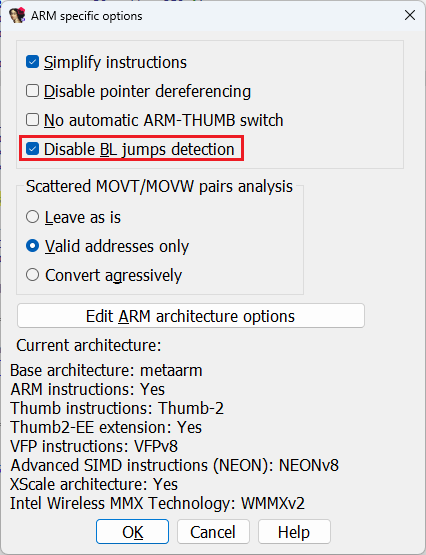
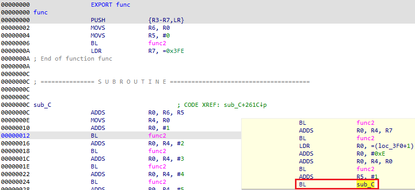
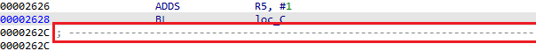

If you ever looked at IDA ARM module’s [processor-specific settings](https://hex-rays.com/blog/igors-tip-of-the-week-98-analysis-options/), you may have been puzzled by the option “Disable BL jumps detection”.  
如果您查看过 IDA ARM 模块的处理器特定设置，您可能会对 "禁用 BL 跳转检测 "选项感到困惑。

What is it and when to use it?  
它是什么，何时使用？

### Background 背景信息

The ARM instruction set initially used fixed-width 32-bit instructions. The relative branch instruction, **B**, allocated 24 bits for the offset, giving it a range of ±32MB.  
ARM 指令集最初使用固定宽度的 32 位指令。相对分支指令 B 为偏移量分配了 24 位，使其范围达到 ±32MB。

Some time later, ARM introduced a a compact 16-bit encoding for a subset of instructions, called Thumb. Because most relative branches occur in the same function, the ±2KB range available for 16-bit **B** instructions was usually enough. In case longer distance was needed, a longer instruction sequence would have to be generated.  
一段时间后，ARM 为指令子集引入了一种紧凑的 16 位编码，称为 Thumb。由于大多数相对分支发生在同一函数中，16 位 B 指令的 ±2KB 范围通常已经足够。如果需要更长的距离，则必须生成更长的指令序列。

Some compiler writers realized, that the **BL** instruction, normally used for function calls, can be used for simple branches as well. On ARM, the function calls do not use the stack, so the only side effect of BL as opposed to simple branch is that it sets the LR register to the address following the BL instruction. If the LR is saved at the start of the current function, it does not matter that if LR is clobbered by the intermediate BL instructions, since it can be restored from the saved area to return to the caller. The BL is encoded as pair of 16-bit instructions, which gives it a range of ±4MB.  
一些编译器编写者意识到，通常用于函数调用的 BL 指令也可用于简单分支。在 ARM 上，函数调用不使用堆栈，因此 BL 与简单分支相比，唯一的副作用是将 LR 寄存器设置为 BL 指令之后的地址。如果 LR 寄存器保存在当前函数的起始位置，那么即使 LR 寄存器被中间的 BL 指令覆盖也没有关系，因为它可以从保存的区域恢复，返回给调用者。BL 被编码为一对 16 位指令，因此其范围为 ±4MB。

A later extension of the Thumb, called Thumb-2, introduced a 32-bit version of B, giving it a range of ±16MB, so there is less need of such tricks in code compiled for modern processors which support Thumb-2. However, old code still needs to be analyzed sometimes, so it may be necessary to support such usage of **BL**.   
Thumb 的后期扩展（称为 Thumb-2）引入了 32 位版本的 B，使其范围达到 ±16MB，因此在为支持 Thumb-2 的现代处理器编译的代码中，就不太需要这种技巧了。不过，有时仍需要对旧代码进行分析，因此可能有必要支持 BL 的这种用法。

### Example 示例

Here’s an example of a Thumb mode program which looks a little strange…  
下面是一个 Thumb 模式程序的示例，看起来有点奇怪...

IDA has created a function because of the BL instruction which normally implies a function call. But we see that `func` is not complete, so most likely `sub_C` is actually its continuation and BL is used only as a branch. Also, `func` saves LR on the stack, so BL clobbering it does not matter.  
IDA 创建了一个函数，因为 BL 指令通常意味着函数调用。但我们看到 `func` 并不完整，因此很可能 `sub_C` 实际上是它的继续，而 BL 只是用作分支。另外， `func` 将 LR 保存在堆栈中，因此 BL 将其删除并不重要。

### Marking single instructions  
标记单指令

If the BL-as-branch approach is used only in few cases, you can handle them manually. For this, place the cursor on the line with BL and use Edit > Other > Force BL jump menu item. IDA will take this into account and indicate that this BL does not continue to the next instruction by adding a [dashed comment line after it](https://hex-rays.com/blog/igors-tip-of-the-week-126-non-returning-functions/).   
如果只在少数情况下使用 BL 作为分支的方法，可以手动处理它们。为此，请将光标放在带有 BL 的行上，然后使用 "编辑">"其他">"强制 BL 跳转 "菜单项。IDA 将考虑到这一点，并通过在其后添加虚线注释行来表示该 BL 不继续下一条指令。

You can then delete the wrongly created function and [extend](https://hex-rays.com/blog/igors-tip-of-the-week-127-changing-function-bounds/) or recreate the original one which had been truncated.  
然后，您可以删除错误创建的函数，并扩展或重新创建被截断的原始函数。

### Changing analysis behavior  
改变分析行为

If the binary has multiple functions which use this technique, it may be worth it to let the analyzer check each BL destination before creating functions. For this, turn off _Disable BL jumps detection_ in the processor specific options and [reanalyze the program](https://hex-rays.com/blog/igor-tip-of-the-week-09-reanalysis/). Note that you will likely have to delete the wrongly created functions, so it may be better to reload the file, changing the options in the initial Load File dialog.  
如果二进制文件中有多个使用此技术的函数，那么在创建函数前让分析器检查每个 BL 目的地可能是值得的。为此，请关闭处理器特定选项中的禁用 BL 跳转检测，然后重新分析程序。请注意，您可能必须删除错误创建的函数，因此最好重新加载文件，并在初始加载文件对话框中更改选项。

To set this by default, change `ARM_DISABLE_BL_JUMPS` value in `ida.cfg`.  
要将其设置为默认值，请更改 `ida.cfg` 中的 `ARM_DISABLE_BL_JUMPS` 值。

In cases where the BL jumps detection fails  (it marks a BL as a jump where it should be a call, or vice versa), you can always override its decision using Force BL jump and Force BL call menu options. In case you discover a specific code pattern and need to script it, you can also use [IDC functions](https://www.hex-rays.com/products/ida/support/idadoc/681.shtml) `force_bl_jump(ea)` and `force_bl_call(ea)`.  
如果 BL 跳转检测失败（将本应是调用的 BL 标记为跳转，反之亦然），可以使用强制 BL 跳转和强制 BL 调用菜单选项覆盖其决定。如果发现了特定的代码模式并需要编写脚本，还可以使用 IDC 函数 `force_bl_jump(ea)` 和 `force_bl_call(ea)` 。