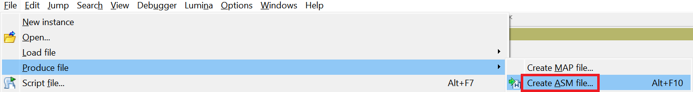
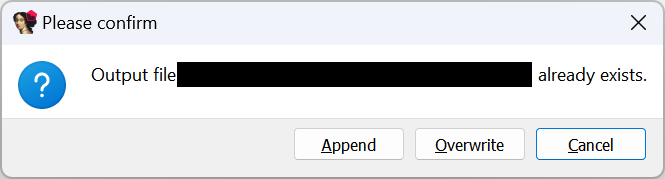
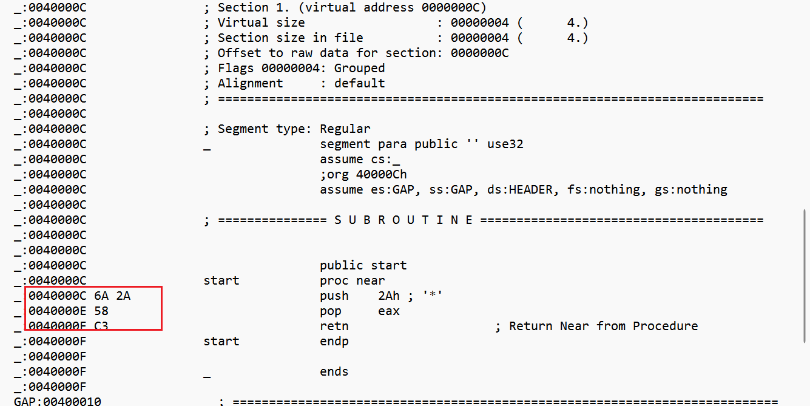

Although most of the time you can probably do all of the reversing inside IDA, occasionally you may need to continue it using other tools. While sometimes it may be enough to analyze the input file with another tool, or use the [Export Data](https://hex-rays.com/blog/igors-tip-of-the-week-39-export-data/) feature, the disassembly listing is more convenient in many cases. Of course, you can use the clipboard to copy some snippets, but this can be awkward and slow if you need big chunks of the listing, or need to remove unnecessary parts of the listing such as the address prefixes.  
虽然大多数情况下您可以在 IDA 中完成所有反转工作，但有时您可能需要使用其他工具继续进行反转。虽然有时使用其他工具分析输入文件或使用导出数据功能就足够了，但在许多情况下，反汇编列表更为方便。当然，你也可以使用剪贴板来复制一些片段，但如果你需要大块的列表，或需要删除列表中不必要的部分（如地址前缀），这样做可能会很麻烦，而且速度也会很慢。

### ASM file ASM 文件

ASM files can be generated by using the menu entry File > Produce File > Create ASM File…, or the shortcut Alt–F10.  
可以使用菜单项 "文件">"生成文件">"创建 ASM 文件... "或快捷键 Alt - F10 生成 ASM 文件。

By default, the contents of the whole database is exported, but you can [select a range](https://hex-rays.com/blog/igor-tip-of-the-week-03-selection-in-ida/) before invoking the command to limit it to just what you need. If you need multiple fragments, you can repeat the action several time, choosing “Append” when IDA informs you that the file already exists.  
默认情况下，导出的是整个数据库的内容，但你可以在调用命令前选择一个范围，将其限制在你需要的范围内。如果您需要多个片段，可以多次重复操作，在 IDA 通知您文件已经存在时选择 "Append"。

In ideal circumstances, the ASM listing can be passed to the assembler to generate code equivalent to the original binary. It means it does not contain extra annotations which may be present in IDA, such as address prefixes or [opcode bytes](https://hex-rays.com/blog/igors-tip-of-the-week-123-opcode-bytes/). Of course, the reality is often not so simple, but minor modification to the ASM file may be enough to solve your problem.  
在理想情况下，ASM 清单可以传递给汇编器，生成与原始二进制代码等价的代码。这意味着它不包含 IDA 中可能存在的额外注释，如地址前缀或操作码字节。当然，实际情况往往并非如此简单，但对 ASM 文件稍作修改可能就足以解决问题。

### LST file LST 文件

The LST file can be generated via the menu entry File > Produce File > Create LST File… (no default shortcut). Unlike the ASM file, it contains all the information present in IDA’s text view, so it can be useful if you want to see [opcode bytes](https://hex-rays.com/blog/igors-tip-of-the-week-123-opcode-bytes/) or address prefixes.  
LST 文件可通过菜单项 "文件">"生成文件">"创建 LST 文件... "生成（无默认快捷方式）。与 ASM 文件不同，LST 文件包含 IDA 文本视图中的所有信息，因此如果您想查看操作码字节或地址前缀，LST 文件将非常有用。

### Protip 提示

The ASM or LST file usually needs at least one line of text per each instruction or data item. If your database contains large data areas, converting them to [arrays](https://hex-rays.com/blog/igor-tip-of-the-week-10-working-with-arrays/) before exporting can reduce the size of the output files significantly. [Hiding or collapsing](https://hex-rays.com/blog/igors-tip-of-the-week-31-hiding-and-collapsing/) uninteresting areas or whole segments is another option.  
在 ASM 或 LST 文件中，每个指令或数据项通常至少需要一行文本。如果您的数据库包含较大的数据区域，在导出前将其转换为数组可以大大减小输出文件的大小。另一种方法是隐藏或折叠不感兴趣的区域或整段数据。