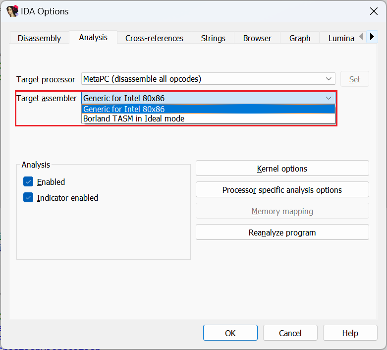
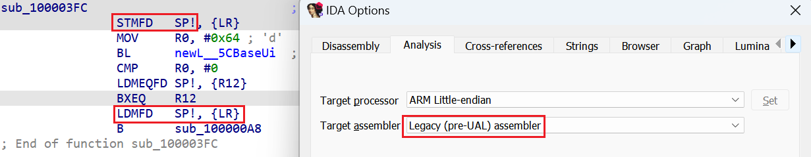
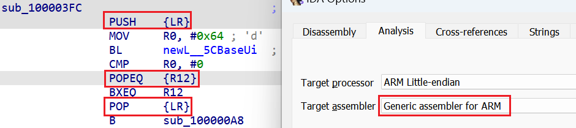
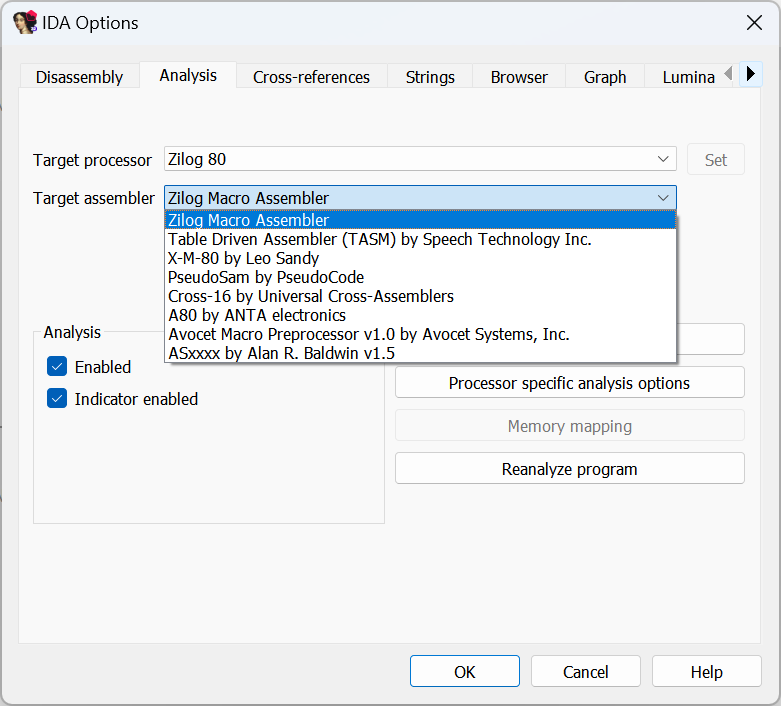

When [exporting disassembly](https://hex-rays.com/blog/igors-tip-of-the-week-135-exporting-disassembly-from-ida/), sometimes you need to modify it so that it is accepted by a specific assembler you’re using. One little-known fact is that some of IDA’s processor modules support different assembler syntaxes, so it may be useful to try a different one to see if it matches your needs better.  
在导出反汇编时，有时你需要修改反汇编语法，以便它能被你使用的特定汇编程序所接受。一个鲜为人知的事实是，IDA的一些处理器模块支持不同的汇编语法，因此尝试一下不同的语法，看看是否更符合你的需要。

The assembler can be changed via Options > General…, Analysis tab:  
可以通过 "选项">"常规..."，"分析 "选项卡更改汇编程序：

For example, on x86 the TASM Ideal syntax may be selected instead of the default Generic one (based on MASM). One feature of this syntax is that it always uses brackets for instructions which dereference memory pointers.  
例如，在 x86 上可以选择 TASM 理想语法，而不是默认的通用语法（基于 MASM）。这种语法的一个特点是，它总是对引用内存指针的指令使用括号。

For ARM, you can choose a legacy assembler, which was used before introduction of UAL (unified assembly language) with Thumb-2. For example, it used explicit `STMFD` and `LDMFD` instructions instead of the more convenient `PUSH` and `POP` introduced for Thumb.   
对于 ARM，您可以选择传统汇编程序，它是在 Thumb-2 引入 UAL（统一汇编语言）之前使用的。例如，它使用明确的 `STMFD` 和 `LDMFD` 指令，而不是 Thumb 引入的更方便的 `PUSH` 和 `POP` 。

Nowadays, IDA defaults to the generic UAL assembler which is de-facto standard and easier to read.  
如今，IDA 默认使用通用的 UAL 汇编程序，它是事实上的标准程序，而且更易于阅读。

For some of the older processors the selection of assemblers can be quite extensive; they often didn’t have a freely available official assembler so many third-party alternatives were available.  
对于一些较早的处理器，汇编程序的选择可能相当广泛；它们通常没有免费的官方汇编程序，因此有许多第三方替代程序。

