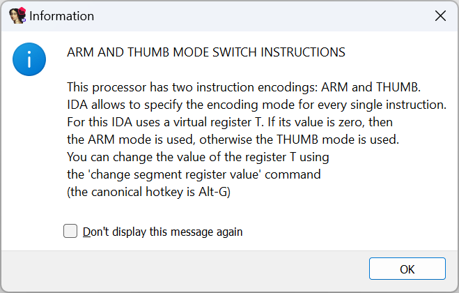
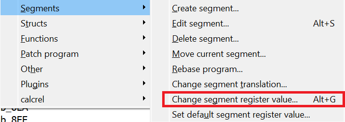
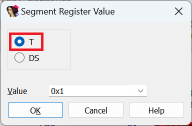
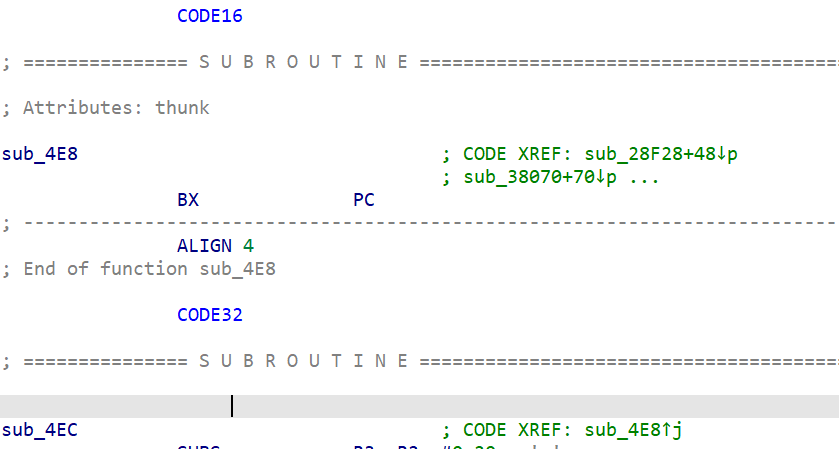
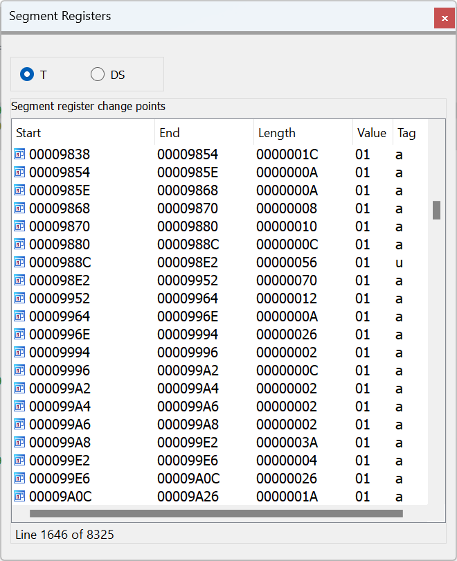

Some of the processors supported by IDA support different ISA variants, in particular:  
IDA 支持的某些处理器尤其支持不同的 ISA 变体：

-   ARM processor module supports the classic 32-bit ARM instructions (A32), 16-bit Thumb or mixed 16/32-bit Thumb32 (T32) , as well as 64-bit A64 instructions (A64)  
    ARM 处理器模块支持传统的 32 位 ARM 指令 (A32)、16 位 Thumb 或混合 16/32 位 Thumb32 (T32) 以及 64 位 A64 指令 (A64)
-   PPC processor module supports the standard 32-bit PowerPC instructions and mixed 16/32-bit Variable Length Environment (VLE)  
    PPC 处理器模块支持标准 32 位 PowerPC 指令和 16/32 位混合可变长度环境 (VLE)
-   MIPS module supports the classic 32-bit instructions as well as the compressed variants MIPS16 and microMIPS  
    MIPS 模块支持传统的 32 位指令以及压缩变体 MIPS16 和 microMIPS

Because sometimes these instructions sets may be present in the same binary, IDA needs a way to determine which subset to use. For this, it repurposes _segment registers_, originally used on 16-bit x86 processors to extend the 16-bit addressing. For example, if you load an ARM firmware binary, you will see the following informational box:  
由于有时这些指令集可能出现在同一个二进制文件中，因此 IDA 需要一种方法来确定使用哪个子集。为此，它重新使用了最初用于 16 位 x86 处理器的段寄存器，以扩展 16 位寻址。例如，如果加载 ARM 固件二进制文件，您将看到以下信息框：

In many cases, IDA is able to determine the correct processor mode by analyzing the code and determining mode switch sequences (e.g. BX/BLX instructions), but you can also force its decision by using the described shortcut Alt–G (if you prefer menus, you can find it in Edit > Segments > Change segment register value…).  
在许多情况下，IDA 可以通过分析代码和确定模式切换序列（如 BX/BLX 指令）来确定正确的处理器模式，但您也可以使用描述的快捷方式 Alt - G （如果您更喜欢菜单，可以在 "编辑">"段">"更改段寄存器值... "中找到）来强制作出决定。

In the dialog, select the **T** register and specify `0` for ARM mode or `1` for Thumb (includes Thumb32 aka Thumb-2).  
在对话框中选择 T 寄存器，并指定 `0` 用于 ARM 模式或 `1` 用于 Thumb（包括 Thumb32 又名 Thumb-2）模式。

You can observe mode switches in the disassembly listing by the `CODE32`/`CODE16` directives (usually text view only):  
在反汇编列表中可以通过 `CODE32` / `CODE16` 指令（通常仅文本视图）观察模式切换：

If you need a global overview, use the View> Open subviews > Segment registers…. (Shift–F8) view or its modal version Jump > Jump to segment (Ctrl–G):  
如果需要全局概览，请使用 "视图">"打开子视图">"段注册表....( Shift - F8 ) 视图或其模式版本跳转 > 跳转到段 ( Ctrl - G ) ：

The _Tag_ column gives a hint on how the specific changepoint was created: **a** denotes a changepoint added by IDA during autoanalysis while **u** is used for those specified by the user (or, sometimes a plugin).  
标签栏提示了具体变化点的创建方式：a 表示 IDA 在自动分析过程中添加的变化点，而 u 则用于用户（有时是插件）指定的变化点。

If necessary, wrong changepoints can be deleted from the list (even many at a time, using the selection). When a change point is deleted, IDA uses the value of a preceding one (or the default for the current segment).  
如有必要，可以从列表中删除错误的变化点（甚至可以使用选择功能一次删除多个变化点）。删除变化点时，IDA 会使用前一个变化点的值（或当前程序段的默认值）。

For MIPS, the **mips16** pseudoregister is used to switch between standard MIPS and MIPS16 or microMIPS, and for PPC, **vle** is used to enable decoding of VLE instructions.  
对于 MIPS，mips16 伪寄存器用于在标准 MIPS 和 MIPS16 或 microMIPS 之间切换；对于 PPC，vle 用于启用 VLE 指令解码。

See also: 另请参见：

[IDA Help: Segment Register Change Points  
IDA 帮助：段寄存器变化点](https://www.hex-rays.com/products/ida/support/idadoc/524.shtml)

[IDA Help: Jump to the specified segment register change point  
IDA 帮助：跳转到指定的段寄存器变化点](https://www.hex-rays.com/products/ida/support/idadoc/547.shtml)